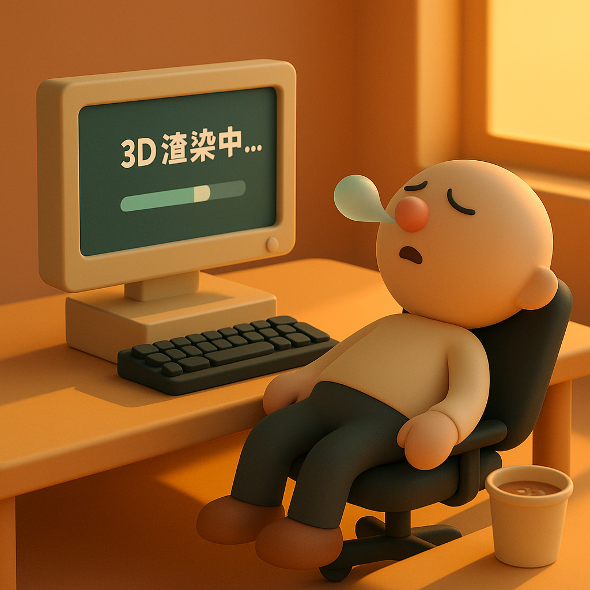

# 【AI】小白话系列——人工智能简史（三十）

回忆起大学时学习编程的时光，有一小段特别搞笑的经历。那时候，整天只喜欢计算机，每次上任何课程，总是抱着一大捧计算机书坐在教室的最后，埋头看自己的书，完全不管老师在前面讲什么。等到考试时，糊弄过去就好。

《高等数学》就这么一头包地混过去了，后来的《线形代数》也是。

一开始，我只是在研究怎么显示二维图像。《仙剑奇侠传》展示出来的平滑快速的卷轴技术让我叹服不已。本质上，那都是在显存区域，把画好的图片（或者整屏，或者部分）搬来搬去，或者重新绘制。这些，都是前面提到过的 2D 加速显卡的核心能力。

然而，当我开始尝试着写一个三维制图的小程序，想把图纸上的零件立体地显示在屏幕上，并且可以拉近拉远，肆意旋转、移动时，我懵圈了。翻了许多计算机书之后才发现，怎么把三维坐标压扁转换成屏幕的二维坐标，并且实现旋转，缩放，平移，乃至近大远小逼真投影效果的奥秘，竟然全部藏在那本被我用刚刚及格的成绩混过去的《线性代数》课本里。

我只好老老实实地翻出旧课本，自己把《线性代数》重新学了一遍。题外话：后来我一直把这段历史拿来吐槽自己，人家聪明人一开始就知道学的东西有啥用，于是认真学；像我这样的蠢人要后来才知道学的东西有啥用，书到用时方恨少，到头还得重新学。

线形代数里的矩阵乘法，是所有这些 3D 运算的核心。而事情还不止于此。记得后来我玩上了 3D Max，在我设置好要显示的 3D 文字，旋转的速度和方向，光源，贴图材质后。点击渲染按钮，计算机就开始了埋头苦算，一段短短十几秒或者几十秒的动画，当时那台接近顶配的 486 电脑居然要运算整整一个下午。

CPU 在那里干什么呢：

**1.  模型与视图变换 (Model & View Transformation)：**

- **是什么：** 首先，要根据动画的设定，计算出3D文字模型新的位置和旋转角度。这就是通过**矩阵乘法**（线性代数的核心）实现的。CPU需要为模型的数千个顶点，一遍又一遍地做着浮点数乘法和加法。
- **通俗比喻：** 就像一个摄影师，先要摆好舞台上的模型（模型变换），然后自己找到一个合适的拍摄角度（视图变换）。

**2. 光照与着色 (Lighting & Shading)：**

- **是什么：** 计算场景中的光源（比如一盏虚拟聚光灯）如何照射在3D文字的表面。每个多边形朝向光源的角度不同，接收到的光照强度就不同，颜色也随之改变，从而产生立体感。这又是一轮复杂的向量和光照模型计算（如冯氏光照模型）。
- **通俗比喻：** 摄影师在摆好模型和机位后，开始布置灯光，思考哪里应该亮一点，哪里应该有阴影。

**3. 投影变换 (Projection Transformation)：**

- **是什么：** 将三维空间中的坐标点，通过透视法（近大远小）或正交法，转换为二维屏幕上的坐标（x, y）。这依然是大量的矩阵运算。
- **通俗比喻：** 摄影师通过镜头（广角或长焦），将三维的场景“压平”到二维的胶片上。

**4. 光栅化 (Rasterization)：**

- **是什么：** 这是最最耗费计算量的步骤！经过上述变换，我们得到了文字在屏幕上的二维多边形轮廓。现在CPU需要逐个像素地去判断，“这个像素点是否在这个多边形内部？” 如果是，它就要根据之前计算出的光照和纹理信息，计算出这个像素最终应该是什么颜色。
- **通俗比喻：** 就像在一张巨大的方格纸上，用铅笔一点一点地为多边形轮廓填色。一个800x600分辨率的屏幕就有48万个像素点，CPU需要对其中很多像素进行归属判断和颜色计算。

**5. 写入显存：**

- **是什么：** 最后，CPU将计算出的每个像素的颜色值，写入到显存的对应位置，我们才能在屏幕上看到图像。

这一个下午，CPU 就在为这几十秒、几百帧的画面，重复着这五步地狱般的计算。每一步都是海量的、重复的浮点运算。

当时的 CPU 功能虽然已经进化到了 486，已经可以处理包括多媒体在内的各种复杂任务。可以说，CPU (中央处理器) 就好像一个「全能的大学教授」：

* **特点：** 他极其聪明，逻辑能力超强，可以处理各种各样复杂的、非重复性的任务。你可以让他解微积分、写小说、指挥交通、管理系统资源。他的核心是**低延迟、强逻辑**。

* **弱点：** 如果你给他一百万道「1+1=？」这样的小学算术题，他虽然都会做，但必须一道一道地按顺序来，速度会很慢，而且非常“大材小用”。

上面那些 3D 图形计算虽然计算量庞大，但本质上并不复杂。于是，就有人琢磨开了——为啥一定要大学教授来算 1 + 1 = 2 呢。

假如组织一个「小学生军团」来处理这些问题呢？

* **特点：** 这个军团里有成千上万个「小学生」（计算单元）。他们每个人都只会做几样简单的算术题（比如加减乘除、向量点积）。但你如果把那一百万道「1+1=？」的题目分发下去，他们可以**同时开始计算**，一瞬间就能全部完成。它的核心是**高吞吐量、并行计算**。

* **弱点：** 你无法让这个军团去写小说或指挥交通，他们听不懂复杂的指令。

3D渲染过程中的「光栅化」等步骤，正是需要对数百万像素进行同样模式的、简单的颜色计算。这完美地契合了「小学生军团」的工作模式。把这些任务从CPU那里解放出来，交给专门的硬件去做，于是乎，3D 加速卡诞生了！

当时的巨头，S3 和 Trident 都尝试过这个领域，但他们在 2D 领域的优势，并没有延伸到 3D 领域。他们就像一群「算术很差的小学生」，反而拖累了 CPU，被人揶揄为——3D 减速卡！

直到后来，传奇的 Voodoo 横空出世！

<待续>