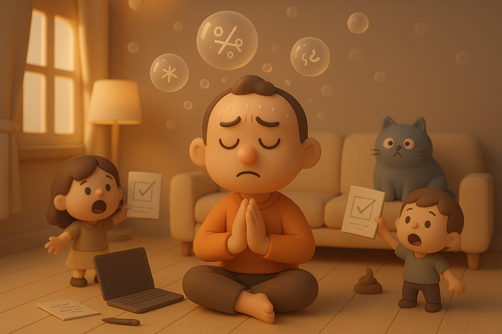

# 【生命⋅修行】说什么就来什么

那天晚上大宝和我聊天，不知不觉到了深夜。忽然，她想起这么一出：

>老公，等有钱以后，我们一起修行好不好？

我说：

> 怎么个修行法？

她说：

> 就是修身养性啊！

我说：

> 好啊！

我想了想，又说：

> 其实，我们现在就可以修行。
>
> 你还记得好多年前，我们去河南灵宝拜访我同学 LY 的一位学太极拳的师兄，他当时和我们说的话吗？

> 他说他时时刻刻都在练拳，喝茶是练拳，走路是练拳，吃饭也是练拳。

> 所以，你把你最近在拳中悟到的那个「静」字，用到生活的时时刻刻，方方面面，就是修行了。

大宝想了想说：

> 我还是要先赚钱，你自己边赚钱边修行吧！

我点点头，说：

> 这就是我现在想要做到的！

……

然而，在生活中修行这句话说起来容易，做起来，只能呵呵！

第二天一早，阿宝让我给她辅导作业。我捧着笔记本，刚刚把周末开了个头没写完的文章又打了两个字，被阿宝一直叫，一直叫弄得烦躁不安。

于是，索性把笔记本收了起来，耐着性子给阿宝辅导完作业。

> 白天或者晚上再找个时间写吧?

我默默这么想着，出门时把电脑塞进了背包。但是，理想很丰满，现实很骨感。一整个白天，我并没有时间掏出自己的笔记本来码字。晚上回到家，阿宝依旧等着我，有许多她不会的题目让我辅导……

看着时间一分一秒过去，我变得越来越抓狂。

时间眨眼到了晚上 9 点钟，阿宝的作业没有做完，而我也不可能开始写我的小作文。我充满沮丧地进到卧室，准备拿睡衣洗澡。却闻到一股浓郁的猫屎味。

不知哪只猫，居然在弟弟的枕头上拉了一泡屎！

我简直要气炸了！

一直情绪很好的大宝，也终于被我点爆。家里顿时陷入一阵狂风暴雨，猫飞娃哭大人叫……

直到一个小时后，我们洗完了被猫尿，猫屎污染的床单，枕头。终于接受了这个现实，全家才渐渐消停下来。

我再一次想起，头一天晚上，自己在那里信誓旦旦和大宝说的话：

> 我现在要做的，就是在生活的每时每刻里好好修行！

老天真是贴心，说什么来什么！迅速把这大好的「修行机会」送到了我面前。

……

一切情绪，似乎都是从不能及时完成写作练习引起。自己的爱好，变成了执着。于是本来一件为了快乐的行动计划，变成了自己痛苦的源泉。

我决定，既然如此，索性停上一停，就像停止使用多邻国那样。不要让这件事情，成为自己的枷锁！

孔子说：

> 言必行，行必果，硜硜然小人哉！

这次，让我试试越过「硜硜然」的小人这道坎，再上一层楼吧？

