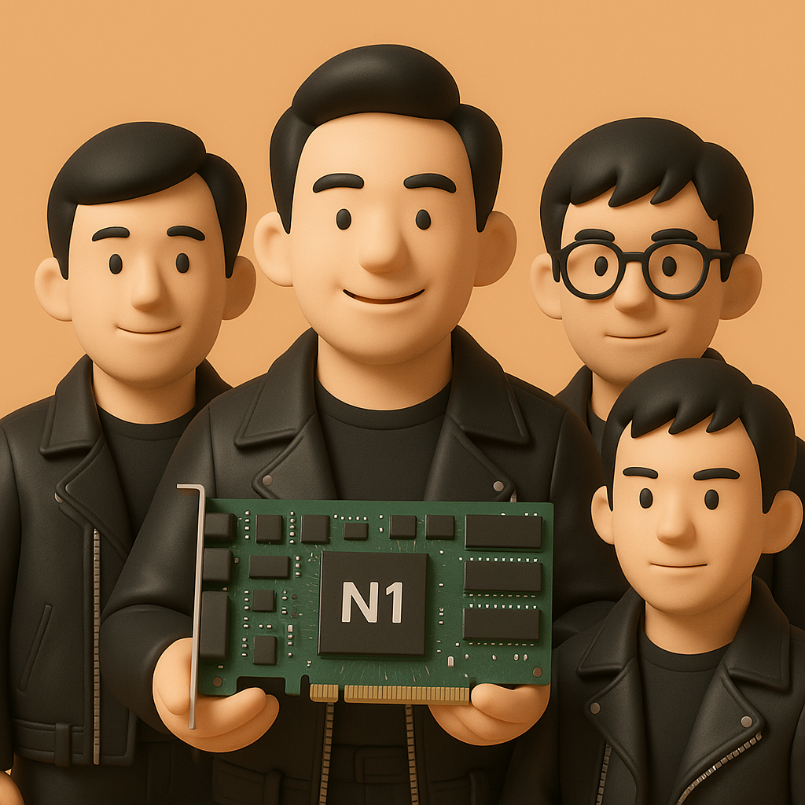

# 【AI】小白话系列——人工智能简史（三十一）

1996 年 10 月，就在我白天坐在大教室里的最后一排，捧着一摞计算机书和线性代数，琢磨着写 3D 坐标变换的矩阵乘法程序；晚上跑去机房，或者同学的宿舍玩各种 PC 游戏时。一种叫做 Voodoo 的 3D 加速卡横空出世了。

我没机缘第一时间见到这高档玩意儿，但好像是《大众软件》还是《个人电脑》的杂志附赠的光盘里，带了一段小小的效果视频。那光滑的，闪着光的水面，清晰、棱角分明的墙面，丝般顺滑的动画效果，把我惊呆了。这和我当时正在玩的 DOOM 游戏里几乎全是马赛克的画面一对比，简直一个天上，一个地下。

这真是魔法一般的效果，3dfx 一夜封神。而 Voodoo 则成为了像我这样游戏爱好者的梦中情人。

然而，要想搞明白这个封神时刻是怎么来的，还得把时间拨回到一年多以前的 1995 年。

那时候，3dfx刚刚成立一年多，名不见经传。而另一家同样年轻的公司则比他早成立一年，正满怀信心地推出自己的第一款产品，却一脚踏入深渊。

这家公司名字，叫做NVIDIA——英伟达，和 3dfx 同样，他们也预见到了3D图形将是PC未来。年轻的创始人黄仁勋和公司的同仁们雄心勃勃，他们不只想做一块显卡，他们要做的是一款「全能多媒体处理器」。

这款 1995 年推出的产品叫做 NV1，不仅有 2D/3D 图形处理功能，还集成了声卡，甚至还有一个专用的Sega Saturn（世嘉土星游戏机）手柄接口。黄仁勋打算，用这张卡搞定一切娱乐需求。

更重要的是，NVDIA 的工程师们觉得，业界传统的，用三角形（Polygons）作为3D模型基本计算单元的方法，虽然简单，灵活，但是实在太「简陋」了。

他们找到了一种数学更优雅，更先进的技术——「二次曲面（Quadratic Surfaces）」。这样，可以用更少的数学描述，来创建更为平滑的曲目。

但结果会是怎样呢？

<待续>

