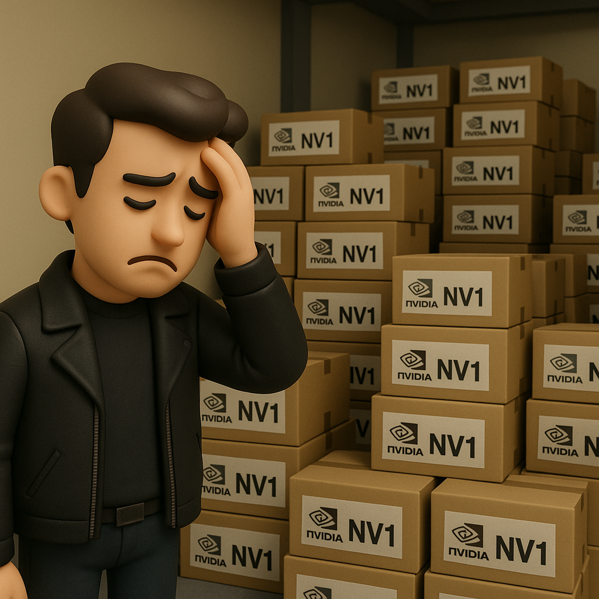

# 【AI】小白话系列——人工智能简史（三十二）

黄仁勋(Jensen Huang)，Chris Malachowsky，Curtis Priem和一众英伟达年轻工程师们没有想到的是，他们引以为傲、并且确实先进的「二次曲面」技术，成为了 NV1 的催命符。

游戏开发者们早已习惯了用「三角形」来构建计算机里的三维世界，没有人愿意为英伟达这套虽然「先进」、「独特」、「不兼容」的「二次曲面」技术，重新写一遍自己的游戏代码。

与此同时，微软发布了第一代的DirectX API 标准，意图在Windows中取代来自图形工作站的 3D 标准 OpenGL，而其中 3D 计算部分依旧是用的「三角形」。NV1 基本上完全无法兼容 DirectX。

于是，最关键的 3D 因为没人为它开发游戏而变得毫无意义，无人买单。声卡效果平平，世嘉手柄接口更是毫无用处。

1995年至1996年中，英伟达可谓走在历史上最黑暗的时期，NV1 堆满了库房，现金流基本断裂，公司裁掉了一半的员工，走到了破产边缘。

雄心勃勃的黄仁勋，遭遇了出道的第一次，也几乎是致命的一次惨败！

而几乎与此同时，在另一间办公室里，那几位来自 SGI 的大神，却做出了和黄仁勋和英伟达的工程师们截然不同的判断。

Gary Tarolli，Ross Smith，Scott Sellers，3dfx 的联合创始人，都来自 3D 图形界的“黄埔军校”——SGI（硅谷图形公司），是顶尖的图形技术专家。尤其是 Gary Tarolli，可以说是 3dfx 的技术大脑。

他们在那个时间点，究竟是怎么想，又是怎么做的呢？

<待续>