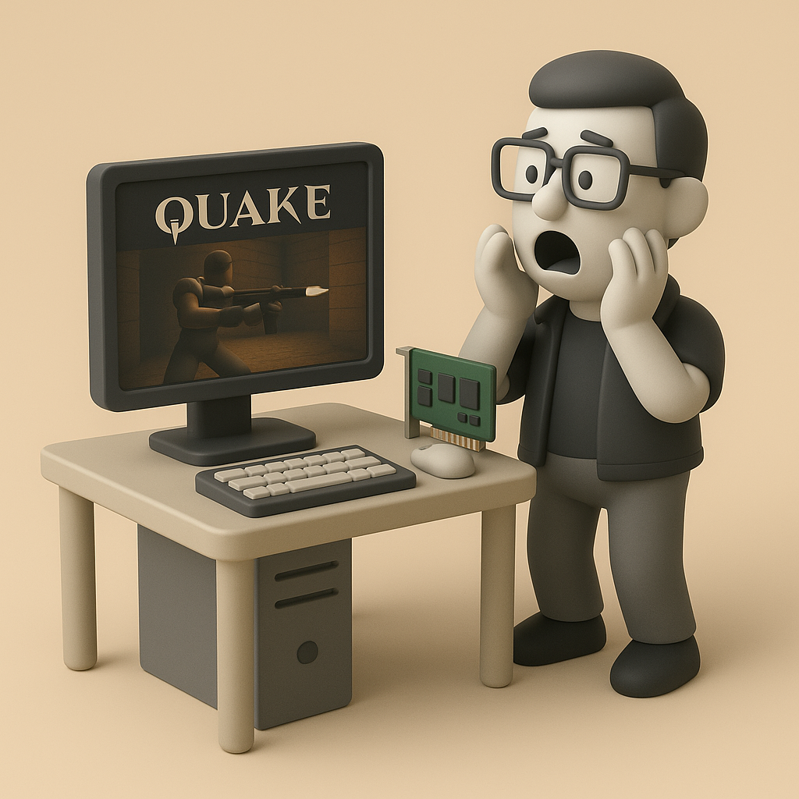

# 【AI】小白话系列——人工智能简史（三十三）

1995年到1996年中，就在黄仁勋他们对着一仓库堆积如山的 NV1 发愁的时候。Gary Tarolli 带领着Ross Smith，Scott Sellers正在为他们纯粹，而且如激光般专注的目标而努力着——

**让PC能以最快的速度玩当时最酷的3D游戏**

不关心声卡、不关心视频、甚至连 2D 显示都不管。他们瞄准了当时 CPU 处理 3D 游戏时最缓慢、最吃力的部分——**纹理填充（Texture Mapping）**和**光栅化（Rasterization）**。

当然，还是基于主流的**三角形（Polygons）**算法。他们将 Voodoo 设计成了一块纯粹的 3D 加速子卡，只干一件事情——用硬件加速来做纹理填充和光栅化。

不知是有心，还是纯粹出于技术与工程上的专注所带来的副产品。他们完美避开了和当时 2D 显卡巨头的直接冲突，开辟了一个全新的细分市场。

他们也看到了开发者们为了适配不同显卡写各种驱动程序的痛苦。于是，为了方便游戏开发者，他们创造出了简单、高效的 Glide API，直接把 Voodoo 所有强大功能一锅端在了开发者面前，让游戏开发者可以尽情地榨干硬件的所有能力。但是，类似这样的一个专用API，有谁会用呢？

机会属于有准备的人。

1996 年 6月22日，《Quake 雷神之锤》正式发布，这是一款真正的全 3D 游戏，相比之前的 《Doom 毁灭公爵》那种模仿 3D 效果的游戏，这可以说是开天辟地头一回。

然而，由于所有的 3D 渲染全靠软件在 CPU 上运算，即便是装备了当时最强大的奔腾处理器，也只能在 320 x 200 这样的低分辨率上跑到 20 - 30 帧每秒而已。

当时最强的 3D 机器都是图形工作站，于是约翰·卡马克（John Carmack）着手开发一套使用 OpenGL API 的版本 GLQuake，好让雷神之锤能够运行在具有更强大 3D 能力的图形工作站上。

到了夏天快结束的时候，3dfx的工程师拿到了《Quake》和卡马克的GLQuake代码。他们迅速写了一个小小的**「MiniGL**」驱动，把所有调用OpenGL 指令翻译成了 Glide 指令。

然后，他们带着 Voodoo 原型卡和加载了 MiniGL 驱动的 Quake 找到了卡马克。卡马克震惊地看着心爱的《雷神之锤》，在一台普通PC 机上，只不过用一块小小的附加卡，就跑出了只有在数万美元 图形工作站上才能见到的丝滑3D效果（60帧每秒）。

毫不犹豫地，卡马克成为了 Voodoo 的最强带货人。

1996年10月7日，Voodoo 显卡发布。

1997年1月，GLQuake 发布。

所有购买了 Voodoo 显卡的玩家，都可以立即体验卡马克曾经见证过的奇迹。

一夜之间，雷神之锤和Voodoo 双双封神！

属于 PC 的3D 游戏时代，就此开启！

而一个短暂的、让人眼花缭乱的 3D 显卡战国时代，也就此揭开序幕。

<待续>