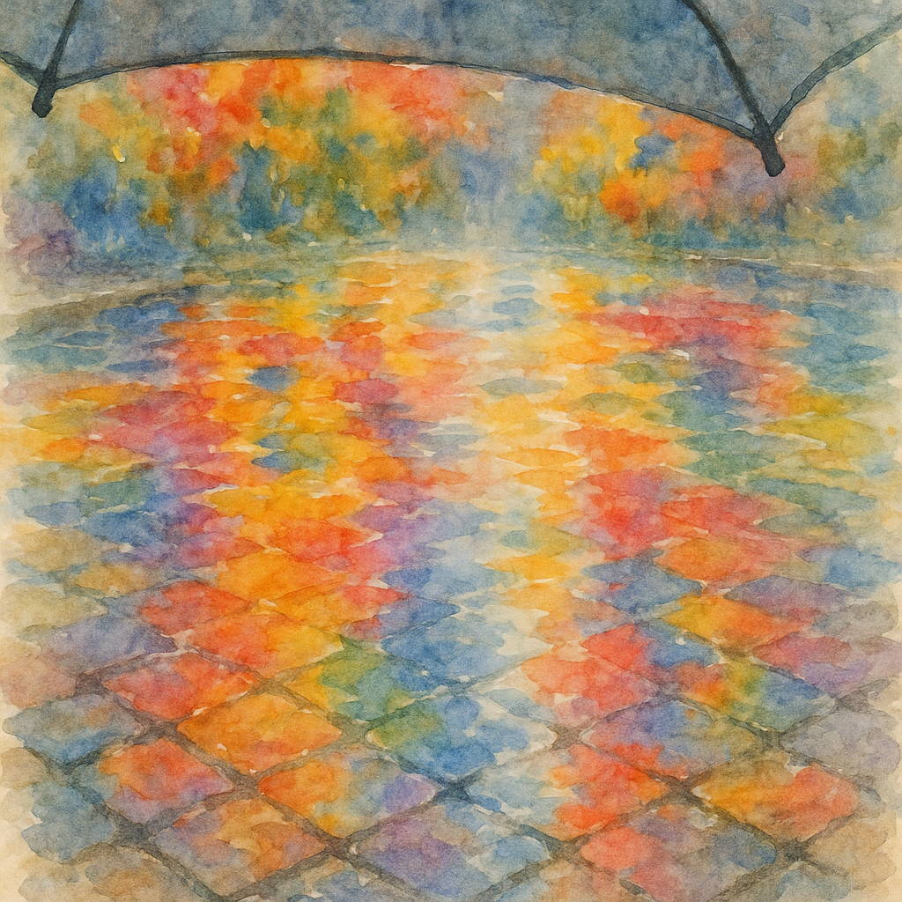

# 【随笔】五彩斑斓的秋天

国庆期间在武汉时，因为阿宝有一个要观察秋天的作业而特意留心了一下，却发现大部分树叶其实都还是绿色的。等回到深圳更是如此，不仅仅满眼的绿叶，甚至是四处鲜花盛开。

但我记忆中的秋天并不是这样的。

直到落地北京，离开航站楼的那一瞬间，一股深刻的凉意从后背直透进肺腑里，我禁不住稍微哆嗦了一下。顿时感觉：

**呼…… 这才是我记忆中，秋天的感觉！**

而更深的震撼，则来自于我在酒店门前下车的那一刻。当时，我接过司机从后备箱拿出来的行李箱，和他挥手告别。接着，我掏出手机一面完成付款，一面目送着汽车离开。

白色的汽车转了一圈，从大院的门口开出去，我这才注意到，这里院墙边是一排高大漂亮的枫树，满树的枫叶火红火红的，漂亮极了。

这是北方才会有的秋天，泠冽而斑斓！

真好看！我拍了两张照片发给大宝，她说她也从来没见过这么好看的枫树。

深圳不会有这样的秋天，我小时候所生活的江城秋天也与此不太一样。

江城的秋天不会有这样像火一样燃烧般的枫叶，樟树叶会有些变成深深的暗红色。更多的，则是那些变得金灿灿的巨大梧桐树叶，不仅满树金黄，还会铺天盖地地落下来，给马路铺上一层厚厚的地毯。

只不过，每一次秋天的降温，必然跟着一场冷雨。

天气寒冷而潮湿，于是路上满是打着各种颜色雨伞、穿着各种羊毛衫的人们。低着头，顶着风赶路，从铺满黄叶又被踩烂，而变得有些泥泞和积水的柏油路面看过去，到处都像是彩色的印象派画作。

