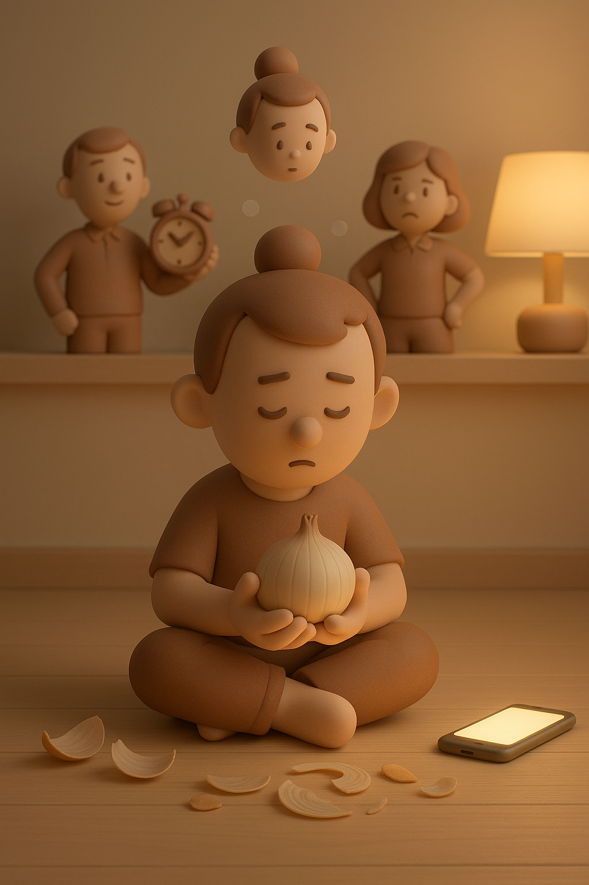

# 【生命⋅修行】自律的人

忘记了那天是在一个什么场景，大宝说我：

> 你这么自律的人，！@#¥@！#¥%……

算起来，大宝应该是第三个这么说我的人。

第一个是儿时的朋友，初中同学 ZK，他大约是在我读高中或者读大学的时候这么说过我一次。

另一个则是不久前，和以前在菊厂时候的老同事聚餐。我说起自己那天早上睡了个懒觉，闹钟根本叫不起来。L 故作惊讶的表情对我说：

> 像你这么自律的人，也会睡懒觉起不来？

这些情节这么清晰地从脑海里翻出来，实在是因为在自我认知中，我自己是一个自制力极差的人——只要稍微不留神，就会滑向那些让自己厌恶的「深渊」。

几乎每天都会会面对的清晨起床时的自我斗争算是一种最常见情况，然而最典型的，就是手机了。

我几乎想尽办法杜绝手机对自己的诱惑和影响，然而一旦没了外力的辅助，我竟然会连续若干天刷手机玩睡，从 11 点 到 12 点最后到凌晨才睡，从一天 5 个小时到 7 个多小时最后甚至超过 10 个小时。

显而易见，「自己看自己是什么人」，和「别人看自己是什么人」，完全是两回事。再加上「你以为别人怎么看自己」，以及「你想让别人怎么看自己」，这四种情形，简直互不重合。甚至像我关于「自律」这个标签那样，干脆就完全相反。

然而，真实的自我是什么呢？

这几天刷到一个短视频，视频中提出了这么一个颇有些哲学感的问题：

> 你是谁？
>
> 不要用你的名字，你的出身地，你的工作来回答；
>
> 也不要用你是谁的丈夫，妻子，儿女，父母这样身份来回答；
>
> 抛开所有这些来自外界的标签，思考一下，真正属于你自己的定义，你是谁？

我拿这个问题问大宝，她略略思索，就说，那只能说：

> 我就是我咯！
>
> 不一样的烟火？

然后她笑着反问，你怎么回答呢？

我说：

> 我仔细想了想，感觉剥掉所有这些标签后，就什么也没有了。

稍停，我又补充道：

> 就像洋葱头一样……

然而，关于洋葱头这个比喻，我显然是听来的。就连这个观点，我也是听来的，因为我自己的体验，仅仅停留在——剥开一层，还有一层，剥开一层，还有一层，层层叠叠无穷无尽的样子。

萨古鲁强调——「我不是我的身体，也不是我的头脑」。但「我」究竟是什么，他没说。

曾经，我给自己起的网名是——「我是谁」，用的温瑞安武侠小说里，那个黑衣大侠的名字。

后来，也一度和大宝一样认定——我就是我！

然而，到了如今却发现，我好像依旧不是「我」。

现如今这个「我」，依然是一层可以剥去的洋葱皮而已……

看样子，这一辈子的修行，远远没有结束，这洋葱皮还需要一层又一层地剥下去，一层有一层！

