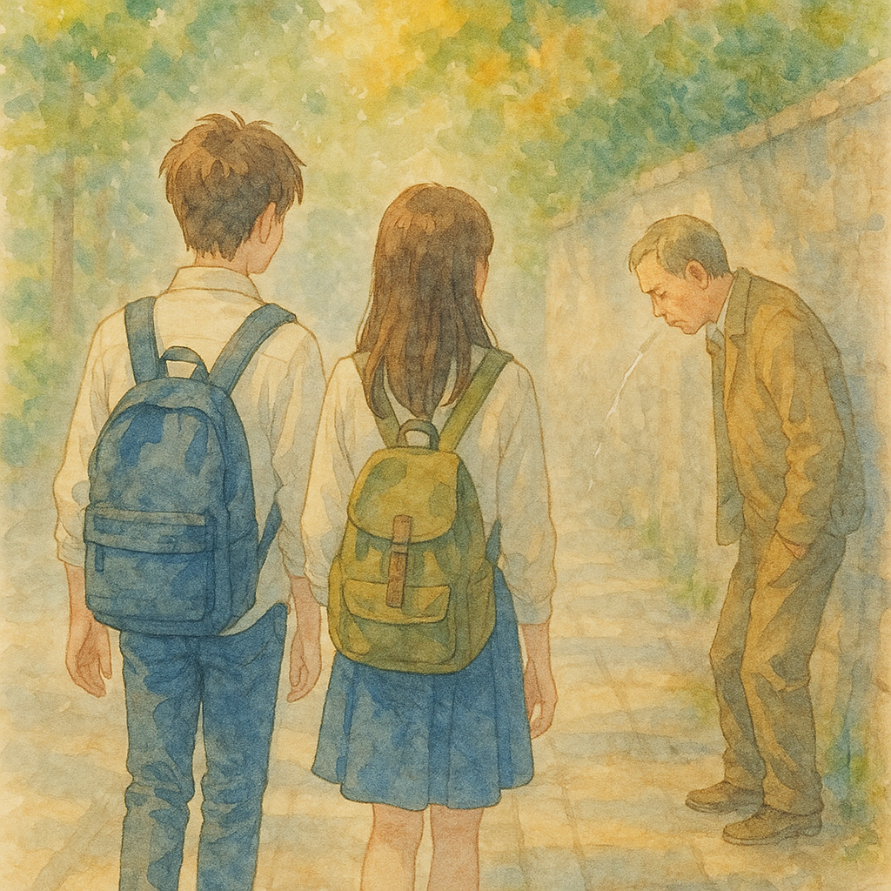

# 【生命•故事】（146）让人恶心的习惯

小时候，不知从什么时候起我就得了鼻炎，严重的鼻炎，怎么也治不好。而且，每逢感冒，几乎是必然会引发支气管炎，要咳嗽上两、三个星期才好。

于是乎，在我整个的学生时代，自己总是一个有很多鼻涕很多痰的——颇有些邋遢的小孩。

读高中时依然如此，我的书桌里总是堆满了擦过鼻涕的纸巾。即便是走在路上，也同样时不时地需要清理一下那完全堵住鼻孔，让自己无法呼吸的鼻涕。

有一天上学，记不清那是不是一个下雨天，我和女同学小 C 一起走在通往学校的那条小巷子里。路上，有位大叔快步经过我们身旁——

> 咔~库～

他一口浓痰吐在路边，然后脚步都没有顿一下，径直扬长而去……

小 C 皱着眉头对我说：

> 好恶习啊！

我颇有些「直男」地回答：

> 啊？可是，我也是这样的啊？岂不是，也很恶心？

小 C 毫不犹豫的回答：

> 你不一样啊，你会停下来。

……

当时，我被她这句话说服了。

可事后，我回想起来，越琢磨越不对劲儿，这叫什么理由啊？或许，这只能是她情商高，不肯当场给我难堪罢了。

又或许，她只是善良而宽容地接纳了一个事实而已——我是她熟悉的同学和朋友，而与此同时，这家伙碰巧有这么一个「让人恶心」的生活习惯罢了——一如在我整个生命中，所遇到过的所有亲人和朋友们一样。

……

之后，我更加留心了一些，免得自己擤鼻涕和吐痰时弄得动静太大。但习性难改，即便如今，我还时不时会忘记场合。于是，让自己这习惯一次又一次地恶心到身边的人🫣