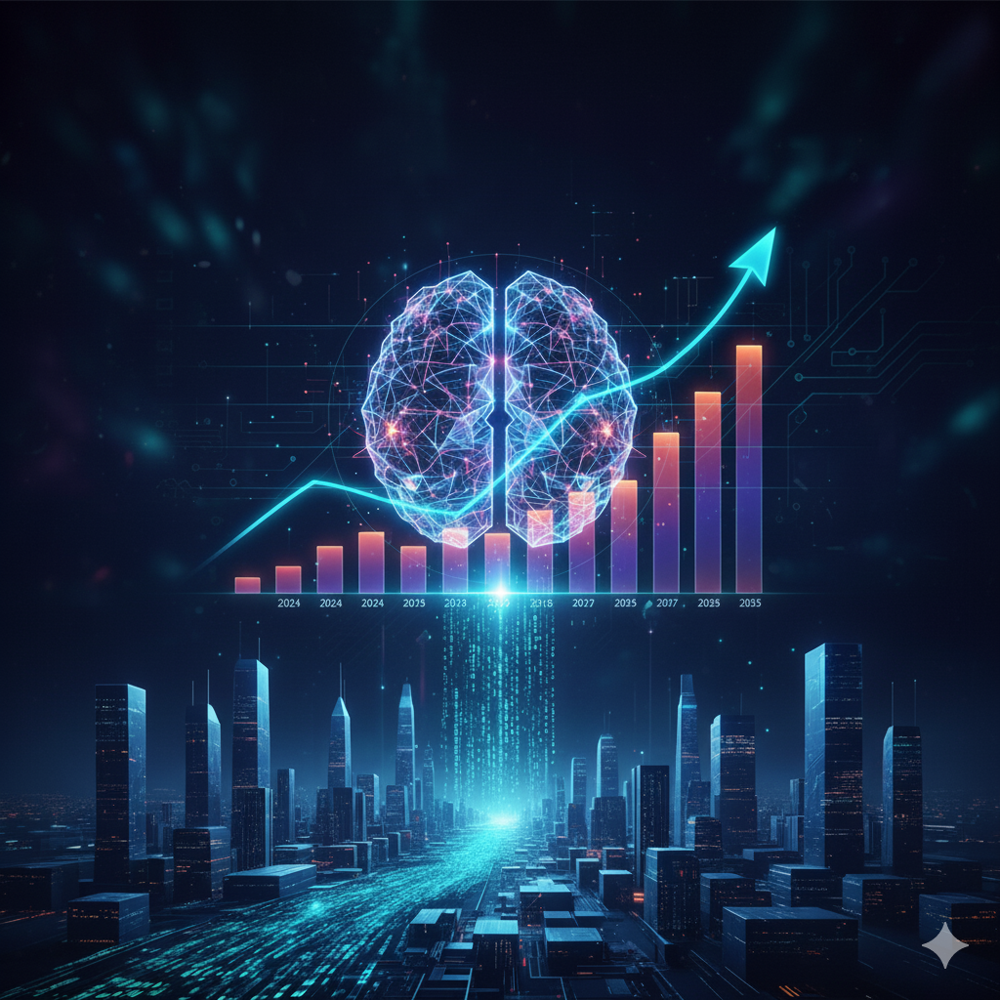

# 【随笔】 谁会享受这场AI竞赛的最终胜利呢

关于这个问题，有很多角度去看待：比如地缘政治、经济与公司、还有个人；也有很多不同的时间维度去看待：短期，中期，长期……

我想聊的，是从公司与投资的角度，按中长期视角的一点思考。

更主要是因为，最近刚听完了[Lex Fridman 对 Google DeepMind CEO Demis Hassabis 的第二轮访谈](https://lexfridman.com/demis-hassabis-2-transcript)。有一些想法，迫不及待地想要记录下来。

### 关于 AI：

Demis Hassabis 认为，Google 的 Alpha X 项目证明了自然界中可以找到的任何模式，都可以被经典的机器学习算法高效地发现和建模——并不需要量子计算机。

Veo3 能够通过被动观察就理解物理模型，这暗示了一些现实本质的基本信息。

到2030年，有很大概率（五五开），通用人工智能将得以实现——能够展现真正创造和发明能力的人工智能，比如提出相对论那样开创性的物理理论，或者发明想围棋这样深奥、优雅的游戏。

而这一轮 AI 变革，影响力将是 19 世纪基于煤、石油和电力的工业革命的 10 倍，而速度也将是 10 倍——这意味着，我们所面临的，是一个百倍变革的时代。

### 关于 Google：

Demis Hassabis 认为，Google 现在积累了深厚的文化底蕴和 AI 领域的人才厚度，现在 Gemini 的表现就证明了这一点——而这样的表现会继续下去。

之前，[Lex Fridman 有一个和 Sundar Pichai 的访谈](https://lexfridman.com/sundar-pichai-transcript)，也佐证了这一点。

----

有人说：这一轮 AI 革命会让山姆•奥特曼这样的人更加富有，而普通人则将面临失业。

那么，我们这些普通人可以怎么挣扎一下呢？关注一下可能最终活到最后的 AI 公司，或许是一条最简单有效的路径。

我用 Notebook LM 推算了一下 Google 未来 10 年的自由现金流，供大家参考：

谷歌未来10年自由现金流推断表

| 财年            | 经营活动现金流 (OCF) (十亿美元) | 资本支出 (CapEx) (十亿美元) | 自由现金流 (FCF) (十亿美元) | 推断依据 (定性分析)                                          |
| --------------- | ------------------------------- | --------------------------- | --------------------------- | ------------------------------------------------------------ |
| **2024 (实际)** | $125.3                          | $52.5                       | **$72.8**                   | 历史数据.                                                    |
| **2025 (推算)** | $144.1                          | $92.0                       | **$52.1**                   | CapEx采纳最新指导区间中值 (91*B*−93B). OCF假设继续保持强劲增长。FCF在短期内受AI基础设施建设加速的影响而下降. |
| **2026**        | $165.7                          | $110.4                      | **$55.3**                   | CapEx预期有“显著增加”. OCF持续增长，但CapEx仍以高速度增长，导致FCF压力持续。 |
| **2027**        | $190.5                          | $121.4                      | **$69.1**                   | CapEx增速放缓，但仍保持高位，以满足Cloud客户需求. OCF增速开始超过CapEx增速，体现AI投资的早期回报。 |
| **2028**        | $219.1                          | $127.5                      | **$91.6**                   | Cloud和AI产品的投资回报率（ROI）开始显著体现，OCF强劲增长.   |
| **2029**        | $252.0                          | $130.0                      | **$122.0**                  | 资本密集度趋于稳定，运营效率（如使用TPU和AI工具）持续提升，推动FCF快速增长. |
| **2030**        | $289.8                          | $130.0                      | **$159.8**                  | 假设AI作为平台转变带来的收益（通过Search、Cloud和Subscriptions变现）达到高峰，FCF加速增长. |
| **2031**        | $333.3                          | $127.4                      | **$205.9**                  | CapEx开始适度下降，反映基础设施的高效利用和长期投资周期的完成. |
| **2032**        | $383.3                          | $122.3                      | **$261.0**                  |                                                              |
| **2033**        | $440.8                          | $117.4                      | **$323.4**                  |                                                              |
| **2034**        | $506.9                          | $112.7                      | **$394.2**                  |                                                              |
| **2035**        | $583.0                          | $108.2                      | **$474.8**                  |                                                              |

注：OCF推算基于2024年实际数据和年均15%的恒定增长率，这与Alphabet在2024年（14%）和2025年Q3（16%）的营收增长率接近。CapEx和OCF的未来增长率是基于来源中对AI投资的定性描述所作出的合理假设。

