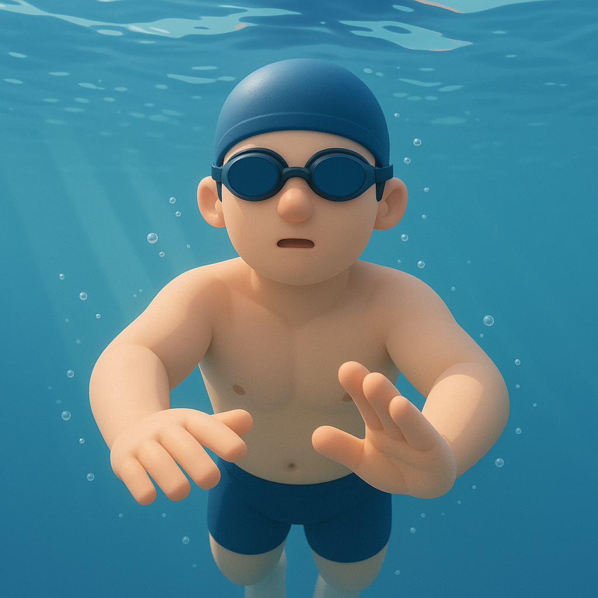

# 【生命⋅修行】游泳

去年刚回到深圳时，正赶上阿宝报名了游泳课，于是我也办了一张 10 次的次卡，打算陪她一起游泳来着。

然而，不知不觉一年过去了，哪怕是经历了一个暑假，还是没用几次。甚至直到过期前的最后一周，竟然还有四次没用；与此同时，大宝的卡上也还剩三次——于是，我们开始了一小段每天早起去文体公园游泳的历程。

我的泳姿，完全是凭着小时候长辈和那些比我大点的孩子们在东湖、长江里教我的野路子——至今也只会蛙泳。而大宝，则是潜水教练和游泳教练正儿八经教过的。

虽然，我可以在泳池里游得来来回回，而她换气还不熟练，甚至还不敢在深水区自己游，但我总感觉她的姿势更加标准好看，而且速度也相当快。于是，有一天早上，我好好问了问她关于蛙泳的几个动作标准，发现自己有一个最大的误区，就是收腿时把大腿也收回来了。而教练告诉大宝的关键点是——收大腿不收小腿。

我开始试着慢下来，好好感受和调整自己的泳姿，却突然发现，因为水的明显阻力，自己可以更清晰地觉察。在地面上行禅时，想要觉知自己如何迈出左脚，如何切换重心，如何迈出右脚，以及觉知整个身体的动作，脚和地面接触的感受需要更慢的动作、更加地专注才能做到。

而在水里，埋头扎进水里的一瞬间，就只剩下了自己和水。于是，我发现了，刚刚换完气后，其实有一个自然跌落水中往下沉的过程。只要不着急，根本不需要挥舞手脚打断这个过程。难怪有时观察到对面游过来的人，觉得他们总是往水下游得很深，原来自己放松下来也会一样。

因为刚刚吸过一口气，整个人可以不慌不忙地沉在水下，把手抽回来、破开水向前伸，用力蹬腿，夹水，感受整个人破开水的阻力，向前穿行的过程，最后完全伸直后，甚至还可以慢慢再飘一会儿，感受着在水的包裹下，前进的动力渐渐消失，而人也几乎飘到了水面上。

这个时候，该换气了。因为手、脚、头几乎是在这一瞬间同时运动，再加上换气的「急迫感」，我常常会在这个时候，丢掉了对自己身体的觉察，不知怎么就冒出水面换了一口气。

我试着只把注意力放在收腿的动作上，才觉察到如果收大腿，尤其是从下方往腹部收大腿，会造成巨大而明显的反向阻力。所以，在这个时候，只收小腿，把大腿大致上藏在身体两侧稍微打开一点就好。

腿上的动作做完了，手却乱了，于是常常又会忘记了觉察，在慌忙中窜出水面吸气。

直到再度沉入水中，被水完全环绕的感觉，提醒着自己再度进入觉察、慢慢行动的状态。

……

连续四天，我发现原来游泳这项运动，也是非常享受的修行过程啊！

而且，大宝发现了一个神奇的副作用——这四天下来，她居然就瘦了不少呢！