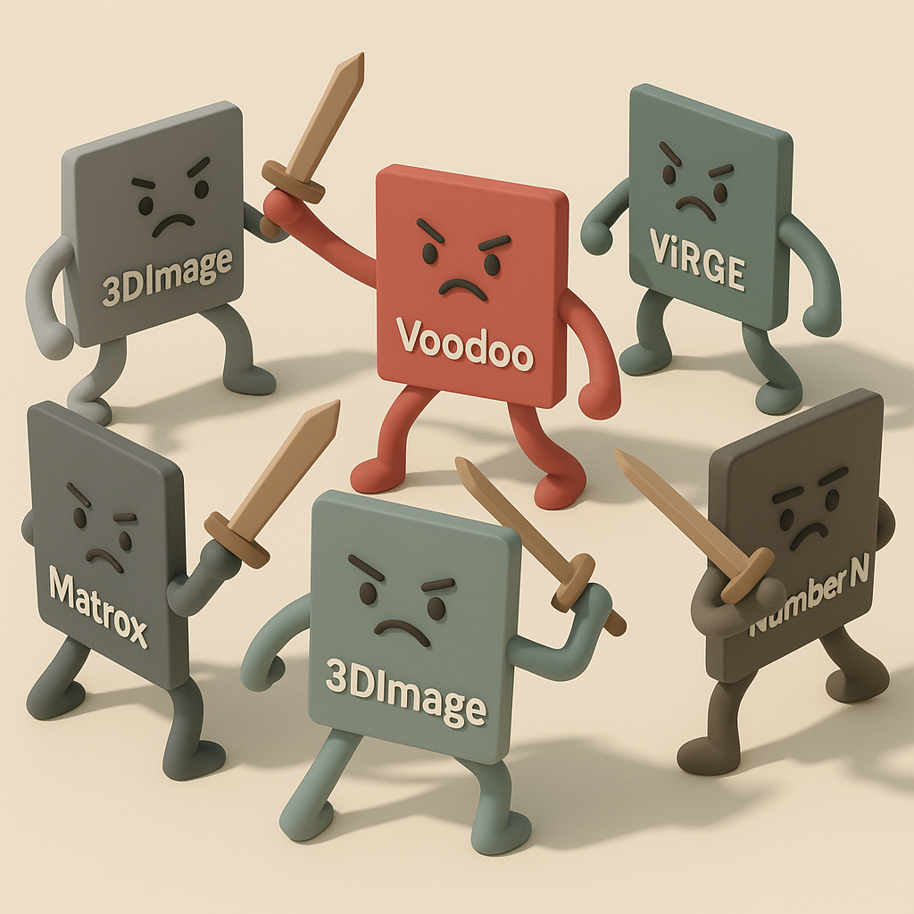

# 【AI】小白话系列——人工智能简史（三十四）

Voodoo 的成功，宛如一声发令枪。1996 年之后，整个行业疯狂了。所有人都意识到，3D 游戏就是未来，就是永不停歇的印钞机。于是，无数的公司带着自己各式各样的 3D 芯片，前仆后继地杀入这个市场，然后迅速地陨落在尘埃里。

让我念念不忘的 2D 时代两巨头之一的 Trident 也推出了自己的 3D 显卡 —— 3DImage 975/985。但灾难性的是，3DImage 系列的产品性能极其差劲，3D 能力几乎可以忽略不计，甚至不如自己的老对手 S3 著名的 「3D 减速卡」ViRGE 系列。

最糟糕的是，他们同样一脚踩进 NVIDIA 跌倒过的那个坑里，驱动程序差劲透顶，几乎所有的游戏都不兼容。当市场新的王者出现时，它的 OEM 老客户（戴尔、康柏等）毫不犹豫地将其抛弃。后来的 Blade 3D 也没有任何回天之力。

它的 PC 图形部门彻底失败，公司被迫转型去做机顶盒芯片，在 PC 市场最终完全销声匿迹。

2D 时代的另一位巨头 S3 则被 Voodoo 彻底唤醒，他们倾尽全力研发了 Savage 系列。不得不说，他们在这款产品上体现出来自己优秀的技术能力。S3TC纹理压缩技术碾压群雄，非常先进，后来甚至被微软纳入 DirectX 的标准。

但遗憾的是，他们同样忽视了驱动程序。Savage 的驱动程序极其不稳定，Bug 漫天飞舞。相比后来稳定发挥的 NVDIA 和 ATI ，玩家们终于失去了信任。

2000年前后，没落的贵族 S3 被正在和 Intel 厮杀的 VIA 看上，将其收入囊中。在边缘市场苟延残喘 10 余年之后，随着 VIA 的失败，它也彻底从 PC 市场消失了。

Tseng Labs（泰升）在 DOS 时代算是 2D 领域的顶尖高手，但是它们的 3D 产品 ET6300 推出实在太慢，完全赶不上。1997 年，他们果断把图形部门卖给了 ATI，断臂出局。

Cirrus Logic，曾经是 2D 时代笔记本领域的巨头，但其 3D 产品Laguna系列 (CL-GD546x) 性能平庸，毫无竞争力，很快在混战中被打败，退出了市场。

Matrox 曾经是 2D 时代画质最强的专业领域王者。它推出了Mystique，G200，G400 等等系列产品。然而，在这场纯粹的 3D 游戏帧率大战中，它们产品的更新速度明显落后于对手，最终也只得退出了主流游戏市场。

Number Nine，另一家高端 2D 显卡厂商，昂贵的产品在 3D 大战中尽显疲态，Revolution IV 既贵、又慢，破产后资产被 S3 尽数收入囊中，并随着 S3 一起消失在历史的尘埃里。

Rendition，曾经是Voodoo早期的最大对手，他的 Vérité V1000 第一个支持《Quake》硬件加速（vQuake）。但后续的 V2x00 性能被 Voodoo2 和 NVIDIA 的 RIVA TNT 彻底辗压，败下阵来。公司后来被美光收购。

PowerVR (NEC/VideoLogic)，它采用了一个非常独特并且先进的技术路线——TBR（Tile-Based Rendering，分块渲染）技术。

和 NVDIA 第一次的失败异曲同工，这个先进的技术需要游戏专门优化，没有厂商愿意做这件事情，在 PC 领域，根本没有它存活的生态。不过，它后来转战移动和嵌入式市场，反而取得了巨大的成功。早起的 iPhone 就使用了它们的GPU。

这场混战持续到 1999 年，被 NVIDIA 彻底终结。

<待续>