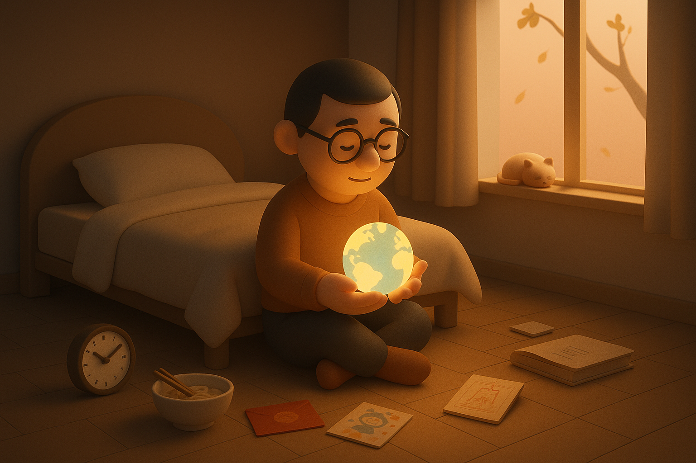

# 【生命⋅修行】知命

这个周末，早上约莫 7 点的样子我就醒了过来。深秋的早晨，即便是在深圳也越来越好睡了。赖在床上，脑子里盘旋着郑渊洁说过的这么一句话：

> 每个人过生日的时候，都应该和自己的母亲在一起。

母亲和父亲远在在江城，这一天不能陪在妈妈身边，至少通个视频吧。这么想着，我便挣扎着爬了起来。

拿起手机，我发现妈妈已经给我发来了一个大红包，她总是这样，赶在我生日这天，出生的那一刻给我一个大红包。我打通视频，她正准备着出门运动，而爸爸还一如既往地在床上呼呼大睡呢。

和妈妈聊完天，大宝已经给我煮好了一碗美味的手工面条。阿宝和大鱼两个宝贝也起床了，拿着他们制作的生日卡片给我晃了一眼，又故作神秘地说要等吃生日蛋糕时才给我看。大女儿 C 也从遥远的地球另一边给我发来祝我生日快乐的消息。

看起来，这就已经算正式地开始自己人生第五十年的生活了。

「圣人」孔老夫子说：

> 吾十有五而*志于学*，*三十而立*，四十而不惑，五十而知天命，六十而耳顺，七十而从心所欲，不逾矩。

过去十年，我一直想知道自己是否已经追上了「圣人」的步伐，对自己的人生观、价值观是不是真的能达到「不惑」境地。然而，按大宝的说法，我现在一给阿宝辅导作业就气得心脏疼，看起来还时常「惑」得很呢。

但不管怎样，这一刹那，是真的有那么一种这张考卷没做完，又一张新考卷发下来砸在面前的感觉。

但是，不管咋样，还是先把辅导作业会生气这一关，过了再说吧……

