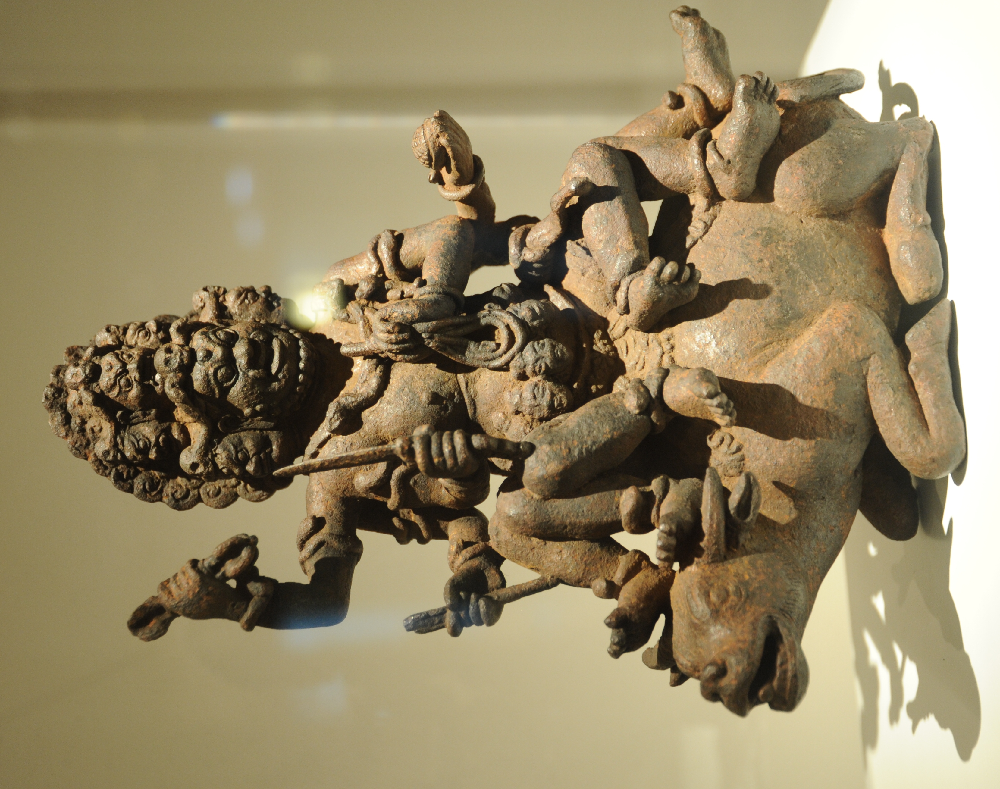
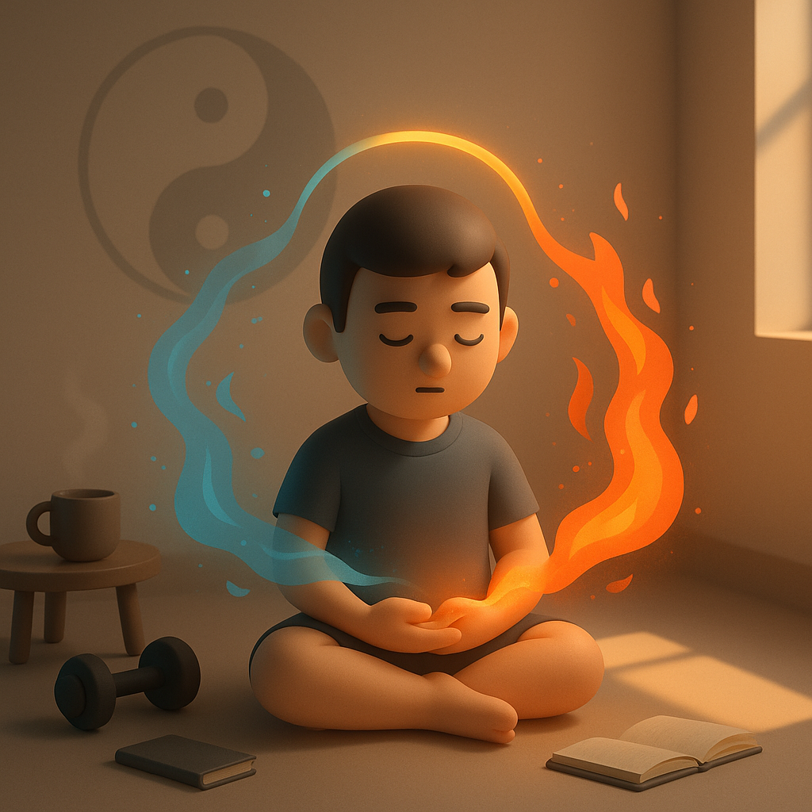

# 【生命⋅修行】更年

前天早上，阿宝有一道作业题需要我去辅导。结果，我进到书房和她说了不到两句话，就变得气哼哼的，跑了出来。

这情绪一上来，先是愤怒，后是低落，连着两天都不能完全消散。

回想着，自己好像近年来火气越来越足，不禁开始怀疑——这是不是「更年期」了？大宝笑我：

> 还指望着你进入「知命」境界，会更睿智呢。结果，还没「知命」呢，你倒先「更年期」了！

怎么办呢？ChatGPT 说，男人脾气变暴躁，通常是因为睾酮（Testosterone）水平逐年下降造成的。它给我的建议是：

> #### 1. **把“运动”当成荷尔蒙电源**
>
> 不是为了健身，是为了“补睾酮”。
>  最有效：
>
> - **力量训练（哪怕很轻，哪怕只有俯卧撑）**
> - 每周 3 次，每次 15–30 分钟就行
>
> 坚持两周就能感到人变“硬气”。

> #### 2. **睡眠就是最强的药**
>
> 睾酮是在 **深睡眠时分泌的**。
>  如果睡不好 → 白天一定火气大。
>
> 真的有必要：
>
> - 晚上不要带手机上床
> - 睡前 1 小时只做放松的事

> #### 3. **少喝酒，别用酒压情绪**
>
> 酒会让睾酮进一步**降低**，反而更烦躁。

> #### 4. **给自己一个“放空的空间”**
>
> 男的也需要 **“谁都不要找我 10 分钟”** 的时刻。

这些事情，我都在做，看来只要继续坚持就好了。然而，在这个当口，我看到了吕波在公众号分享的关于《突破修道上的唯物》的系列文章。

其中有一篇，是讲[创巴仁波切介绍藏传佛教中各种「本尊」](https://mp.weixin.qq.com/s?src=11&timestamp=1763077724&ver=6357&signature=TQcW8kVslZ9pT28svUuahSPUxrGkIgfod4ehRTNjynTdtqqtInWbmJ7pdtSBPzIjL0WtC08xBGpsp9Z*Kra*y5YqH5B3g1WGou6jfTpZ3HatNplgitO9l-6chwsOCajJ&new=1)，「本尊」的形象基本上是两类，或忿怒，或慈祥，象征着两种转换的路径——或者是奋力一跃，或者是循序渐进；而本尊的各种图案与装饰中，又有着与各种根本烦恼与习性，比如贪嗔痴慢疑，比如风火土水的象征。

比如，这个大威德金刚，就是文殊菩萨的「忿怒相」。

聊到这儿，他在文章里说：

> 我不知道大家是否在某一个这样的时刻，曾经生起过这样一种莫名其妙的愤怒
>
> ——我他妈到底在干什么？

我想起自己最近这些常常莫名升起，泼天的怒火和铺天盖地的悲伤，和文章里说的虽然不太一样，却又有着千丝万缕共通的地方。

一直以来，我日常中最主要的方法，就是把这些「情绪信号」，这些让我「受苦」的「情绪信号」当作一个纯粹的「信号」，提醒自己正在「偏航」——或者是在认知上；或者是在行动上，偏离了世界与自己的真相。

然而这段话，却让我意识到，我的这些情绪，不仅仅只是一个信号，更是来自我本身的，特有的「能量」。

然而，要怎么利用这力量呢？

这是我还没有想明白的事情。

发现每日刷多邻国成为自己无意义的执念后，我抛弃了它，任它每天在我的屏幕上花式打滚也不理它。

发现写作也成为让自己痛苦的执念后，我有意无意地停了好几次，但还是不想抛弃它。

大宝说，她曾经因为要带大鱼不能练太极拳很是生气恼火，但最终，她接受了这个现实。然后，有空就练练，自己真正爱好的事情，无需刻意也会坚持下去。

她和我说，你真的喜欢写写写，有精神就早起写上一个小时，没精神就多睡一个小时，怎么样都好！

果然，烦恼即菩提——这「更年期」的烦恼也是一样一样的！

