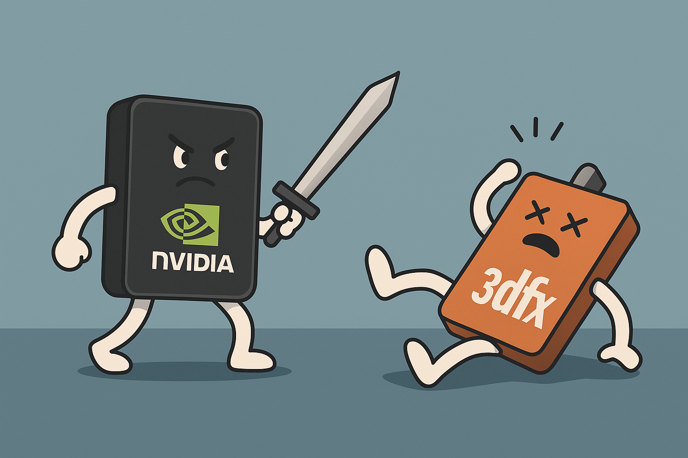

# 【AI】小白话系列——人工智能简史（三十五）

然而 3dfx ，这场 3D 大赛的领跑者，在 Voodoo 1 大获成功后，他们没有停下脚步。1998年，他们又推出了 Voodoo 2，3D 显卡历史上的第一支性能「怪兽」。

就在竞争对手还在努力追赶 Voodoo 的时候，Voodoo 2 的性能却已经翻了 3 倍。这还不算，3dfx 还发明了 SLI **(Scan-Line Interleave)** 技术。只有你有钱，你就可以买两块 Voodoo 2 ，用排线接起来，两块卡交替渲染屏幕上的每一条扫描线——性能直接再翻一番。

这简直就是 PC 玩家的超跑。在那个年代，拥有两块 Voodoo 2 是所有男孩子的终极梦想，绝对是身份的象征。大部分如我们这样的穷小子，只好抱着杂志淌口水……

3D 显卡的市场份额，85% 都被3dfx 所占据，**Greg Ballard** 和创始人们坚信：**Glide API就是标准，3dfx就是上帝。** 一路狂飙卷起的烟尘，让他们看不到身后的竞争对手，也开始看不清脚下的路。

本来，3dfx 的商业模式是只提供芯片，显卡则是由它的伙伴，像创新（Creative）、帝盟（Dimond）、华硕（Asus）等显卡制造商完成的。这些伙伴们制造显卡、做市场推广、分担库存，也赚取相应的利润。

 **Greg Ballard** 和高层们看着财报，贪心蒙蔽了心智。他们想，85% 的市场份额，如果不只是芯片，而是连同显卡也都是 3dfx 的，那岂不是完美？

于是，1998 年 12 月，他们走出了致命的杀招——只不过是自杀——3dfx 斥资 1.41 亿美元收购了墨西哥的显卡制造商 **STB Systems**。

大众哗然，创新（Creative）、帝盟（Dimond）忿怒地转身拥抱英伟达，干脆地和 3dfx 决裂。3dfx 的全球销售渠道就这么被自己斩断了。

3dfx 也从一家轻资产的高科技设计公司，陷入了重资产的泥沼——工厂、库存、渠道、售后——每一样都需要投入巨大的精力与资金。而STB 效率低下的工厂，让后续的产品上市时间也开始一拖再拖。

隐藏在烟尘中的竞争对手，其实就追在 3dfx 身后。差点从 NV1 惨败的死掉的英伟达（NVIDIA），开始老老实实地抛弃所有非主流想法，抱上微软的大腿，全面支持 Direct 3D，在 1997 年，它推出了 Riva 128，奋起直追。

虽然 Riva 128 的性能不如 Voodoo，但是黄仁勋巧妙地找到了自己的细分市场，在 2D + 3D 二合一的显卡世界里，它是最快的存在，而且便宜。

于是，凭借着这个优势，黄仁勋拿下了戴尔等 OEM 大单，终于赚到了足以复活的第一桶资金。但显然，此时此刻，傲慢的 3dfx 眼里根本看不见 NVIDIA 的存在。

收购 STB 背刺了所有伙伴的 3dfx 将咽喉袒露在竞争对手面前却还浑然不觉，然而 NVIDIA 的工程师们没有丝毫的犹豫。他们恪守着黄仁勋从破产边缘缓过来后所提出的铁律—— 6个月一代新产品。在1998年下半年，推出了**RIVA TNT** (Twin Texel)。

与此同时，黄仁勋提出了著名的「雷管 (Detonator)」驱动策略。通过不断优化驱动程序，TNT的性能在几个月内猛增，逐渐逼近了Voodoo 2。不仅如此——TNT支持**32位真彩色**和**1024x768以上的高分辨率**。

虽然当时跑32位色很慢，但NVIDIA再次给3dfx 垄断下的市场撕开了一个小口子：

> 3dfx的画面是过时的，我们才是未来的画质标准。

凭借着紧追在 Voodoo2 身后的性能，以及从 3dfx 阵营投靠来的华硕、创新、帝盟等等强大萌芽，英伟达已经具备了一剑封喉，杀死对手的实力。

但 3dfx 浑然不觉。

1999 年 4 月，Voodoo3 是 3dfx 转型后的第一款产品。本质上，它只是一个高频板的 Voodoo2。不支持32位色，也不支持大纹理。3dfx 的工程师傲慢地辩解：

> 32位色只比16位色好看一点点，但会消耗大量显存带宽，降低帧率。玩家要的是速度，不是那些肉眼难辨的颜色差异。

英伟达没有放弃这一剑封喉的机会，几乎在同一时间，英伟达推出了 NVIDIA (RIVA TNT2)：

* 速度上，TNT2 Ultra 版本在核心频率上疯狂飙升，超过 Voodoo3。
* 画质上，TNT2 完美支持32位色和超大纹理。

此时，此时，此时——《Quake 3》即将发布，卡马克大神表示新引擎将**重度依赖32位色**。成也雷神，败也雷神，这句话直接判了Voodoo 3的死刑。

玩家们开始意识到：**3dfx落伍了。**

正如毛泽东当年所说：

> 谁是我们的敌人？谁是我们的朋友？这个问题是革命的首要问题。

3dfx 没弄明白这个问题，但英伟达弄明白了。

于是，战斗已经结束。剩下的事情，只是打扫战场罢了。

<待续>