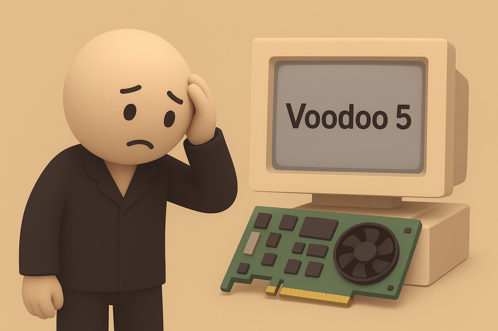

# 【AI】小白话系列——人工智能简史（三十六）

因为和世嘉游戏机合作的技术细节被泄露，日本人最终为他们新一代的游戏机 Dreamcast 的GPU选择了NEC/VideoLogic的PowerVR芯片。这给 3dfx 带来雪上加霜的声望打击。

3dfx 急了，它们需要反击，于是开始了代号 Napalm 的新架构产品研发。但是，过去的成功路径，成为了他们此刻最为严重的阻碍——它们的 VSA-100 没有任何新的功能，还是在用老旧的架构死磕速度。但速度也不行，于是一颗芯片不行，他们就暴力地堆两颗、四颗。

VSA-100的良品率始终上不去，导致 Voodoo 5 一再跳票。一直等到2000年中，他们才拿出了 Voodoo 5 ，然而，此时的 Voodoo5 更像是一个笑话：

* **Voodoo 5 5500：** 双芯片卡。体积巨大，功耗惊人。很多机箱都放不下它，而且它还需要自己外接电源。
* **Voodoo 5 6000：** 一张卡上集成了四颗 VSA-100 芯片。需要一个独立的外接变压器供电——Voodoo Volts。这个荒诞的怪兽从未正式量产，沦为收藏界的绝响。

在这一年里，NVIDIA 先是在1999年四月抛出了重新定义行业的核武器——GeForce 256。黄仁勋第一次提出了 GPU **(图形处理器)** 的概念。在这张卡里，集成了硬件的光照与变化引擎（T&L）。

在以前，就是我初学图形编程时，程序里那些把三维坐标转换为屏幕上二维坐标的向量计算，都是 CPU 的工作，显卡只负责把颜色填上。现在这些工作，GPU 也能干了——小学生集群升级成了中学生集群。

于是，在支持 T&L 的游戏里，GeForce 256 的性能碾压所有的显卡。它不仅仅打败了 3dfx，更是从架构上彻底颠覆了整个行业的认知。

接着，6个月后，黄仁勋军团又拿出了更为强大的 GeForce 2 GTS。Voodoo 5 刚准备上市，就已经落后了对手两代：价格贵、体积大、功耗高、性能差、功能上还缺胳膊少腿（没有 T&L）。

产品卖不出去，现金流断裂，STB 工厂成了巨大的包袱，它再也爬不起来了。2000年12月15日，3dfx宣布即将破产。**NVIDIA** 宣布以 **7000万美元现金 + 100万股股票**（总价值约1.1亿美元）收购 3dfx 的核心资产。

NVIDIA 不仅干掉了 3dfx，更是席卷了整个 3D 显卡市场。除了唯一的一只，打不死的小强。

<待续>