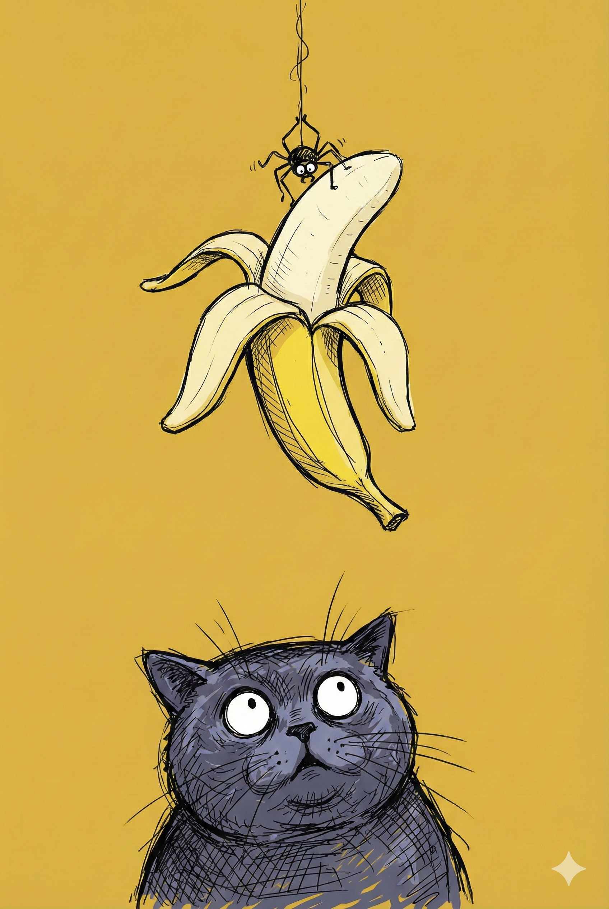

# 【随笔】聊聊 Gemini Pro

那天，在犹豫几个月之后，终于因为某张信用卡的失窃事件，停掉了GPT Plus 的订阅。已经记不得它在使劲儿挽留我时，我填的啥理由了。只记得，转头在打算请 Gemini 帮我梳理 GPU 历史时，我顺手叉掉了下面那个小小的、不起眼的提示——

> 模型已切换到最新的 Gemini 3 Pro Thinking，请尽情尝试吧……

我记得上次 Nano 和 Veo 刚推出新版本时，我还兴奋地把玩了一下，但最终大致上是失望的——在我自己的场景里，它们是不够让我满意的。所以这次，我几乎无视，在叉掉它时，连那行字的完整内容都没读完。

然而，紧接着的两天，我就看见了网上铺天盖地惊叹！各种角度，各种膜拜，让我不得不对 Google 又刮目相看了几分。但是，这几天在我自己的使用场景中，我并没有感受到有多么地不同。深度调研依旧比 GPT 好那么一点点，但没有感受到和 2.5 的巨大差别，其他使用场景更是如此——翻译、以及那些随手问的问题——比豆包、DeepSeek 也没多大差异。

主要，我也并非时刻拿着着同一个问题，来回比较不同模型的产出质量。使用 AI 工具已经成为我日常工作的一部分，但选择用哪个，我却只是基于一种习惯和随性。

在那些鼓噪的文章中，大多数人盛赞的主要还是各种跑分，以及一句话生成一个完整游戏、完整应用的惊艳和夸张。

我想，既然 Gemini 最强的在这些地方，我不如试试让它给我写游戏吧？二十年前，我第一次看完《三体》就想要做的游戏——

> 一个完全计算机运行的模拟宇宙，推演对比究竟是「猎人」还是「圣母」更适合在「黑暗森林」的宇宙中生存。

意料之外，又是情理之中的——这一个念头，占用了我接下来连续两天的业余时间，以及睡前躺在床上胡思乱想的时间。

只一句提示，Gemini 果然就生成了一个完整的单页 HTML 游戏，但是，想要把它修改得和我心目中完全一样，却历经了上百次改动而未遂。和以前持续进行某个角度的深度研究一样，这种密集，大数据量的持续交互，直接冲垮了 Gemini 的上下文记忆空间，它同样在大约三四十次版本修改后崩溃、混乱了。

就在我以为自己已经用重启三次会话的策略，得到了一个自己想要的游戏时。我让它重新 Review 了一次我的代码，却发现一个重要的，规则上的 Bug ——

> 它竟然没有给每个文明开启记忆功能，而是让它们每一轮都重新地、随机地再次探索黑暗宇宙……

我想象了一下，要完成我心中这个不大的游戏构想，可能还得再一次推翻重来，把宇宙规则和游戏规则构思得更严谨一些才行。

于是，又是连续几个小时，以及晚上上床后忍不住地「大脑运转」。我忽然意识到，自己在持续和反复思考同一个问题后，其实出现了和 Gemini 类似的混乱状态！

我的上下文记忆，其实也和它一样脆弱！只是阈值略略不同罢了！

……

再去看网上盛赞 Gemini 的文章，我意识到了一个严重的问题——其实不长 Gemini 不行，而是我这个使用 AI 的人类，造成了 AI 发挥的上限。

Gemini 当然有它的能力上限，但除了上下文记忆这个硬伤，它大模型内部的能力，其实大多已经隐藏在我当下力所不能及的虚空中了。

