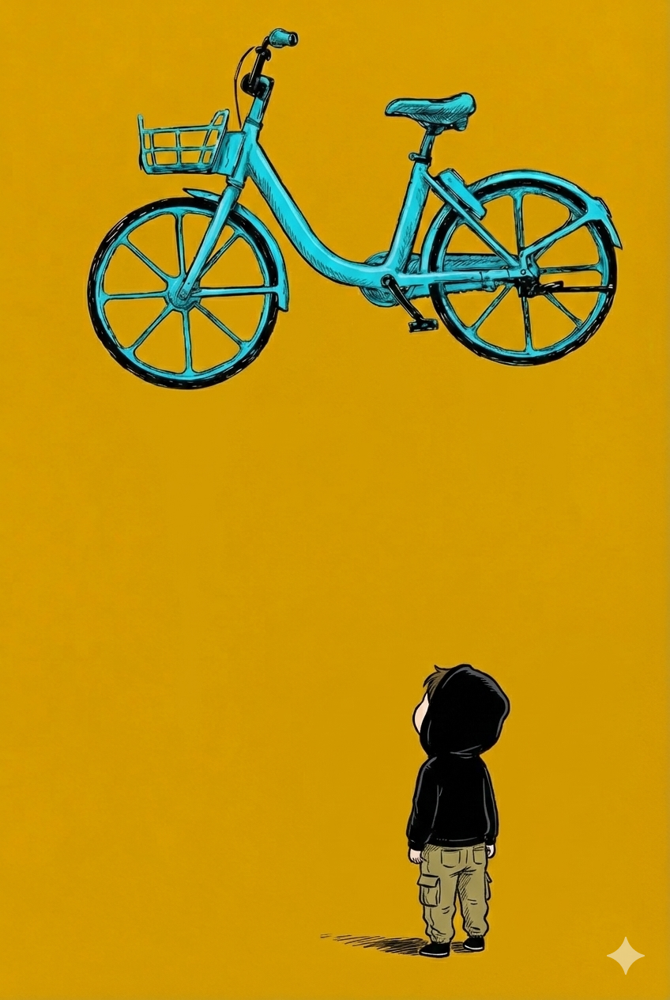
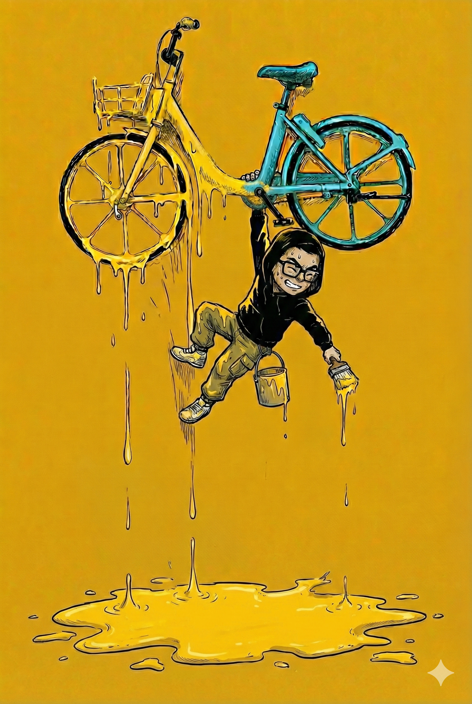
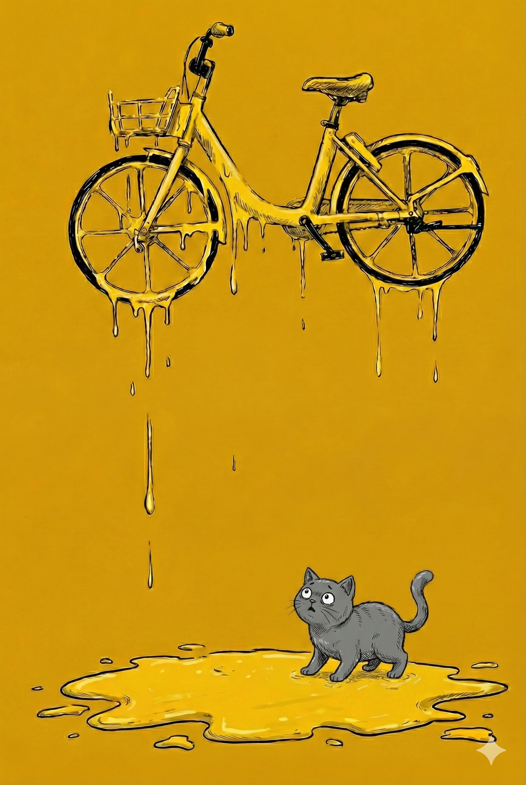

# 【生命⋅修行】美团vs.青桔

我对青桔自行车终于忍无可忍了——当然，之前使用「企业滴滴」时造成的困扰同样算在了它头上——在小程序留下一篇长篇差评之后，我决定彻底和它拜拜。

因为，我意识到一件事情：这几个月来，青桔可能贡献了超过一半以上的「不快」事件，主要就是找不到自行车，停车被收调度费，停车不成功被收超时费，碰上极烂的自行车，小程序又慢又难用，投诉和处理渠道主打一个尽量让你难以解决自己放弃。但这些事情一而再，再而三的发生。

而我居然一忍再忍，之前还给它们提意见，后来决定不给任何反馈任它烂掉，但我一直继续用青桔，每次被错误扣费后都死乞白赖尽可能想办法投诉找回我的钱，虽然几块钱并不多。但我用青桔的初衷，不就是因为买了一张百来元的年卡，想要省钱吗？

我忽然想通了：省钱不是为了开心吗？可是，和这家企业打这小小的交道，就贡献了这么多不开心，我何必呢？为了几十块钱不到两百块钱而已？

作为一个每天要骑四次自行车的高频用户，我意识到自己这无谓的执着，决定换回美团。本来还想贪便宜，在闲鱼上淘一个，后来发现其实和官网价格差不太多，都是一个月16块以上，19块不到，索性直接在官网买了一个每月自动续费的套餐。

第一次，可巧扫到的是一辆崭新的美团，顺滑调节的座椅，灵敏的刹车，车身轻巧操控丝滑，顿时找回了骑行的快乐。我真是后悔，为什么不在第一次被青桔困扰的时候，果断止损换回美团呢。

为了一百多块钱，给自己带来那么多苦恼，还真是不值啊！

……

手机里有两张不同公司的骑行卡，我甚至感觉自己更加自由了。

有一天，我发现了那一排青蓝黄色的自行车中，最新的是一辆青桔，果断扫码，结果你猜怎么着？

骑得非常满意！

我顿时意识到，自己之前对青桔，乃至滴滴的愤怒也是自己的偏颇。我在内心里一次又一次地恶狠狠诅咒这种公司应该早点倒闭，早点从我身边消失，实在也是一种情绪化的反应。

这家公司，就是便宜且差的一种存在，想要占它的便宜，就要忍受它的差。我的全部愤怒，都来自于对它和自己需求的误解和错配。

离开青桔，重回美团，顺便看清自己的内心，真是一件快乐的事情。

