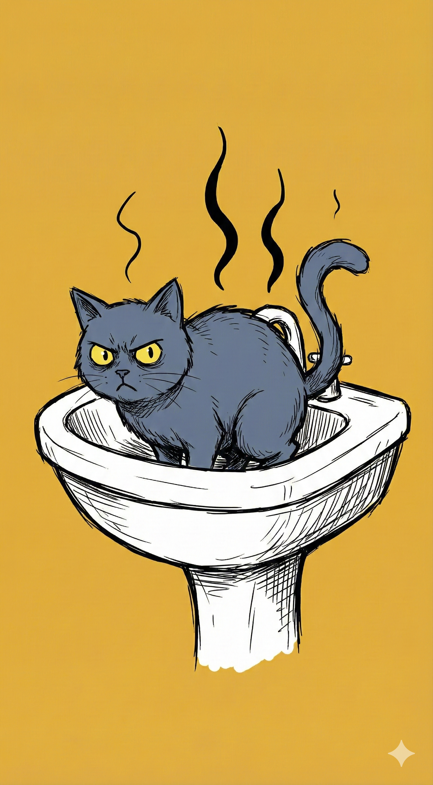
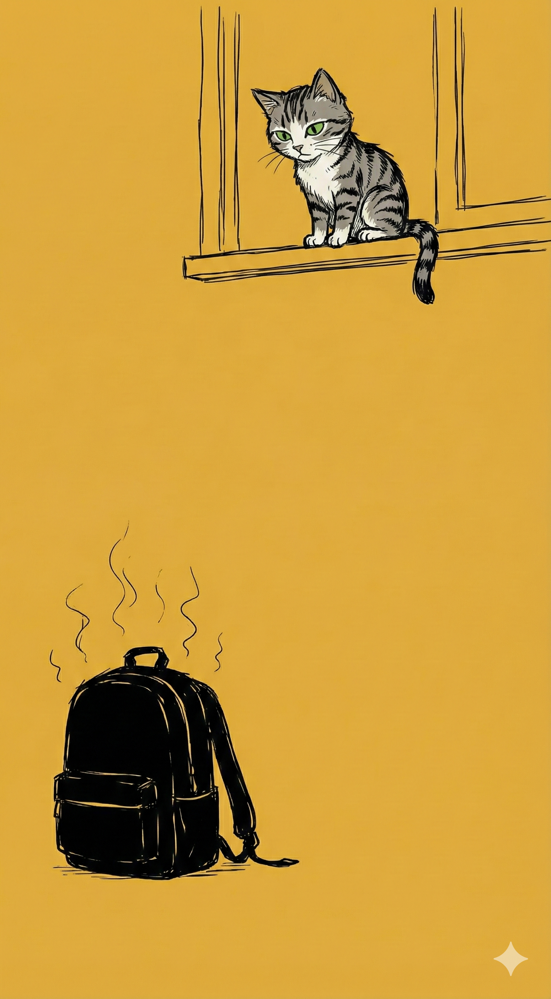

# 【随笔】千万不要相信猫咪

不知道是不是因为出生「猫舍」，有所谓「贵族血统」或者是从小有着良好的教养，Cup 猫到我们家以来，从来没有到处乱拉过屎尿过。

以至于，就算它到了发情期，我们发现它唯一出格的表现就是半夜里嗷嗷乱叫，我们也没有动过心思把它「咔嚓」掉。甚至，还费心给它找过一个女朋友，妄想着给它留下个后代。但是——它在折腾了两三天，弄了一屋子毛的情况下，遗憾地配种失败了。

不过，我们还是把它的小铃铛保留了下来。甚至在收留小椰子，然后小椰子发情开始在家里到处乱尿时，我们还表扬 Cup——说它果然是从小家教严格的猫咪，就算发情也不乱尿尿。

后来，我们放了野性十足的小椰子，让它出去浪了。Cup 依旧陪着我们，表演它居家乖猫咪的角色。但，没想到的是，意外出现了。

去年深秋，我们收留了小玉。

然后，到了冬天，我们回湖南，父母在深圳帮我们看守着猫咪。借鉴一辈子的他们，猫砂用完，他们也舍不得告诉我们要买新猫砂，自作主张地用一堆碎报纸给它们布置了猫砂盆。

Cup 没搞明白，以为这臭哄哄的猫砂盆被废弃了，开始在家里另找拉屎的地方。也许，它经过多年观察，意识到人类都是在卫生间处理自己的五谷轮回问题，它也在卫生间找到了自己的新厕所。

只不过，马桶边缘太窄，脚感不好，它选择的地方居然是——洗脸盆！

这下，Cup 可打开了新世界。它终于发现——原来不一定需要乖乖， 在猫砂盆拉屎。

于是，等我们回来深圳，虽然给它们换上了干净的新猫砂盆，它还是会跑去卫生间的洗脸盆里拉屎。我气得跳脚，教训了它好几次，它依然不能领会。搞得我只好离开卫生间，就在洗脸盆上放一个凳子，封死它的落脚点——而一旦哪天忘记了这件事，只要猫砂盆稍微清理不及时，它一定会给你在洗脸盆里留下几团味道深刻的猫屎坨坨。

……

从此，它再也不是那只发情期也绝不会乱尿的英伦绅士了。

这还不算结束。

眨眼之间，小玉也长大了。它也是一直小公猫，而它第一次发情，就像小椰子当年一样，开始四处乱尿。

但糟糕的是，因为我们之前一直放任它穿过卧室，去阳台吃它喜欢啃的各种花花草草。它毫不犹豫地把我们的床、枕头、堆着衣物的沙发当作了用尿液宣誓主权的场地……

气得我们！¥%！@#¥#¥……

然后，我们把小玉抱到宠物医院，咔嚓一声，医生刀起铃铛落。

……

但是，世界并没有因此消停。

只要一个不小心，卧室门没有关好，猫咪一定会窜到床上，用一大泡那和化学武器一样浓烈的液体，重新宣誓主权。一开始，我们以为只是小玉，后来才发现，Cup 也是罪魁祸首之一。

甚至有一次，忘记关门只不过几分钟的功夫，Cup 竟然在枕头和被子上，给我们奉上了一团和着猫尿的猫屎疙瘩。

一开始，我们几乎次次暴跳如雷。到后来，我们竟然可以偶尔做到不惊不乍地，只是直接抱着枕头被子去阳台，清理它们的痕迹。然后提醒孩子们——关门！记得关门！！不然要把猫咪扔掉哦！！！

就在我以为，世界达成了一个新的动态和平时，意外再次发生。

……

有一天上班，坐在办公室里，我依然能够闻到若有若无的猫尿味儿。我像狗一样趴在桌子上四处闻了一圈，才发现，自己的电脑包也被不知哪只猫咪做了记号。

天呐！它们不是从来不在我们的包上尿尿的吗？

回来告诉大宝，大宝同情地说：

> 天呐，坐你周围的同事们，这一天是怎么渡过的哟！

认知再一次被打破。

真是！记住！千万不要相信猫咪！！！

