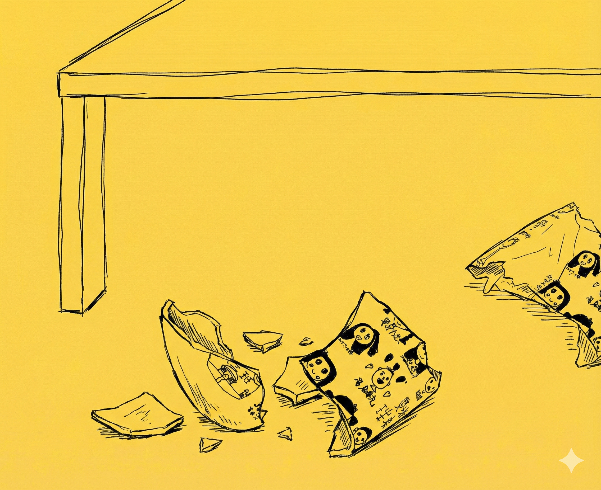

# 【生命⋅修行】迟早会摔碎的瓷器

接近下班的时候，猛然焦虑起来——一堆要做的事情都没有完成，甚至都没来得及在自己的小本子上把它们梳理清楚。

而这焦虑感，直接从脑海里挖出了更多被自己拖延，却一直埋在心里想做却没做、或者没做完的小事——比如，把 DreamHost 上出问题的 WordPress 修复，省下每月的 5 美金「插件维护费」；比如把大鱼的积木赛车拼装完毕；比如修家里的水龙头；比如修大鱼的遥控跑车；比如研究一下那个坏掉的小爱同学……

我想起前几天，也是突然袭来的情绪，当意识到自己——可能做不完自己想做的工作时——一股浓烈的，想哭的情绪猛地涌上头。我意识到，这和阿宝做不完作业大哭时的状态没有任何区别，和童年的我到深夜也做不完作业时大哭也没有任何区别。

当时，我起身转了一大圈，也没能缓解那突入起来的悲伤。

于是，我想到，几乎所有那些积压在心里的小事，其实只对我自己有意义。如果我此时此刻死去，这些事情大概率是根本不会有人再去做它们了……或许，那个待修的水龙头除外吧。

于是，我洗了把脸，挑了一件 Deadline 是 12.1 日的事情开干……

……

半夜里，我听见小玉在客厅里钻进塑料袋疯跑，接着传来一声清脆的瓷器碎落的声音。

我一惊，心想：

> 完了！阿宝幼儿园毕业的纪念马克杯一定被摔碎了！

我很喜欢那个杯子，阿宝也很喜欢，那是她幼儿园毕业的纪念品，上面印着全班同学和老师的自画像和签名。每次给那杯子加水，看着那杯子上那些稚嫩的笔迹，就觉得可爱至极。

我告诉身边睡得迷迷糊糊的大宝我的猜想，她却声都没有吭。我又问她：

> 要不要去看看？

她却依旧呼呼大睡。

我从吃惊与伤心的情绪中稍微缓回来一点，决定忍住自己要出卧室查看的冲动，继续睡觉。是的，无论查看与否，都无法改变阿宝那个杯子摔坏或是没有摔坏的事实。

……

早上起来，果然是阿宝的杯子被摔得稀烂。昨晚放在餐桌上没有收拾，现在躺在客厅已经破破烂烂的外卖塑料袋，想必是造成这一切的第二元凶。我揍了跑过来跟着我查看现场的小玉一巴掌，它赶紧识趣地跑开了。

再喜欢这个杯子也没有用，摔了就是摔了。

而且，瓷器被摔坏是它们的宿命，哪怕是那些被珍藏的古董——经过数千年，能完整保存下来的寥寥无几，而且从概率上来说，将来它们一个都不可能完整地留不下来。

生老病死，成住坏空——无论是生命，还是那些被生命倾注了意义的小物件——都逃不过这自然规律。

我们能做到，只有好好珍惜、享受这每一个与他（它）们共处的，必然逝去的瞬间吧。

