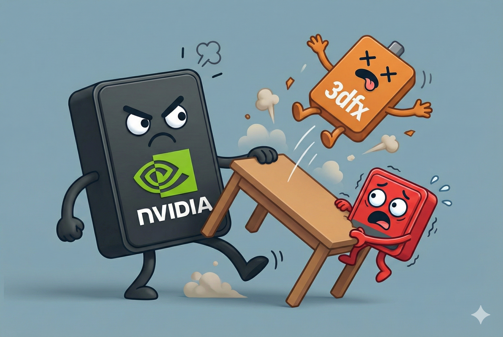

# 【AI】小白话系列——人工智能简史（三十七）

让我们把时间再拉回到 1985 年，三位来自香港的华人：何国源 (Kwok Yuen Ho)、Benny Lau、LEE KA LAU (刘理凯) 在加拿大多伦多创建了一家叫做 Array Technology Inc. 公司，简称 ATI.

在整个 80 年代，他们简直就是一个包工头，什么都做。「只要你肯下单，我就给你做出来」，从图形芯片，到 I / O 芯片，甚至网络接口。这给他们攒下了第一桶金，也为他们和各家 PC 建立起了牢固的合作与信任关系。

到了 90 年代，Windows 3.x 的多媒体个人电脑开始兴起，S3 如日中天，他们逮住一个市场空隙，推出了 2D + 视频加速的全能显卡。市场定位比 S3 更高端（难怪当年我对他们印象不深刻），这让他们牢牢占据了「二当家」的地位。

Voodoo 的横空出世，震惊了所有 2D 显卡厂商，和 S3 一样，ATI 仓促应战，然而万幸的是，他们的工程师团队技术底子更加扎实，仓促中还是拿出了一款基本凑活，有那么一点 3D 加速能力的 3D Rage II。这比S3的「3D减速卡」可强太多了！

由于 Voodoo 是一张纯粹的加速卡，而各 PC 大厂还是需要一张能解决所有问题的 N 合一（2D + 3D + 视频）显卡。在烂中选优的淘汰赛中，ATI 的3D Rage Pro 战胜了 S3 和 Trident，成为了唯一且最好的选择——凭借着不错的 2D 性能，优越的视频能力，凑活的 3D 加速能力—— ATI 在 Voodoo 的碾压和玩家的嘲笑声中，竟然通过 OEM，赚了个盆满钵满。

ATI 趁机继续充实救活自己的工程师团队，他们在 1997 年收购了Tseng Labs (泰升)的图形部门。这次收购，冲着的是那创造出 DOS 时代的 2D 速度之王的工程师团队。

有了这支才华横溢的工程师团队加入，花着通过 OEM 赚到的充沛现金，ATI 在 1998 年底推出了自己的翻身之作——Rage 128。

这下子，它们终于可以在性能上硬刚市场上斗得正欢的两位主角：NVIDIA 的 Riva TNT 和 3dfx 的 Voodoo3。连苹果也选择了Rage 128 作为 Power Mac G3 的标配显卡，这一下，ATI 名利双收！

1999年10月，ATI 正喘着气，以为从此可以三足鼎立的时候。黄仁勋一拍桌子，扔出了王炸—— **GeForce 256**。

「GPU」概念从此横空出世，所有的厂家，无论是 3dfx 还是 ATI，全都傻眼。它们再一次措手不及，谁都没有硬件 T&L（变换与光照）的能力，眼睁睁地看着英伟达横扫整个市场。

<待续>

