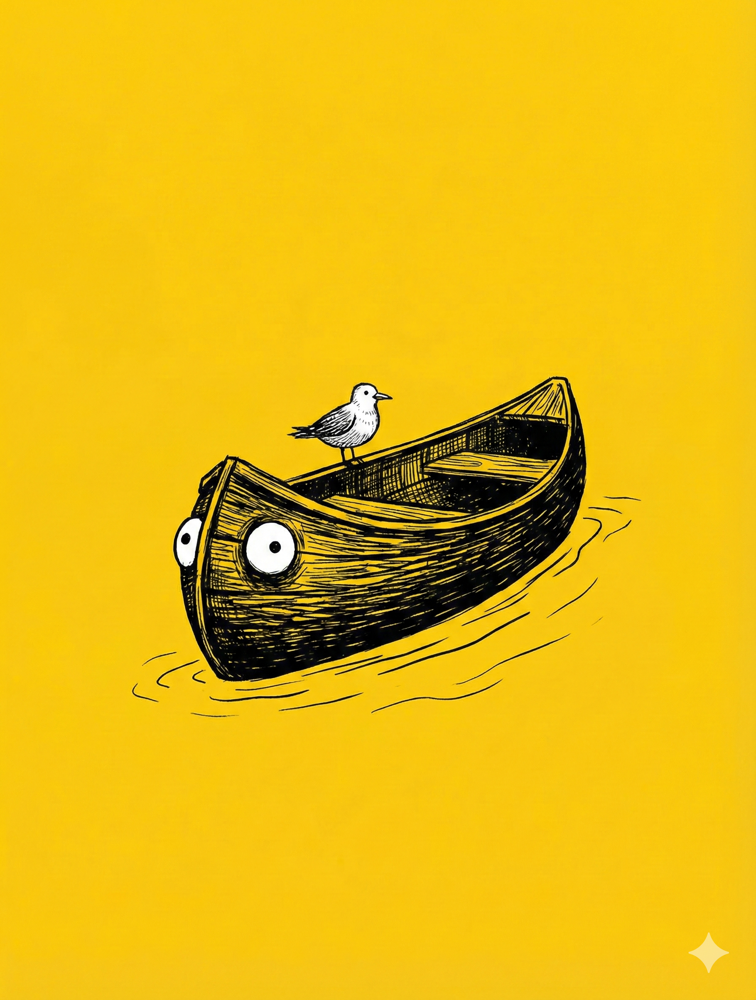

# 【生命⋅修行】空船

似乎自己正在一个想要触碰，又想要逃避的「念头」边缘。开始只是因为有一天早上，大宝不经意地顺嘴问了我一个问题：

> 你为什么总是给自己安排那么多做不完的任务和事情呢？

然后，我鬼使神差地想，为什么不让拥有几乎全人类知识的 Gemini 来给我做个心理分析呢？我甚至不想用那些角色扮演之类的提示词，生怕限制了它的发挥。我直接让作为一个拥有全部人类知识储备，并且有丰富的心理咨询经验，能敏锐洞察一个具体的人类内心的心理咨询师和我对话。

然后，我把那个问题抛给了它……

写到这个开头时，我非常想把这个对话过程都贴出来。但是，我打开 Gemini，找到那段历史对话，却发现：

最早的历史对话，是我说：

> 真的谢谢！

而这四个字之前的所有对话，却怎么也找不到了。

我记得，那绝对不止一轮对话。然而，最后戳中我泪点的，却是那句——「你恐惧、你不敢做一个平庸，一点都不特别的人！」

而这句话，从最开始看到时的一点点的「泪崩」，到后来的「释然」，没想到经过几天的酝酿，居然变成了一场在内心深处铺天盖地、充满忧伤的风暴。

大宝和阿宝都说我变得怪怪的，出现许多让他们无法理解的暴躁和 Emo 时刻—— 虽然，阿宝并不懂 Emo 是什么梗，但她还是欣然认可了妈妈用在我身上的这个词儿。反正，这段时间我的状态，离她们印象中的好爸爸和好老公，似乎有那么点不搭。

……

而这场内心里的情绪风暴，我甚至都不知道应该怎么去表达出来。不用说，大宝和孩子们也能有所感觉。但无论是打开电脑，还是拿起我的日记本和钢笔，却怎么也找不到合适的文字来承载。有时候，拿起尺八，脑子里就会冒出一些代表着内心情绪的旋律，才刚刚吹出几个音符，刚刚找到点共鸣，就会因为自己的不熟练，发出一个想象之外的声音……于是，怎么也不够痛快。

而我甚至都搞不清，自己究竟是想把这情绪表达出来，还是压根就不想要这情绪。

这些混乱的念头，缠绕在脑海里，缠绕在心里，不知道用什么来形容和描述它们。如果说它们有颜色，那一定是一些铅灰的色彩；如果说它们有声音，或许尺八的低鸣正好与它们相和；如果说想看清它们是什么形状，却似乎只是一些黏糊糊、湿漉漉完全无形无状的雾霾而已。

直到我又一次读到《庄子•山木》里那则空船的寓言，我忽然明白，自己不过是再次从偏执的一端坠入另一端而已——一时火，一时冰；想当「超人」时，是在用火灼烧自己；殇于「平庸」时，是在用冰冷冻自己：

这些情绪痛苦的背后，只有一个原因，那就是自己再一次错看了真相——错看了自己的真相。

我并没有看到，也没有接受自己本来的样子！

以下是《空船寓言》的原文和我的解读……

----

> 市南宜僚见鲁侯，鲁侯有忧色。市南子曰：「君有忧色，何也？」鲁侯曰：「吾学先王之道，修先君之业，吾敬鬼尊贤，亲而行之，无须臾离居，然不免于患，吾是以忧。」

市南子见鲁侯，鲁侯不开心——就好像我那样不开心。市南子问他为啥？鲁侯说：我兢兢业业，修行操持，却还是有各种麻烦，灾难。所以我愁啊！鲁侯愁的样子，简直可以说和我忧心自己 Todo List 上那些做不完的任务清单时，一模一样。

> 市南子曰：「君之除患之术浅矣。夫丰狐文豹，栖于山林，伏于岩穴，静也；夜行昼居，戒也；虽饥渴隐约，犹旦胥疏于江湖之上而求食焉，定也。然且不免于罔罗机辟之患，是何罪之有哉？其皮为之灾也。今鲁国独非君之皮邪？吾愿君刳形去皮，洒心去欲，而游于无人之野。南越有邑焉，名为建德之国。其民愚而朴，少私而寡欲；知作而不知藏，与而不求其报；不知义之所适，不知礼之所将；猖狂妄行，乃蹈乎大方；其生可乐，其死可葬。吾愿君去国捐俗，与道相辅而行。」

市南子说鲁侯用来解决问题的那些修行方法不行，太流于表面了。那狐狸和豹子，在山野之中，居能静，行有戒，心能定，但还是免不了灾祸，为啥呢？因为那身毛皮啊！而鲁侯的皮，就是鲁国。于是劝鲁侯舍去这惹祸的毛皮，追寻大道，去往那所谓「建德之国」的理想国土。这「建德之国」，显然是个精神乐园的比喻，这愚朴的建德国民，显然是修行有成之人的状态。

> 君曰：「彼其道远而险，又有江山，我无舟车，奈何？」市南子曰：「君无形倨，无留居，以为舟车。」

鲁侯听懂了，便顺着这个比喻问，这修行太难，而且我还有江山社稷要打理，我也不知道有什么修行方法，怎么才能修成呢？市南子说：别端着那傲气，别守着那执念，就是修行。

> 君曰：「彼其道幽远而无人，吾谁与为邻？吾无粮，我无食，安得而至焉？」市南子曰：「少君之费，寡君之欲，虽无粮而乃足。君其涉于江而浮于海，望之而不见其崖，愈往而不知其所穷。送君者皆自崖而反，君自此远矣。故有人者累，见有于人者忧。故尧非有人，非见有于人也。吾愿去君之累，除君之忧，而独与道游于大莫之国。方舟而济于河，有虚船来触舟，虽有惼心之人不怒；有一人在其上，则呼张歙之；一呼而不闻，再呼而不闻，于是三呼邪，则必以恶声随之。向也不怒而今也怒，向也虚而今也实。人能虚己以游世，其孰能害之！」

鲁君简直就是我的替身，他又说出了我内心最大的两个恐惧。他说，要是我这样修行，结果：

1. 没人爱我，没人关心我怎么办？
2. 没有钱，没有粮，活不下去怎么办？

市南子说：

1. 你活下去也花费不了多少。
2. 你也不用求着别人爱。

修行是一条少有人走的路，甚至是一条孤独的路，独自行走的路。任何人，包括我，最多也只能陪你到崖边，剩下的路全靠你自己走。你必须明白，你终究需要彻底斩断对他人的依赖，承担起对自己全部的责任，独与天地相往来。

当然，其他人也一样，他们的修行终究也是他们自己的事情。

如果你把别人的责任硬抢过来，扛在自己身上，你就会累。而你一看着这些被你抢了自己责任的人，你就会愁。

最后，市南子说了那个著名的「空船」寓言。

你正在渡河，一只船撞了你的船。你一看，那船上没人，即使你是个脾气暴躁的人，你也**不会发火**。但假如那船上有人，你立马就会大喊：「喂！怎么搞的？」喊一声不听，喊两声不听，第三声恐怕就直接开始骂娘了！

同样是你，同样撞船，为什么一个骂，一个不骂呢？

所以啊！

**人能虚己以游世，其孰能害之！**

把自己放空，做一只「空船」，在这世间的河流上尽情游玩，谁会、谁又能伤害你这艘「空船」呢？

