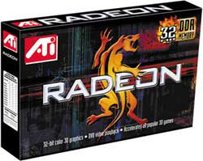
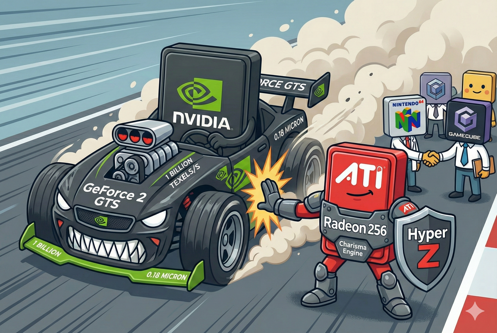

# 【AI】小白话系列——人工智能简史（三十八）

凭借 GeForce 256横扫市场的黄仁勋率领英伟达团队，毫不犹豫地将油门一踩到底。

他们推出了 GeForce 2 GTS (Giga-Texel Shader)，这名字里的 Giga 代表着它每秒钟可以处理 10 亿个纹理像素。这不是什么架构革命，根本就是一次「暴力堆料」。和 3dfx 用「暴力堆料」进行失败前的垂死挣扎不一样，黄仁勋这次摆开的是那种「宜将剩勇追穷寇，不可沽名学霸王」的气势：

- 它使用了当时最先进的 **0.18 微米工艺**。
- 它单纯地把频率拉高、管线加倍。
- **结果：** 性能极其残暴。

.jpg)

再一次，英伟达对市场上仅存的竞争对手们，进行了降维打击。黄仁勋的「6个月铁律」——每6个月发布新产品，每12个月进行架构换代——正是在这一时期确立并持续贯彻了下去。这种「极速迭代」直接拖垮了几乎所有试图追赶的竞争对手。

除了那只打不死的小强——ATI。

ATI 不是第一次被击倒，上一次，它们凭借 Rage 128 在 Voodoo 的暴击后重新站了起来。这一次，历史再次重演：

到了 2000 年夏天，它拿出了 Radeon 256，具备了 Charisma Engine —— ATI 版硬件 T & L（坐标转换和光照引擎） 。与此同时，它还使出巧劲，发明了 Hyper Z 技术——看不见的像素，我就偷懒不渲染了——这个四两拨千斤的技巧，颇为巧妙地扛住了英伟达势大力沉的攻势。

它甚至直接扔掉了曾经辉煌，但现在已经口碑烂掉的 Rage，选用 Radeon 这个新名字应当新的挑战。

就这样， 被第二次打倒的 ATI ，又第二次站了起来。

甚至，和上一次几乎一模一样，就在推出 Radeon 256 的前两个月，ATI 悄悄地、成功地收购了一家叫做 ArtX 的小公司。这家公司虽然名气不大，但里面全是天才——他们是任天堂 **N64** 和 **GameCube** 游戏机图形芯片的设计者。

原 ArtX 的 CEO Dave Orton 带着 ArtX 的顶尖工程师团队（包括后来的传奇架构师 **Eric Demers**）入主 ATI。这支队伍，被安置在西海岸，秘密研发代号为「Khan」的项目。

这次收购，简直是神来之笔，为 ATI 有能力成为接下来近 10 年红绿大战主角之一，埋下了重要的伏笔。

<待续>