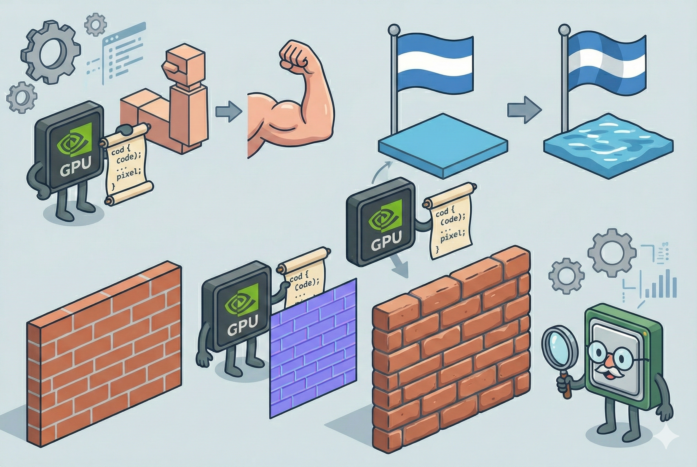

# 【AI】小白话系列——人工智能简史（四十）

让我们稍微回忆一下英伟达上一次推出硬件变换和光照时做了什么事情。本来，小学生——3D 加速显卡只负责三件事：

1. 纹理映射 (Texture Mapping)，也就是贴图（把图片贴在三角形上）。
2. 深度测试 (Z-Buffering)，也就是遮挡（算出谁在前谁在后）。
3. 纹理过滤 (Filtering)，包括像素混合（制作半透明效果）。

3D 游戏里，CPU 依然要处理两种特别累的活：

* **算坐标（Transform）：** 游戏里的怪兽在跑，它的骨骼怎么动？它的手举到了哪里？它在 3D 空间里的坐标是多少？如果不动，怎么把它“拍扁”投影到 2D 的屏幕上？ 

* **算光照（Lighting）：** 现在的火把离怪兽 2 米远，怪兽的鼻尖应该多亮？耳朵应该多暗？ 

英伟达推出的GPU —— GeForce 256，这个升级版的小学生把 3D 坐标转换和算光照两件事情也接管了。

到了 NV20，也就是 NV2A 和 GeForec 3 的新架构里，引入了两个新东西：

1. Vertex Shader（顶点着色器）

​	以前的硬件 T&L，显卡只是老老实实地按照标准算法，计算 3D 图形各个三角形顶点的位置、移动和它们从 3 维坐标到 2 维平面的映射，这些运动轨迹都是硬邦邦的。

英伟达引入了可编程的 Shader，为这些硬邦邦的三角形组成的模型增加了一些新的可能，比如：

* 骨骼蒙皮（Skinning）的精细化：以前，手臂弯曲时，肘关节就会像折断的水管一样，变成扁扁的多边形；现在。可以让开发者为这个变换，专门写一段代码，告诉显卡：手臂弯曲时，肘部的皮肤要鼓起来，有点肉的感觉。显卡就可以根据这段代码，把构成肘部模型的那些三角形顶点位置，计算得更像是真正覆盖着血肉皮肤的身体。
* 布料与流体模拟（简单的物理）：以前，旗帜、头发都是硬的，水面也是平的。现在，给显卡一个平面的网络模型，再给一段它们运动起来的代码，比如常见的正弦波公式。显卡就可以计算出旗帜、头发、水面的物理波动。

2. Pixel Shader（像素着色器）

​	通常来说，为了节省资源，不会把凹凸不平的砖墙专门按照砖头的形状制作成精细的模型。一面墙就是一个光滑的平面。以前的游戏，会在上面贴上一副画着砖头的画。但是，如果你走到墙边，或者某个对着光线的角度，这种「贴墙纸」的效果立刻就穿帮了。

现在，英伟达有了 Pixel Shader，编程者可以给显卡一张特殊的「紫色图片」（法线贴图），在这里，记录了墙面每块砖头凹凸不平的角度信息。然后显卡不会只是简单地把「墙纸」贴上去，它会计算，根据这张法线贴图记录的角度信息，在当前光照角度下，哪个像素应该反光，哪个像素应该有阴影。所以，无论你在哪个角度看，这面墙都是凹凸不平，像极了真的砖墙。虽然，假如你贴着墙根看过去，会发现这面墙依然是一个平面。

所以，从那时候起，游戏里的怪物们开始出现「呼吸感」，也开始有了碧波荡漾的水面。我还记得，有一阵子我玩《魔兽世界》，最喜欢指挥着我的暗夜精灵，在月圆之夜，跑到黑海岸边钓鱼。看着月亮从海面升起，闪闪如银片的月光撒在大海之上，波光粼粼，真的美极了。

回到我们之前那个小学生的比喻，以前拿着固定形状贴纸、蜡笔的小学生们，现在升级了装备。他们每次工作，都会收到一套特殊可以变化的贴纸，和一份专门的调色工具套装。画出来的画，再也不会是千篇一律了。

<待续>