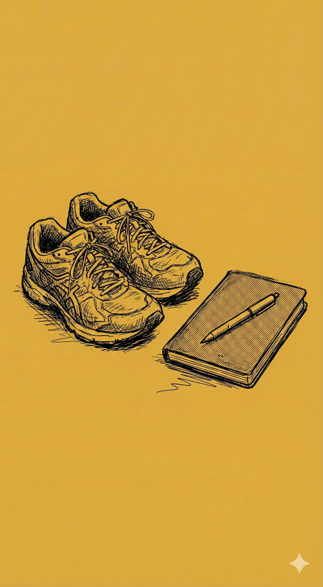

# 【随笔】跑步的村上春树

周五和大宝带着孩子们一起去家门口新开的图书馆，看他们各自找到自己喜欢的书，我也在书架上寻觅起来。想找一本此时此刻想读，又不至于读不完的小书。于是，那本小小、薄薄的村上春树的《当我谈跑步时，我在谈些什么》映入了我的眼帘。

稍微有那么点出乎我意料的是，这不是一本小说，这是有点类似于回忆录性质的文字。而且，他那淡淡的，犹如随笔一般，却又娓娓道来，剖开他内心的文字，深深地抓住了我。最终，到了该离开图书馆的时间，我也才把这本书读了一半左右。于是，毫不犹豫地请大宝帮忙，把这本书借回了家。

周末两天，断断续续地，把这本200来页，10 万字的小书读完了。说实话，这本小书，让我对村上春树的亲近感拉近了很多。原来，像他这样「专业」陪跑诺贝尔文学奖超过 10 年，感觉颇有有天赋的作家，也会自觉属于没有天赋的那一类人；原来，他不仅仅是个作者（Writer），还是个跑者（Runner）；原来他不仅仅跑马拉松，还玩铁人三项，而这些他玩得已经很是专业的运动，只是他用来平衡写作，锻炼身体的手段。

最让我感触的一点是，就他在打算写「跑步」这个题目时，也会经历那种左想也不满意，右想也不满意，左写写觉得不对，右写写仍然觉得不对，最后干脆想到啥写啥，反而把这本小书写完了。你能从文字中感受到，他努力地想把关于这个主题的一些想法，在一个字又一个字的写作过程中，抽丝剥茧地变得清晰起来。就好像，那是一个他几乎要抓住、却又时常在逃跑的感受和真相，在写作中不但表达得更清晰，自己也渐渐牢牢地抓住它们。

而这些，居然是我这个纯粹业余的写作者也会有的感觉。

和厉害的人，拥有类似的感觉，不禁有了自己也变厉害了的错觉。虽然明知是错觉，感觉还是很不错。

书不厚，读起来也舒服，可以一口气读完，也可以每天随便读上两页。好看这方面，我给🌟🌟🌟🌟四颗星。

另外，读完这本书，除了对于这个写作者，有了更多了解。我还除法了两个有趣的念头：

1. 村上对《了不起的盖茨比》评价颇高，说越是反复读，越觉得 29 岁就写出这本书的弗朗西斯·斯科特·菲茨杰拉德厉害。这让我对这本书又添了一分好奇。
2. 村上居然也在跑步中又了「灵魂出窍」的神秘体验，最近在读费曼的传记时发现，费曼也专门研究并体验过。于是我很好奇，到底有没有科学家，用科学的方法研究并给出实证呢？那些「灵魂出窍」者跳出身体之外的感受和体验，是自己根据自己已有观察、信息的「想象」或者说拼凑，还是用第三方观察证实的，正在发生或发生过的事实。

所以，启发，我也给🌟🌟🌟🌟四颗星。

《当我谈跑步时，我在谈些什么》，这本书，值得推荐给所有对村上春树感兴趣，对写作感兴趣，对跑步感兴趣，或者只是随便想找本书阅读休闲一两小时的朋友们。