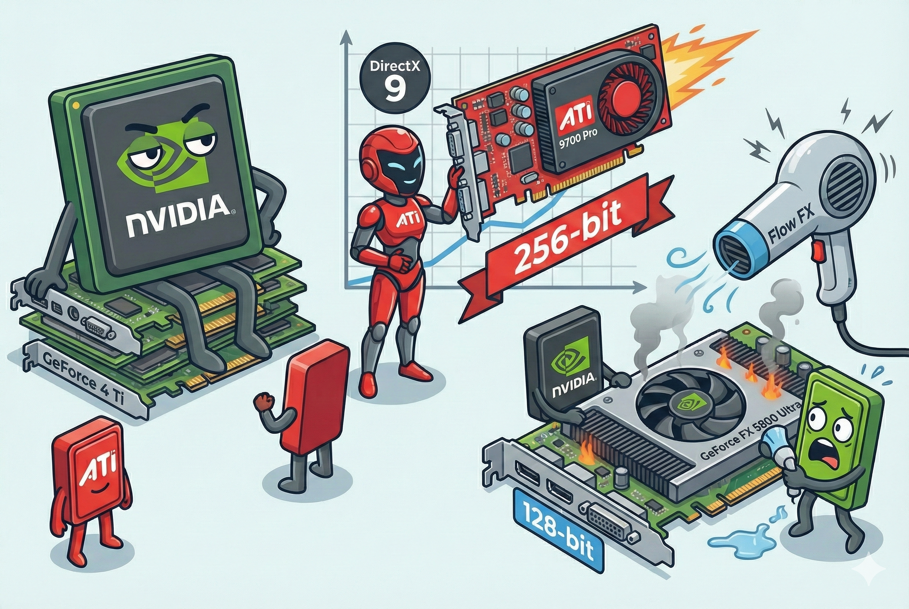

# 【AI】小白话系列——人工智能简史（四十一）

历史最大的教训就是——人类总是不吸取历史的教训。

2002 年初，GeForce 4 Ti 系列发布，依然是几乎没有对手的一代神卡。英伟达再一次创造行业标杆之后，飘了！

他们一脚踏进 3dfx 曾经踩过的那个坑里，没有看到紧跟在身后的竞争对手，自以为是地继续在「堆料」的路上越走越远——只顾着埋头提高频率，甚至在规划下一代核心 NV30 时，都忽视了提升价格的效率。

然而，来自 ArtX，到了 ATI 之后就带领团队躲在西海岸埋头磨剑已经两年的Dave Orton 可不是这么想的。他们打造的秘密武器 R300 ，架构上显然更加优雅和高效。

2002 年 8 月，ATI 发布了Radeon 9700 Pro，正是 Dave 率队打造的神器——代号 R300。这款显卡，第一次使用了 256-bit 的显存带宽，这是消费级显卡头一次使用这么高的显存带宽。与此同时，在 DirectX 9 的游戏还没上市时，他们就完全支持了 DirectX 9。

于是，拿到首测资格的硬件媒体们惊呆了，ATI 这款显卡，性能居然领先 NVIDIA 当时的旗舰两倍以上。

面对 ATI 的突袭，NVIDIA 有些慌了。原计划的 NV30 芯片无法量产，被迫回炉。直到2003年初，NVIDIA 才拿出了GeForce FX 5800 Ultra。

结果，这是一个留下无数黑历史的灾难性产品：

* 著名的「吹风机」：为了强行追赶 ATI 的性能，NVIDIA 疯狂拉高频率，结果导致芯片发热量失控。为此，NVIDIA  设计了一个名为 Flow FX 的散热系统，风扇全速运转时噪音高达 70 分贝。某著名硬件网站录了一段视频，用 FX 5800 的风扇噪音假装吹风机吹头发。于是，这个「吹风机」的梗至极还在江湖流传。
* 英伟达使用了昂贵，但是不成熟的 DDR2 显存，为了平衡成本，显存带宽还是 128 bit。结果，就这一个失误，导致他们的性能还是被 ATI 吊打。

<待续>
