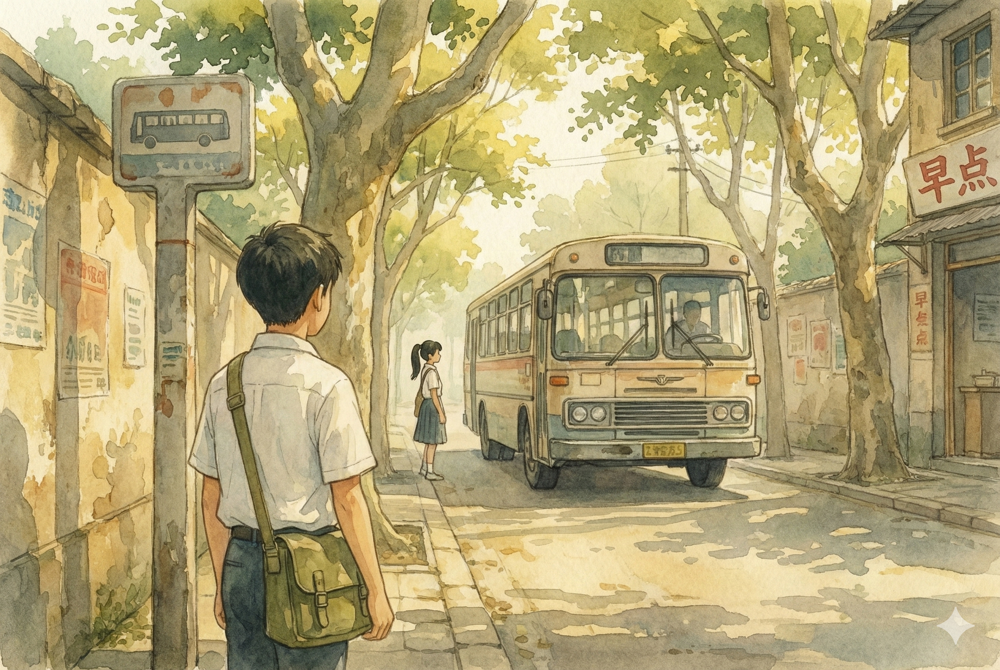

# 【生命•故事】（147）花季雨季

在电视剧《十六岁的花季》之后不太久，当年的青春小偶像林志颖又唱了一首《十七岁那年的雨季》，于是乎，花季、雨季就莫名地成为了十六岁和十七岁年龄的代表。

一如当年的电视剧里，真正谈恋爱的男孩女孩其实只有一对儿，其它青春的男女同学之间，只是在正常的交往中混合着一些微妙、美好、若隐若现的情绪。在高中的前两年，我似乎也没有看到真正在老师眼皮子底下谈恋爱的同学，但男孩子之间的话题里，除了「功夫」、「军事」和「国际政治」，对「女孩子」的关注也慢慢多了起来。

高一时我们的好朋友 L，那个黑黝黝、阳光十足的体育委员，同桌就是女生。他们正好坐在我和 S 的前面。然而不知道 L 干了啥事儿，或者说了啥话，他的同桌小 C 被他惹恼了，坚决不肯理他，一句话也不说。问题是，不论是 L 还是小 C 都不告诉我们到底发生了什么事情。L 表示完全不明白为什么，而小 C 则坚决不肯说。这变成了一个谜题，在之后的岁月里，再也没能解开。

小 C 坐在我正前方，扎着长长的马尾辫，个子不高，脸圆嘟嘟的稍微有那么一点点婴儿肥。她和 我的同桌 S 是初中同学，于是，即便是在和 L 闹矛盾的日子里，她依然和我们关系很好。好到什么程度呢？她上课时，总是非常认真地做笔记，一开始我们会借了她的笔记抄。后来她嫌把笔记本借给我们，自己用的时候不太方便，干脆在上课时把我们的笔记本拿过去，同时记录两、三份笔记。到了后来，几乎整个高一，我的各种课堂笔记都是她帮忙记录的。

不知道这样持续了多久，反正我心里一直很享受这件事情。也问过她这样会不会太辛苦，她却表示没什么大不了的。

后来，每天早上我会先坐公交车中途到一个公园下车，跟着一位老师傅学硬气功、螳螂拳。运动玩了，再重新搭乘公交车去学校。那一站，正是小 C 要上车的公交站。从那里， 14 路、19 路都可以坐，我惊喜地发现，自那以后，早上遇到小 C 的概率变大了。于是，每一天，我更加期待着和她的偶遇。或者在车站遇到，或者下车后环顾四周，发现她就在同一辆车上下来，或者在前方、后方的另一辆公交车上下来。

我变得很享受和她一起上学，有时候还一起放学的时光。当然，她更多是和她的闺蜜一起。我则是和 S、H 同路。

记得有一天早上练完拳，我和一位胖胖的师兄聊着天走到了公交车站分手。正巧遇到了小 C，她问我那个人是谁，我说是一个朋友。她惊讶极了：

> 我看那个人是个大人啊，居然是你的朋友。

看她这么吃惊，我内心里颇为得意，告诉她那是和我一起练拳的师兄，确实是大人。

<待续>