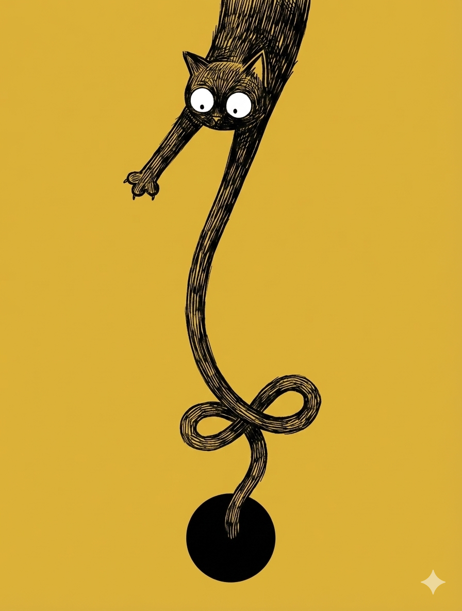
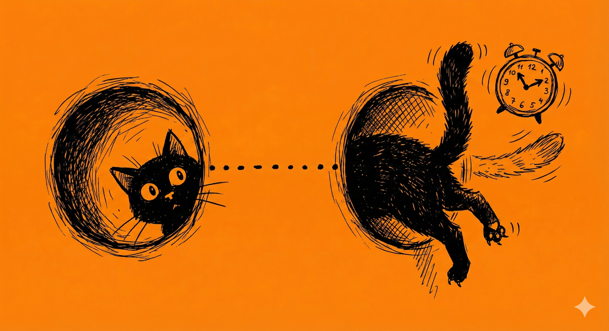
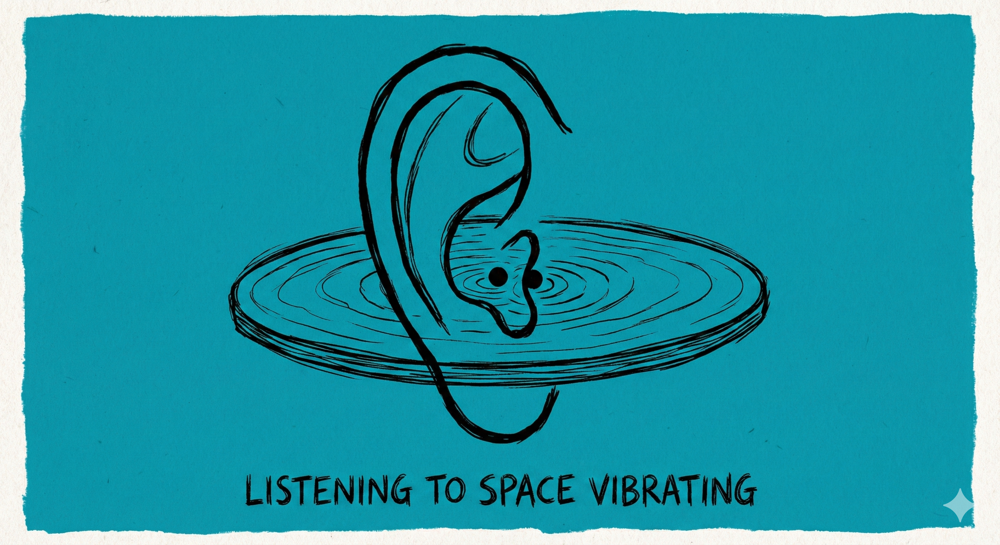
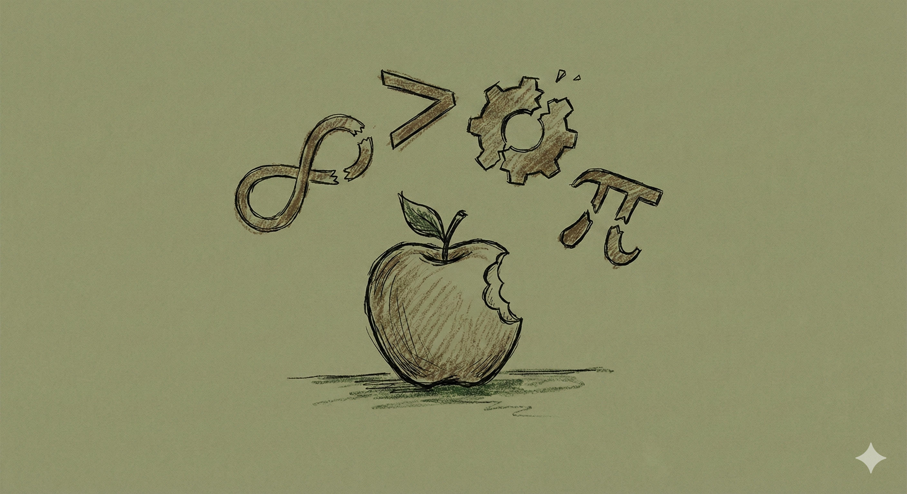
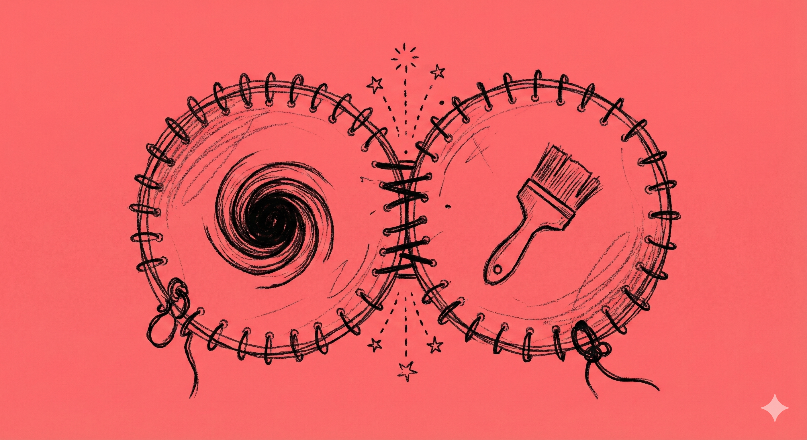

# 【随笔】又被Janna Levin圈粉

为什么说「又」呢，因为上次有这种感觉，也是在看完[ Lex Fridman的一个超长访谈](20240913【教程】一个人的公司（五）——产品与服务.md)后。现在，我差不多已经成了 [Lex Fridman](https://lexfridman.com/) 的粉丝。但他的访谈，真的是太长了！

这期访谈——[Black Holes, Wormholes, Aliens, Paradoxes & Extra Dimensions - Janna Levin](https://lexfridman.com/janna-levin-transcript) —— 我是大约几个月前就开始看了。中间还岔题去看了一篇[Lex Fridman 和 Demis Hassabis的第二轮访谈]([https://lexfridman.com/demis-hassabis-2-transcript) 。昨天终于鼓起勇气，把最后一部份看完了——还是在 Gemini 的帮助下——因为太多前沿的物理概念，脑子被轰炸得嗡嗡作响。

但是，看完这三个小时的聊天，我实在是深深地喜欢上了 [Janna Levin](https://en.wikipedia.org/wiki/Janna_Levin)，一开始我以为她只是一位天体物理学家，研究黑洞的。但仅仅是黑洞这个概念，就把我吸引住了。

她告诉了我许多关于黑洞但新鲜想法——视界的本质，面条化的体感。还有，我头一次听说过的「信息丢失悖论」。我第一次听说，在有些物理学家心中，「能量守恒」都可以偶尔被打破，但「信息守恒」则绝对不容撼动。然而，在黑洞的证据面前，这些理论基石都在动摇！

我不停地一边听，一边请教 Gemini 才能勉强跟上 Janna Levin 的节奏，了解那些关于虫洞、白洞、暗物质、暗能量的奇思妙想。

他们甚至讨论了那些神奇的「地平论」爱好者，让我惊讶的是，Janna Levin 居然对他们为什么如此并不惊讶也不鄙视。

等Janna Levin 充满感情、充满诗意地讲到了那个伟大的、聆听宇宙引力波声音的 LIGO 工程时。她忍不住感慨，在2015年9月14日凌晨，刚好是爱因斯坦相对论发现100周年的那年，在大家还在忙着做最后的校准测试时，来自13亿光年外，两个黑洞相撞时引发的引力波席卷而来——先击中了路易斯安那州的探测器，穿过美国，随后震动了华盛顿州的探测器。我终于忍不住问 Gemini：

> Janna Levin 究竟是科学家还是……

原来，Janna Levin 不仅仅是一个扎实的理论物理学家，更是一个文笔优美的作家。她不愿意称自己为科普作家——因为那个说法把自己放得太高高在上了。在她眼里，她热爱科学，和任何其他的热爱并没有不同。科学只是她用于创造的「乐器」而已。

他们聊到图灵、哥德尔那样的天才、悲剧和他们与生俱来的矛盾。也聊到他们内心里的各种冲突，Lex Fridman 甚至忍不住（或有意）感慨了一下自己敏感、开放这种矛盾给自己带来的痛苦。Janna 却安慰他说——这一切都是必然，并且有深刻的意义。

她甚至不指望有个神庙为她解决她一直魂牵梦绕的「黑洞」与「大一统」问题，她知道问题之后还有问题。

但她享受在沙滩上建起美丽的沙堡，画上美丽的图画，哪怕明知海浪会吞噬这一切。甚至她认为，正因为这注定的消失，让这过程变得更加美妙绝伦！

实在是太喜欢她了！如果你也想感受科学与人文的共振和共鸣，推荐你也去听听这个访谈。

我这么喜欢——或许是因为——通过喜欢她这件事，我得以瞥见了深藏在心底的真正的自己吧？

