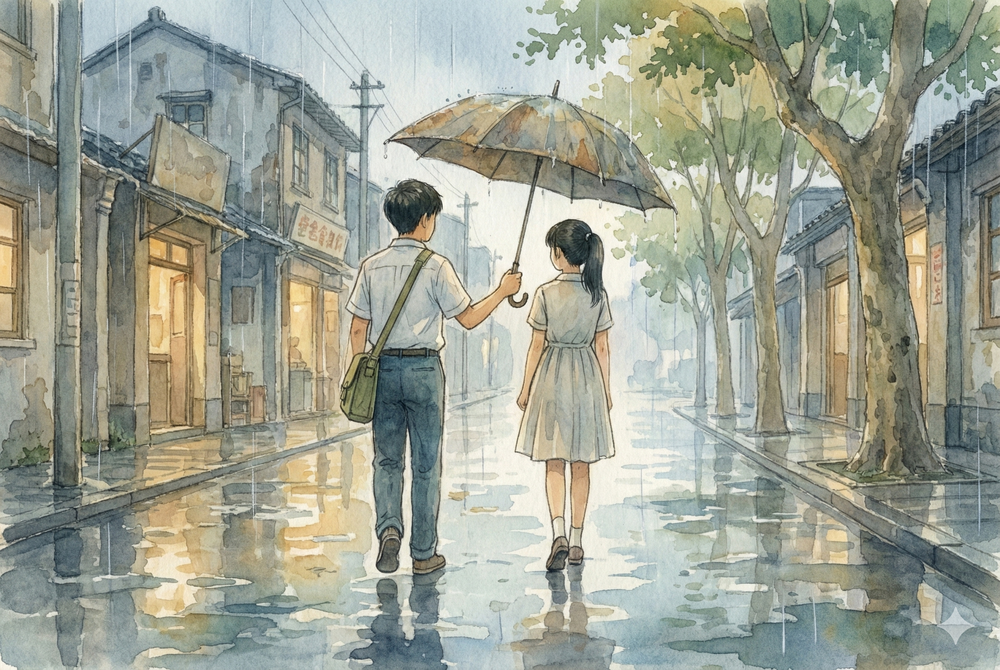

# 【生命•故事】（148）花季雨季续

就这样，享受着有女生给自己抄笔记的得意，享受着上学路上时常偶遇的快乐，不知不觉高中的第一年就这么过去了。

高二开始文理分班，我原来所在的六班成为文科班。我和所有选理科的同学被安插到各个不同的班上。我们坐在一起的几个人，以及其他认识的朋友们，被分到了不同的班上。我的同桌 S 去了三班，但坐我后面的 H，坐我前面的小 C 都和我一起分到了五班。

刚开始，我被分配坐在最后一排。看不见黑板，我就整天和胖乎乎的，也姓 H 的同桌聊天。然而，和他不同，他不需要听课，那些数学题也难不倒他，我却越来越懵圈。我们的数学老师还是高一教我们的那位来自黄冈中学、眼神锐利的年轻人。他总是在我偷瞄同桌答案时，远远地一粉笔头准确击中我。

但我就是跟不上，还是只能靠着抄同桌答案度日。我自嘲，原来过去以为自己数学好是错觉，其实只是算术不错而已。我也想起初中时看我不听课，不停摇头的那位穿着羊毛背心，好心的广东老师叹息的话：

> 你总这样不听课，将来……唉！

……

有一天班主任问我：

> 你坐在后面，看得见黑板吗？

其实，我是看不清黑板上的字，但我故作幽默地回答：

> 黑板那么大，怎么会看不见呢？

后来没多久，班上开始轮换座位。不仅仅是大组从左往右轮着转，前四排的学生和后三排的学生也分别轮着转。然后我惊喜地发现，每过四周，小 C 就会换到第四排，而我则刚好换到第五排。得以再次坐在她身后。于是乎，这再次变成我在内心里周期性期待的美好事情。

就这样，在这一次又一次悄悄的期待中，青春时光一天又一天溜走了。

我和 H 依旧是小 C 熟悉的好朋友，常常聊天。我还是经常会在上学路上遇见她，有时早上从公交车下车看不到她，我就估算一下时间，猜猜她在我前面还是后面。大多数时候，我会一路紧走，试图在路上追上她。

记得在那些雨季里，我从来不愿意带伞，总是顶着书包一路小跑。然后，有时会看见她穿着美丽的纱裙，举着伞袅袅婷婷，正好走在我前面。我就开心地追上去，钻进她伞下，拿过雨伞，名正言顺地一起走完剩下的路程。

……

到了高三的某一天，她谈恋爱了。开始每天和班上那位高大、总是健身、总是秀自己一身老鼠肉的同学出双入对。奇怪的是，学霸们谈恋爱好像根本不会耽误学习，她的成绩越来越好，最后考到了武汉当时排名第二的华工。

后来听说，她和男朋友分手了。

虽然还是她的好朋友，我却一直没问过她这些事儿。

高中最后一个暑假，我去找了一个做月饼的短期工。没有告诉她，等到后来见面，她反而问我为什么不叫她一起，说这个暑假无聊死了，我才颇为后悔。

……

<待续>