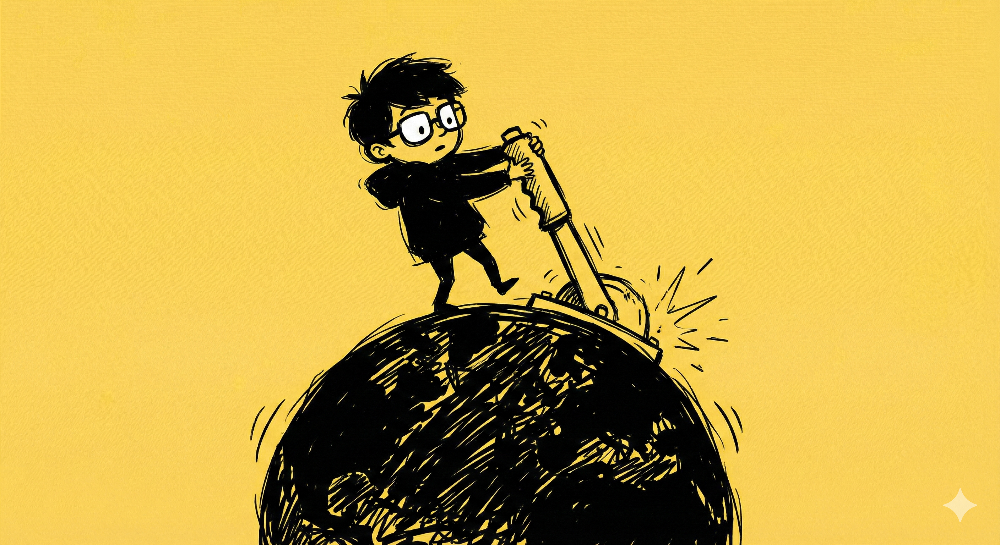

# 【随笔】周一综合症

其实这种 Blue 的感觉，周六晚上就袭来一次——我抱着大鱼的小爱同学，让它放音乐，它却一而再再而三地让我充会员，于是乎，忧郁变成了小小的愤怒——我最后关掉它睡觉了。

再往前回忆，周五晚上我几乎是在脑海里奏着 BGM 回家的。其实，那天自愿加班了快两个小时，只为了多完成两项自己「计划过」的事情。等确实完成后，也确确实实地快乐着。

路过火山引擎的大楼门口时，发现那里有一个秃顶，神色奇怪，瘦弱的中年男人敞着夹克，坐在石凳上高声唱歌，声嘶力竭、五音不全。我骑着一辆崭新的美团，从他身边飞速，由于多普勒效应，他高亢而奇怪的歌声迅速在夜色中蜕变成一声低沉的回响——

> 春去春会来，花谢花会再开……

我脑海中，幻化出一种奇怪的画面：

那个神经病一般的男生，和光怪陆离的都市夜晚一起风中褪色和消散，高亢而奇怪的嗓音变成了周华健深沉而动情的歌声。在美妙的音乐声里，一个少年坐在课桌上，泪流满面地唱着《花心》，他的朋友在一边不知如何安慰，只好陪着一起唱着那首歌……

[少年时美好的情绪](20250528【生命•故事】（135）谁说少年不识愁滋味.md)，混合着脑海中自动奏响的背景音乐，让心情变得更加愉悦。再加上对即将到来的周末的期待，简直雀跃起来。

……

然而，到家才发现，大鱼生病了，记得早上在幼儿园门口告别时还和我愉快地打打闹闹，不知怎么就再次病倒。

……

周六陪着大鱼去医院，最近一直不愿意让我抱的大鱼，这下子让我抱了个够。我笑着问他，怎么又允许爸爸抱了，他说：

> 因为我生病了呀。

然后，周日依旧是在家的一天，除了傍晚时分去小公园里转了半小时。

或许，因为这整个周末都变成了「不得不」的两天，到了周日晚，想要早早睡觉的时候，我变得极度沮丧起来。或许，因为有太多想要做的事情，或者不想要做的事情在脑海里盘桓了太久，全部心神都被耗尽了。

我只好忧郁地躺在床上，心想，自己真是个伤春悲秋的无聊家伙。窗外的风声越来越大，呜呜作响，这是冬至的晚上，这将是今年最长的一夜。我似乎能感受到地球在宇宙中在轨道的尽头刹了一脚车，吱吱嘎嘎地震动了一下，然后转头向着春天的轨道滑去。

我想起地球那边的西雅图，在冷雨中有人暴毙街头；我又想起，来深圳过冬的鸭子们，已经齐聚在深圳湾的海边，愉快地在天空一圈又一圈地飞翔着……

