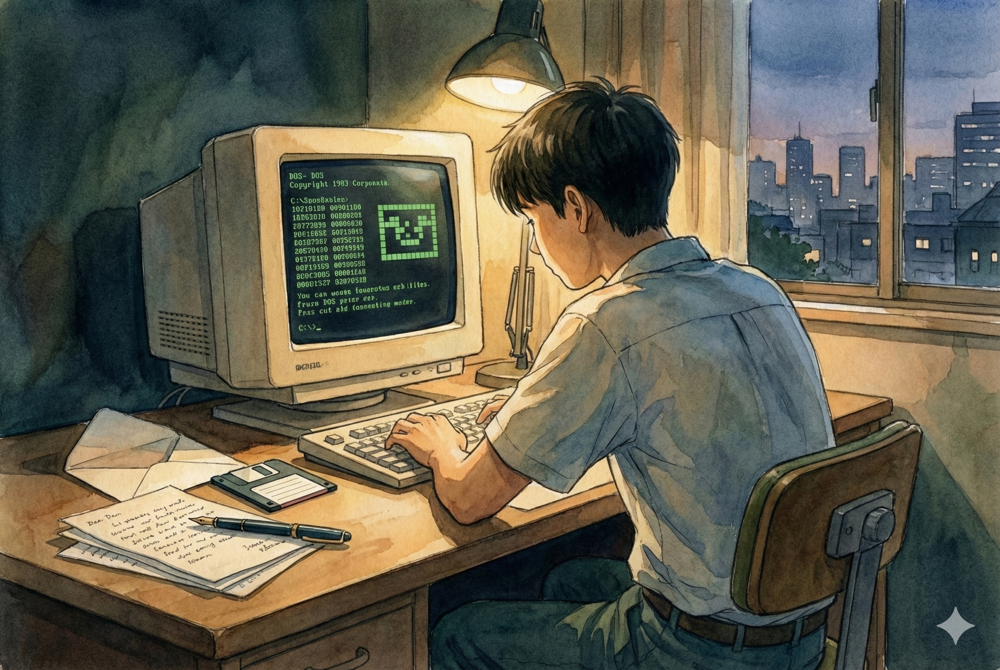

# 【生命•故事】（149）花季雨季（完）

不管后不后悔，高中的最后一个暑假结束后，曾经憧憬过的大学生活就那么开始了。

在那个时候，从我的大学到小 C 的大学要坐近1个半小时甚至两个小时的公交车。虽然同在武昌，感觉挺远的了。串门并不容易，于是，我们开始写信。

给远方的亲友写信，是我们刚上大学时最最热衷的活动之一。用真正的钢笔在洁白的信笺上写下一行又一行文字，然后再塞进信封里。在信封上工工整整写上地址和收信人的姓名，用胶水封上信封口，再端端正正贴上一枚或两枚邮票。把它投入路边墨绿色的邮政信筒里，就开始期待收信的日子。

我就在自己出生的城市读书，甚至家和学校都同在武昌区。所以，我几乎所有的信都是寄给去全国各地读书的高中同学。只不过，后来，我和小 C 的信件越来越频繁。我告诉她我们在军训时所遭受的折磨和各种有趣的轶事，还有自己一顿吃下一斤饺子的壮举；她告诉我她们女生宿舍夜间各种算命、看星象的许多隐秘趣闻。我的信越写越厚，有时会一口气写上 5、6页……

后来听说，小 C 和她高中的男朋友分手了，好像是高考结束就分手了。再写信时，自己的内心就有了许多微妙的情愫。不过，现在想来，当时完全没意识到的事情是——无论是她和男朋友分手，还是又谈新男友的事情，都是我们共同的其他朋友告诉我的。小 C 从来没有自己对我（不管是当面还是在信中）说过自己这方面的事情。

于是，有一天（现在完全忘记了是在读大学几年级的事情），我鼓起勇气，写了一封表白信。然而，我费尽心机地不走寻常路，没有用纸和笔。用自己新学的小技巧，在电脑上制作了一封带音乐，五彩斑斓的电子信件——不是电子邮件，那时候我还不懂什么叫email——而是用一个有趣小软件，生成的一个自带排版，可以在 DOS. 下运行，自动显示信件内容的 exe 文件。

我把这个装载着自己隐秘心思的软盘放在信封里，寄给了小 C ，然后石沉大海。

不知过了多久，我实在忍不住了，跑去她们学校找她。见面后，我什么也不敢说，只是淡淡在聊天中问起这张软盘，问她看了我放在软盘里的信没有。她说：

> 你不知道，我把这张盘一放进计算机，计算机就开始报警，说有病毒。然后我一害怕，就把这张盘格式化了！

有病毒？我心想，自己可是用各种杀毒软件仔仔细细查杀过的呀，不过，谁说得准呢？我只好放下这颗心，不再谈这些在软盘里说过的事儿……

……

大学毕业后，在湖北的某个电信局做工程。一天夜里加班后，我酝酿了很久，鼓足了十二分的勇气，拨通了她的电话。我很激动，几乎无法连贯地说话，红着脸，磕磕巴巴和她讲了自己那封未能送达的信，和几乎萦绕着自己整个青春期的暗恋情愫。她却很淡定地安慰我：

> 说出来就好咯，可以继续做好朋友。

……

很多年后，我和 H 聊天，他说起之前某次和小 C 的闺蜜聊天，了解的一些她们的近况。我又问道：

> 那你最近又有和她们联系嘛？

他淡淡地说：

> 我是不会和已经结婚了的女同学联系的。

……

当时我纳闷不解，现在回想起来。原来我的同学都是这么成熟和有智慧吗？是啊，所有那些花季雨季的故事，就让它们封存在回忆的青春中，不就是最美好的事情吗？

