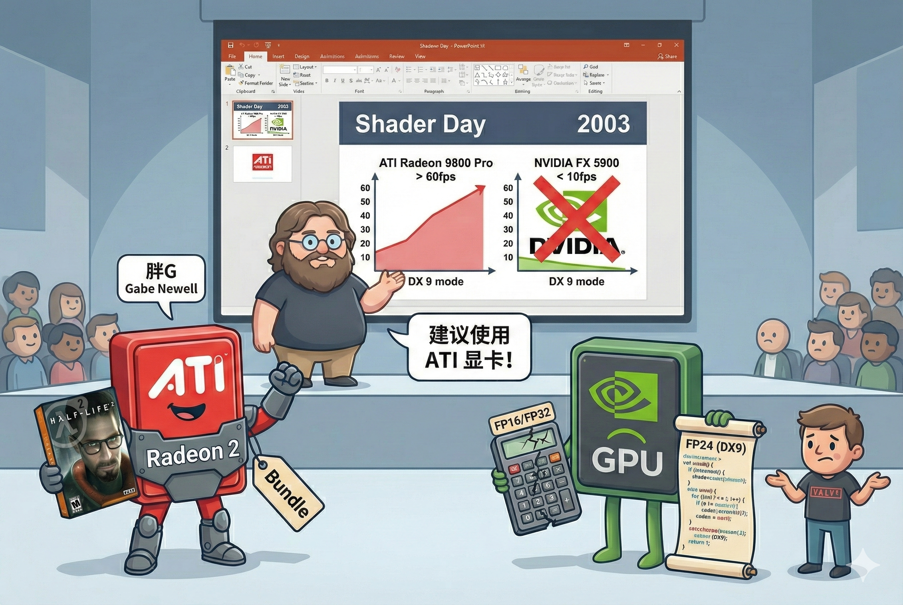

# 【AI】小白话系列——人工智能简史（四十二）

2023 年，全世界都在等待着 Half-Life 2。这将是世界上首款大规模应用 Direct X 9 Shader 技术的游戏，当时图形技术的天花板。

黄仁勋信心满满地以为，游戏的开发者一定会围绕着英伟达的架构来优化这款游戏，再一次巩固英伟达的市场地位。但是，不出意外的，意外发生了。

2023 年 9 月，在 Valve 举办的名为「Shader Day」的发布会上，胖G Gabe Newell —— 主创 Half-Life 的大神 —— 不但没有和往常一样吹捧英伟达，反而拿出了一组令人震惊的 PPT：

* 在 DX 9 模式下，NVIDIA 的新旗舰 **GeForce FX 5900 Ultra** 输给了ATI 的中端卡 Radeon 9600 Pro。
* 同样的场景，ATI Radeon 9800 Pro 跑得飞快（60fps+），而 NVIDIA FX 5900 只有个位数帧率。

Gabe Newell 毫不留情地说：

> 为了获得《半条命 2》的最佳体验，我们建议您使用 ATI 显卡。

这还不算，Valve 还宣布，《半条命 2》将捆绑赠送给 ATI 显卡的购买者！

为什么会发生这样的背刺事件呢？原来，在微软发布的 DirectX 9 规范中，所有的像素计算都应该使用 24-bit （FP24）甚至更高的精度。ATI R300 全面地贯彻了新标准。

但英伟达托大了，它的 NV30 架构要么跑 **FP16 (半精度，低画质)** 飞快，要么跑 **FP32 (全精度，高画质)** 速度极慢。它指望的是，开发者可以围绕着自己的架构——不重要的画面用低精度，重要的画面才用高精度计算。

Valve 照着英伟达的建议试了试，发现代码变得极其复杂，还容易出问题。折腾许久，大神 Gabe Newell 怒了：我为什么要将就你的硬件，把我的代码改得乱七八糟呢？

没办法，所有骄傲的程序员，心中都有一根独属自己关于「美」的金线——追求代码与架构的美！

于是，Vavle 决定，要么Dirext X9 纯 FP32，要么降级用 Dirext X 8 的代码，流畅但是低画质。对英伟达的「背刺」，就这样顺理成章地发生了！

<待续>