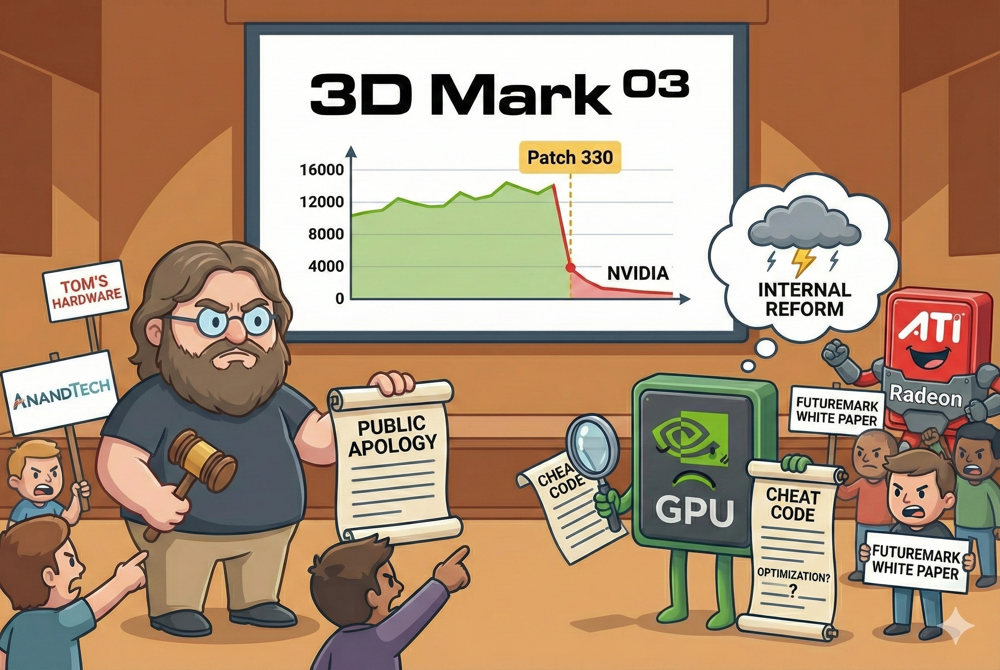

# 【AI】小白话系列——人工智能简史（四十三）

有道是：

> 人逢喜事精神爽，事到难时心绪昏。

在这郁闷的，被 ATI R300 全方位碾压的 2003年，英伟达的工程师感受到了前所未有的压力。在来自客户、股东的重重压力之下，有人悄悄地想出了歪招。

当时最主流的显卡跑分软件是3D Mark03。英伟达在驱动程序里藏进去了一些检测列表，一旦发现是`3dmark03.exe`在运行，驱动程序就会悄悄换掉原本的 Shader 代码。通过直接跳过完整的光照算法，甚至偷偷降低画质，去掉一些肉眼难以察觉的特效。终于让英伟达的跑分直接暴涨了 20% ～ 30%。

只不过，东方古国还有一句老话是这么说的：

> 若要人不知，除非己莫为。

3DMark 的开发商 Futuremark 发现了猫腻，他们发布了一个简单的补丁（Patch 330）。这个补丁没啥别的功能，只不过把可执行文件的文件名改了一下。

英伟达的作弊程序没认出改名后的 3DMark，一夜之间，所有英伟达显卡的跑分全部跌回原形。

黄仁勋一开始还嘴硬，说 3DMark 03 这款软件本身就是垃圾，不符合游戏的实际情况。他说：

> 如果你为了跑分而优化，那才是作弊；我们是为了让用户在真实应用中获得更快的速度，这是**特定应用优化(Application Specific Optimization)**

可惜，媒体不买账。AnandTech， Tom’s Hardware 这些知名硬件网站纷纷发文谴责。Futuremark 还干脆出了一篇白皮书，深刻揭露英伟达的作弊证据。

 HardOCP 的 Kyle Bennett 更是大声疾呼，让玩家抵制英伟达，直接要把英伟达钉在耻辱柱上。

黄仁勋无奈，改变了公关策略。他通过专栏文章，分析师会议和媒体专访，事实上地承认了错误。以下是他认错话术的三明治——事出有因、我们错了、我们改、其实我们还有苦衷：

1. NVIDIA 的初衷是「帮助开发者挖掘硬件潜力」。他说以前的 CPU 厂商也这么干（针对 Benchmark 优化），为什么 GPU 不行？
2. 我们在追求性能的过程中，可能模糊了‘优化’与‘跑分’的界限。我们承认，针对 3DMark 的某些特定优化**让用户感到困惑，并没有反映真实的性能**。
3. 他宣布 NVIDIA 将在未来的驱动（Detonator 50 系列）中：
   - **移除**那些针对 3DMark 03 的“特殊代码”。
   - 开放驱动策略，让媒体可以审查。
   - 重申将专注于**真实游戏性能**，而不是合成跑分。

4. 这是公司内部工程师为了对抗 ATI 的压力，**「求胜心切导致动作变形」**。

但这些，只是公关辞令。在英伟达内部，这场危机酝酿成了一场变革的风暴。事实上，这个事件成为了改变英伟达未来的，极其重要的契机。

<待续>

