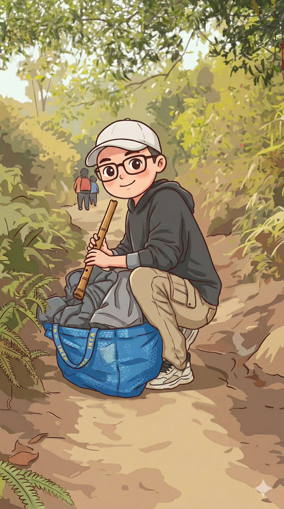

# 【随笔】挑战深圳第一险——七娘山

看到新闻说，七娘山的望郎归又出事儿了。我咯噔一下，赶紧拿出地图，对比了一下我们元旦假期刚爬过的路线。原来望郎归在我们徒步路线的另一侧，从山顶过去至少还有5、6公里。

呼～～我长长出了一口气。

这么说，至少那天我们还不算太过冒险。

那是一个相当随性的旅程，头一天我们租了辆 SUV，大宝开着车，在假日里拥堵的公路上开了停，停了又开，阿宝和大鱼，甚至我都昏昏沉沉睡了过去，一觉醒来，终于到达了大鹏半岛。我们在国家地质公园附近的停车场里找了块空地，一家人直接猫在汽车里睡了一晚。

清晨，天亮了，早起爬山的人们一辆车又一辆车的开了过来，停在我们附近。太阳还没升过山顶，圆圆的月亮也还挂在西边的天上，风声呜呜作响，我们穿上厚厚的羽绒服，收拾收拾，也准备去爬山。

大宝翻了翻后备箱，说：

> 哎呀，居然一个双肩包都没有带，只能拿塑料袋装两瓶水了。

我也跟着翻找了一下，决定还是把宜家那个巨大的编织袋也拿上——这一念之间的决定，让我们后来庆幸不已。

……

因为孩子们不想上楼梯那么无聊，于是我们选择了从大榕树起点爬上去的路线。那是一段土路，和大宝老家深山里的路没什么不同，甚至更加平坦。因为走的人多，泥土全被碾成了灰，在清晨阳光的照射下，路上腾起的灰尘显得林间「雾气蒙蒙」，然而一头扎进「雾气」，就会弄得满鼻子满嘴、粗粝的尘土。

孩子们很喜欢这大自然环境，阿宝和大鱼在我们身前身后跑来跑去，不时停下在路边研究一些没见过的花花草草和蚂蚁昆虫。或是躲在岔路口的树后，在我们走近时猛地跳出来，看着我们被吓了一跳的样子哈哈大笑。

大宝一开始还用塑料袋帮我分担了一些辎重，但后来塑料袋磨破了，这些水和食物也只好重新放回了我的蓝色宜家编织袋里。太阳越升越高，我们身上的羽绒服也一件又一件放进了袋中。本来空一半的巨大袋子，竟然被塞得鼓鼓囊囊。

一队又一队的登山队伍，举着小红旗从我们身边呼啸而过。他们大多穿着轻便的速干衣，背着小巧的双肩包，两手各擎着一支登山杖。看着他们一身专业的装备，感受着蓝色宜家编织袋那细细的带子嵌在我肩膀里，更觉得疼痛。然后，我还是坚持把尺八拿在手里，这样停下来等孩子们时，我可以随时靠在路边的树桩上，悠然自得（自鸣得意）地呜呜两声。

掂量一下，自己浑身上下可能只有来自迪卡侬的防风太阳帽还算是件「登山装备」吧。

不知不觉，轻松的土路阶段就要结束了……

<待续>

