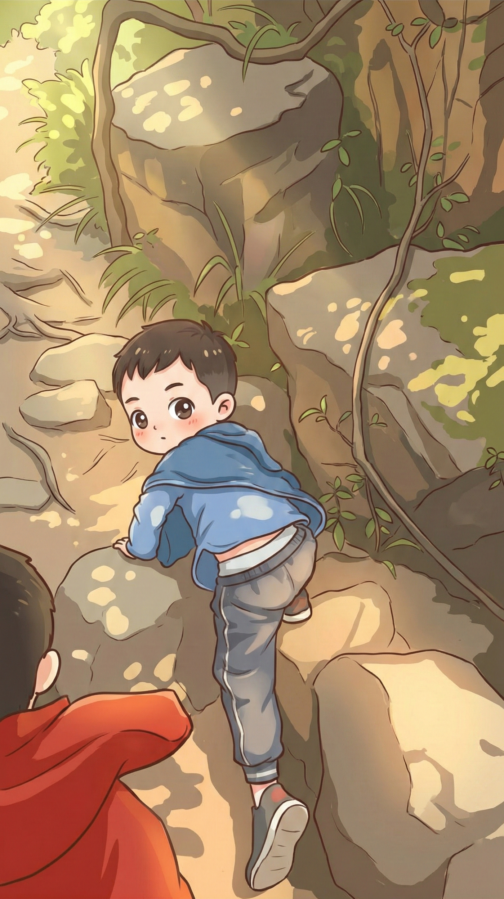

# 【随笔】挑战深圳第一险——七娘山（续）

拐了几个弯，山路开始掉头向上，并且越来越陡。一开始小路只是跟着高压线的方向拐来拐去，后来干脆直接顺着山脊往上延伸。

一个巨大的石头横在路前，必须得爬上去。小孩子们尖叫着冲了上去，在大宝的带领下，手脚并用地跟着其他人走过的路线爬过了巨石。接着，又是一段小树林中的陡坡，脚下的沙土粒像滚珠一般滑动。运动鞋完全抓不住地面，一打滑，差点失去平衡趴倒在地上。我赶忙把挂在肩上的巨大蓝色宜家袋往身后挪了挪，用拿着尺八的那只手固定住不让它乱晃，腾出一只手抓着树枝或者树干稳住身体，一步一挪地往上爬。

大宝守着大鱼，落在了后面，阿宝还爬在我的前方，或者说是上方。

> 阿宝！
>
> 你发现没，这个树枝一定是很多人扶过，光光溜溜的真好摸。哈哈，都已经被盘出「包浆」了。

阿宝凑过来，仔细看了看我指着的那截长在树上，却泛着油光的树枝，好奇地问我：

> 什么叫「包浆」？

我只好给她解释了一下老男人们盘核桃和念珠的「典故」。她「哦」了一声，然后一面爬，一面兴奋地指给我看：

> 爸，你看这个！
>
> 你再看这个！
>
>  你看，这里还有！

……

我们以为翻过这个大石头，再爬过这段需要抓着树枝和树根手脚并用地陡坡，险路就算结束了。却没想到，土坡之后又是一个石坡，石坡之后又是一段土坡，没完没了。

在一处稍微平缓，可以休息的林中路边。我放下大包，等到了大宝和大鱼。

我们原计划是，如果孩子们爬不上去了，就原路返回。此时此刻，我们第一次认真地开始琢磨，要不就这样掉头回去算了？

但是，站在山间回头望下去，来时的小路陡峭、笔直，根本找不到可以落脚的地方。我掂量着手上蓝色大包的份量，想像着如果从这里下山，或许直接就失去平衡滚下去了。这么一想，我忍不住哆嗦了一下，赶紧抬头往远处看去。

我们所在的高度，已经可以看到另一座山头那边的大海。嗯，风景已经开始好起来了！

再掉头看看往山顶的方向，同样陡峭，但至少看得出哪里可以落脚，哪里可以上手。

唉，算了，下去一点都不容易，而继续上山，大概率还能享受一下山顶的美好风景。

要不我们还是继续上山吧！

<待续>