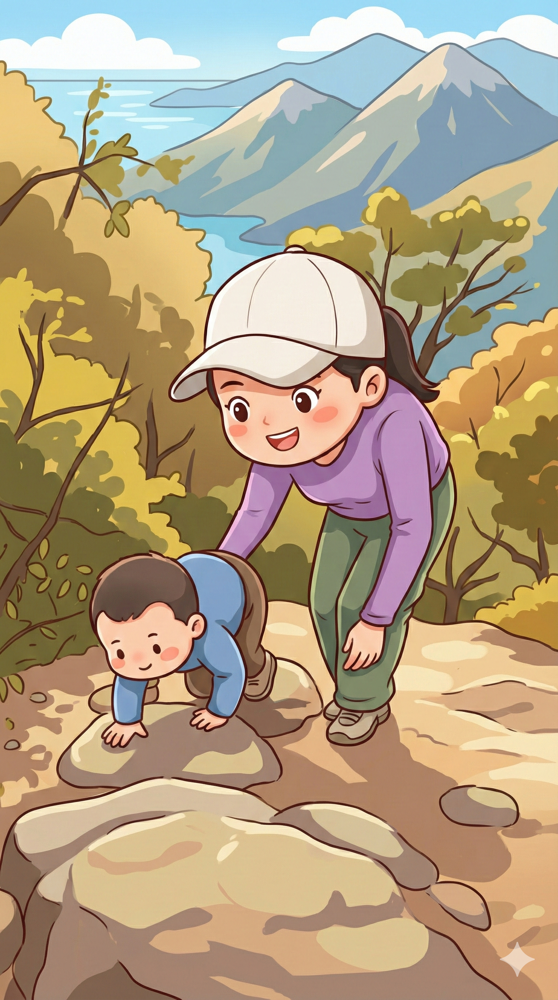

# 【随笔】挑战深圳第一险——七娘山（续二）

又到了一处岔路口，拥堵、聚集着一大群登山的人。大部分人都堵在左边的路上，右边的小路有几个人走上去两步，然后又看他们退了下来。

我听见有一个男人在不远处高声和自己同伴说着：

> 我研究过了，这条路猿猴可以过去，但不是人类可以搞定的。

我不由得暗自嘀咕：

> 有这么难？

我再次找了个树根放下大包，叫住阿宝，让她和我一起等妈妈。我可不想和他们在这个关键的路口走岔了……

等大宝带着大鱼爬上来，我和她说了自己在这路口的犹豫，然后问：

> 我们该走那条路呢？

她让我再去看看。

我发现经过这么一会儿，拥堵的人已经渐渐通过了左边那段山路，另外一条路看起来好走，却没有人走。而且，左边路口的大树上，系着好多根红布条，那显然是各个户外组织留下的路标。于是，我往左边的路上走了两步，路再次分岔。

一条往上，似乎是通往一段峭壁边上的小路，另一条则是从峭壁下绕行。我让大宝带着孩子们在这里稍微再等等，自己背着大包往上去探探路。

果然，小路迅速收窄，很快变成只有一人宽左右。右边是垂直而陡峭的石壁，左边也是，并不深，但下方三四米左右就是一大块巨石，尖锐的棱角让人忍不住害怕。从这里摔下去，肯定会骨折吧？

还好，悬崖上有垂下来的藤条。我试着拉了一下，很结实，便把尺八放进包里，一只手固定住大包，一只手拉住藤条，走过了那一小段最窄的山路。有一个妈妈，带着两个和阿宝差不多大的孩子，在略宽的石头平台上犹豫着。我绕过他们，才发现，前面没路了，只有一根粗粗的藤条垂下去，必须拉着这根藤条下降一人多高才能重新踩到地上。

那位妈妈沮丧地冲后面的同伴喊道：

> 这里走不通，孩子们没法下去。
>
> 但是，我们也退不回去了，怎么办？

我拉住藤条，小心翼翼地下到石头平台下方，确实，这里只能全凭手的力量拉住身体，在落地之前，脚根本就是摆设。

我放下包，转身招呼那两个妈妈，让她在上面拉着小孩，我在下面接着，用接力的方式保护着两个小家伙下了平台。

大宝在后面，听见前面这出惊险的囧境，干脆地选择了峭壁下面绕行的路。但是，遇到了类似的麻烦，同样有一人多高的断头路，小孩子自己跳不下去，她一个人也办法拉住小孩。还好，有另一位男士帮忙，把阿宝和大鱼接了过去。

就这样，大家灰头土脸地通过了这段号称「只有猿猴才能搞定」的路段。

带着大包和两个孩子，是更不可能回头了。大宝对我感叹说：

> 都被那些爬山攻略的视频骗了！
>
> 现在总算明白视频里为什么根本没有啥特别难爬的路段了。

我说：

> 可不，在这几段路上，谁敢分心拿出手机来拍照和拍视频呢？

……

转过这石壁，风一下大了起来。

<待续>