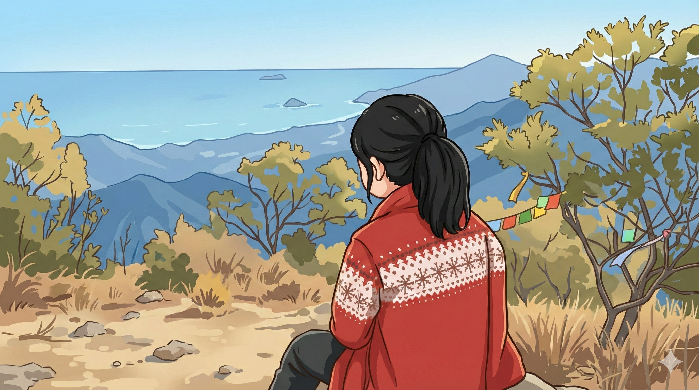

# 【随笔】挑战深圳第一险——七娘山（续三）

这是一片开阔地，回头能一眼看到我们来时走过的所有路段。最初的那段土路，其实绕过了一座靠海边的山头，而此时此刻，那座山头已经不到我们脚下的高度了。

我们的右手边也没什么遮拦，有几棵稀稀拉拉，半人多高的小树，更多的只是路边的杂草。3、5米远开外，就是陡坡，一直延伸到山脚下的陡坡，和我们身后的陡坡没什么区别。左手边是岩石和峭壁，人们踩出来的路就在石头和小树之间弯弯曲曲的向着山顶延伸。

脚下全是被人踩碎的沙土，根本站不住。

阿宝在我前面，拉着一棵细细的小树枝，左右看了看，吓得哭了起来：

> 爸爸！我害怕……

我也害怕，在这随时会打滑的土路上，一不留神，我可能就会连人带包一直滚下山坡。而那几棵小树，估计根本挡不住一个人滚下山的人。我感觉自己手心都有些出汗，脚也开始因为恐惧而发抖，不由得更用力地抓紧了手边的树枝。

> 不用怕，爸爸挡在你这边。
>
> 你弯下腰，手脚并用，就不会打滑。
>
> 而且，就算滑下来，还有爸爸在这里接着你。

我想了想，又接着说：

> 现在也不可能掉头下山了。
>
> 你要是实在害怕，就找个稍微稳当点的停下来停下来，哭一会儿我们再往上爬。

阿宝哭着开始往山上爬，头也不会。我赶紧跟上，尽量紧紧地跟在她身后不远处，隔在她和最陡峭的斜坡之间。我不敢伸手扶她，因为只靠两只脚，我根本站不稳。这种情况下去拉一个人，哪怕只是她这样 8 岁的小姑娘，我也不敢——害怕失去平衡。

我更害怕她跌下来时，我自己也没站稳，接不住她。这时，我真想把肩上的沉沉宜家袋子扔了，它不仅深深地嵌在肉里让我肩膀生疼，还总是晃来晃去拉得我东倒西歪。我必须一直空出一只手控制住这个大袋子，另一只手要么扣着石头，要么拉着树根。大气都不敢喘地盯着我前方的阿宝，甚至不敢多想她万一脚一滑，我要怎么才拉得住她。

每到一处稍微能直起身子，有一块石头或一棵树挡在我们和悬崖陡坡之间的地方。我都会忍不叫她：

> 阿宝，要不要在这里歇会儿？

她却头也不回，一边哭一边越爬越快，我只好咬牙跟上。

……

终于，到了一大块巨石形成的十几个平方米的平台，阿宝终于敢坐下来休息会儿。我也找到一个稳当的角落放下了大包。不少人在这里休息，有人看到我的宜家大包，笑着和我打招呼：

> 大哥，你这是搬家吗？

我尴尬地说：

> 早上出门早，穿着羽绒服就出门了。

大宝和大鱼落在后面不知哪个地方，伸长了脖子也看不到。阿宝稍微歇了会儿，收住了泪水，又开始催着我往山上爬。我面朝来时的方向坐在台阶上，闪闪的太阳光撒在远处的海面上，让人有些分不清哪里是天，哪里是海。风也不大，阳光晒得身上暖暖的，汗水从毛孔钻出来，就迅速地蒸发了。

都爬到这儿了，不吹吹拿了一路的尺八，未免亏得慌。我把尺八从袋子里掏出来，对阿宝说：

> 这里风景太美了，我想吹吹尺八。
>
> 就在这里等一会儿妈妈和弟弟吧……

> 好吧……

阿宝有些无奈地说。

<待续>