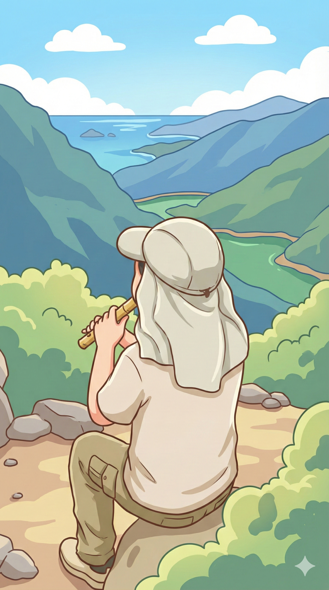

# 【随笔】挑战深圳第一险——七娘山（续四）

眯缝着眼睛，面朝山谷和大海，吹着尺八，「努力」地享受着阳光、海风。

我「努力」地不去管那些好奇地停下来打量我的目光。有人在我不远处坐下来，对我开口：

> 这是什么乐器？

> 尺八。
>
> 有点小众。

我停下来回答，又略显多余地补了一句。有点炫耀地摸了一下手中的竹管（其实只是竹根模样的树脂管）。拎着巨大的「不专业」宜家袋，爬到这辽阔的海天之间，掏出一支小众乐器呜呜吹两声，很有令狐冲的范儿嘛。我这么想着，同时山脚下有人路过我身边时打趣儿的话再次从心底里冒出来：

> 真是高手在民间啊！

看来，我还真主动把这「民间高手」的标签贴身上了。

大宝带着大鱼终于爬了上来。她在我身边坐下，喝了口水，有些郁闷的对我说：

> 你知道吗？
>
> 我刚才一路好几个地方就在那想，我们来这儿干嘛！

我问：

> 怎么了？

她说：

> 有好几段路，我根本没办法保护大鱼，既没法站上方拉，也没法在下面接。
>
> 只能让他自己爬。

她停了停，又说：

> 大鱼吓得哇哇哭，在哪里喊：
>
> > 妈妈！我害怕！！！

> 我对他说：
>
> > 害怕也要站稳，脚不能软。

她拿着水瓶，盯着地面，头都没有抬：

> 还好大鱼给力，他真的自己就一边哭着，一边就挪过去。
>
> 然后我就在那儿想，我来这干嘛。
>
> 我知道，只要他脚一软，他就会摔下来。在那个角度，我根本保护不了他，他一定会受伤，说不定骨折什么的……

我说：

> 阿宝也哭了，一边哭一边爬。
>
> 我还安慰她说爸爸在下面保护她。

她说：

> 没用的，两个人会一起滚下去。我知道我的水平，你肯定比我更站不稳。

我知道，在山里长大的她，对山路比我更懂。

沉默了好一会儿，阿宝走了过来。大宝问：

> 阿宝刚刚也哭了呀？

我说：

> 是的，边哭边爬，一路爬上来，很棒的。

阿宝说：

> 嗯，我害怕。不过，一到这里，我就不怕了。

我又问：

> 那现在是不是很有成就感？

阿宝困惑地问：

> 什么是成就感？

我一时还没想起怎么解释，阿宝自己就想出一句话：

> 我觉得自己很了不起！

大鱼凑过来，浑身都是土，连脸上都是毛绒绒的一层，两只眼睛又黑又亮，闪闪发光：

> 我也觉得，我很了不起！

停了停，阿宝和大鱼又一起说：

> 但是，我们再也不来了……

我和大宝把水瓶装回蓝色的宜家袋，扭头看了看身后上山的路。

<待续>