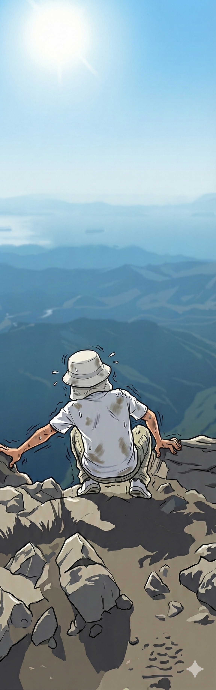

# 【随笔】挑战深圳第一险——七娘山（续五）

我收拾好大包，走在最后面。

明明水和食物都消耗了不少，包却还是越来越沉。我把外套裹在带子上，好稍微减缓一点它嵌进肉里的疼痛感。风忽大忽小，太阳时有时无，我闷头爬着山，竟然一直没有追上带着两个孩子的大宝。

直到距离主峰顶的最后十米，我看见他们仨靠坐在峰顶下方休息。最后这一小截山峰只有石头，感觉四面全是悬崖，爬上去似乎非常难，而且挤满了人。我回头看了一眼，身后就是陡峭的来路，我忍不住腿肚子开始哆嗦。

这时，我做出了一个很快就后悔的决定。

我把宜家袋放在路旁一棵小树边的空地上，顿时感觉轻松了许多。陡峭的山路也觉得没那么难了，三步两步走到大宝身边，我说：

> 我上去探探路，看有没有能直接绕到山后台阶的路，就不用爬这最后一截了。

空着手上山果然容易得多。很快，我就登顶了。然而，山顶只不过是一块十多平米的平台，四周随便垒了几块石头，垫高了大约二三十公分，算是把山顶平台和四面的悬崖隔开了。另一边果然有台阶，但是并没有任何其他路可以绕过去。

我准备原路返回，一扭头，把自己吓住了。

这个位置，自己就直接站在悬崖正上方，然后必须面对着陡峭的深渊，一步一步走下去。

心脏开始狂跳，手软脚抖。我强压住那种眩晕的感觉，弯下身子，抓着石头往下挪了几步，到了大宝身边：

> 没路，只能从这儿上。

大宝看我害怕的样子，问：

> 那我们先上去咯，你自己下去拿包？

蓝色的宜家包就躺在在悬崖下方 10 米左右的地方，在它后面又是深渊。只是这样看着它就让我头晕目眩，而我必须走过去。

我拍拍胸口，强装镇静：

> 那当然了。

我看了一眼阿宝和大鱼，想要冲他们笑一下，但声音却在打颤：

> 站在这里，爸爸恐高症都要犯了。

阿宝和大鱼笑起来，在大宝的带领下往山上爬去，我则蹲下来，用手扣住脚边的锋利的岩石，一步一挪地去拿包。砂石在脚下打滑，阳光明晃晃的格外刺眼。

等回到自己刚刚放包的地方，我已经满头大汗，心都要从嗓子眼蹦了出来。

而现在我必须再背上这个大家伙，重新再爬回去。

<待续>