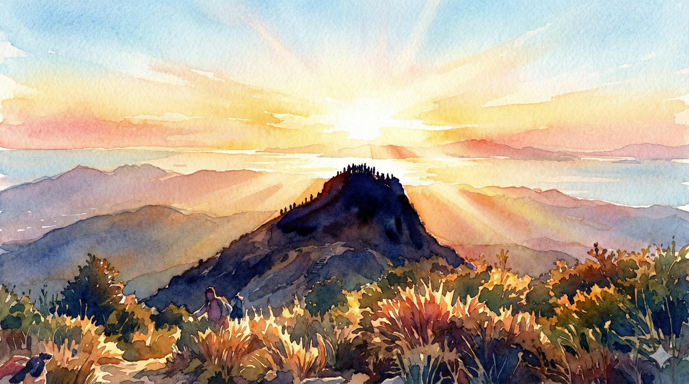

# 【随笔】挑战深圳第一险——七娘山（续六）

我决定要么抬头看着山顶，要么低头看眼前下一块准备抓住的石头。不用再看着悬崖，心跳也慢慢缓和了下来。巨大的蓝色宜家袋既沉重，又碍事，但终究，我还是把它背上了山顶的平台。

跨过最后一块石头，上到山顶的平台。风呜地就起来了！

我感觉自己差点儿要被吹下去，平台边垒的那几块石头，矮得连我膝盖都拦不住，我只好猫着腰，四下里寻找大宝和孩子们的身影。

转了一圈没有看到他们，湿透的 T 恤贴在后背，冷冰冰的，狂风一直不停，眨眼之间我就觉得自己已经冷透了。我赶紧把自己的大羽绒服拿出来穿上……

呼～暖和多了。但我还是不太敢站直身子，怕山顶的大风把我吹下去。

那个和我开过玩笑的小伙子也在山顶，看到我后说：

> 大哥，你带羽绒服上来是对的！

我使劲儿给他挤出一个微笑。继续寻找大宝和孩子们，身边不少人在拍照留念，还有一架小小的无人机在头顶盘旋。我很想像他们一样拍张照片，留下自己「勇敢」登顶的身影。

但是，咦，大宝和孩子们已经从台阶下去了。他们在十几米下方的山梁上，大鱼趴在妈妈腿上，阿宝甚至蜷缩进了石沟里。我正想叫她们从下方给我拍张照片，话到嘴边又吞了回去。

算了，我也赶紧下去吧。在这山顶，实在是又冷又怕，没什么好拍照的。

……

原来，这一面山梁处的风，不比山顶小多少。我赶紧把厚衣服全拿出来给他们穿上，袋子一下空了一大半。

阿宝穿上厚羽绒服，似乎感觉自己重心稳了不少，勇敢地从石沟里爬了出来，牵着我的手一起走过了这道山梁。再转过一道弯，风终于停了。

……

后面还有两处观景台，没那么险峻。我们终于可以安心地停下来，欣赏风景。回头看过去，下午刺眼的阳光照耀着我们刚刚爬过的主峰顶，上面还有不少人，海面反射出强烈的白光，只看得清剪影。

我叫住大宝和孩子们，说：

> 你们看，多美啊，刚才我们就在那里！

当时我们在那只想着赶快离开，哪里能想到，那也是别人眼中美丽的剪影呢……

<待续>
