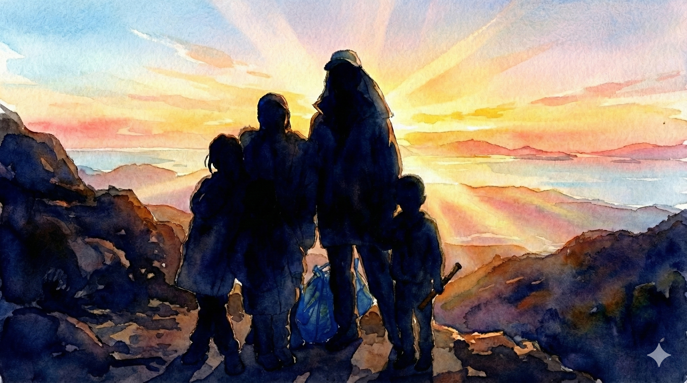

# 【随笔】挑战深圳第一险——七娘山（全）

看到新闻说，七娘山的望郎归又出事儿了。我咯噔一下，赶紧拿出地图，对比了一下我们元旦假期刚爬过的路线。原来望郎归在我们徒步路线的另一侧，从山顶过去至少还有5、6公里。

呼～～我长长出了一口气。

这么说，至少那天我们还不算太过冒险。

那是一个相当随性的旅程，头一天我们租了辆 SUV，大宝开着车，在假日里拥堵的公路上开了停，停了又开，阿宝和大鱼，甚至我都昏昏沉沉睡了过去，一觉醒来，终于到达了大鹏半岛。我们在国家地质公园附近的停车场里找了块空地，一家人直接猫在汽车里睡了一晚。

清晨，天亮了，早起爬山的人们一辆车又一辆车的开了过来，停在我们附近。太阳还没升过山顶，圆圆的月亮也还挂在西边的天上，风声呜呜作响，我们穿上厚厚的羽绒服，收拾收拾，也准备去爬山。

大宝翻了翻后备箱，说：

> 哎呀，居然一个双肩包都没有带，只能拿塑料袋装两瓶水了。

我也跟着翻找了一下，决定还是把宜家那个巨大的编织袋也拿上——这一念之间的决定，让我们后来庆幸不已。

……

因为孩子们不想上楼梯那么无聊，于是我们选择了从大榕树起点爬上去的路线。那是一段土路，和大宝老家深山里的路没什么不同，甚至更加平坦。因为走的人多，泥土全被碾成了灰，在清晨阳光的照射下，路上腾起的灰尘显得林间「雾气蒙蒙」，然而一头扎进「雾气」，就会弄得满鼻子满嘴、粗粝的尘土。

孩子们很喜欢这大自然环境，阿宝和大鱼在我们身前身后跑来跑去，不时停下在路边研究一些没见过的花花草草和蚂蚁昆虫。或是躲在岔路口的树后，在我们走近时猛地跳出来，看着我们被吓了一跳的样子哈哈大笑。

大宝一开始还用塑料袋帮我分担了一些辎重，但后来塑料袋磨破了，这些水和食物也只好重新放回了我的蓝色宜家编织袋里。太阳越升越高，我们身上的羽绒服也一件又一件放进了袋中。本来空一半的巨大袋子，竟然被塞得鼓鼓囊囊。

一队又一队的登山队伍，举着小红旗从我们身边呼啸而过。他们大多穿着轻便的速干衣，背着小巧的双肩包，两手各擎着一支登山杖。看着他们一身专业的装备，感受着蓝色宜家编织袋那细细的带子嵌在我肩膀里，更觉得疼痛。然后，我还是坚持把尺八拿在手里，这样停下来等孩子们时，我可以随时靠在路边的树桩上，悠然自得（自鸣得意）地呜呜两声。

掂量一下，自己浑身上下可能只有来自迪卡侬的防风太阳帽还算是件「登山装备」吧。

不知不觉，轻松的土路阶段就要结束了……

拐了几个弯，山路开始掉头向上，并且越来越陡。一开始小路只是跟着高压线的方向拐来拐去，后来干脆直接顺着山脊往上延伸。

一个巨大的石头横在路前，必须得爬上去。小孩子们尖叫着冲了上去，在大宝的带领下，手脚并用地跟着其他人走过的路线爬过了巨石。接着，又是一段小树林中的陡坡，脚下的沙土粒像滚珠一般滑动。运动鞋完全抓不住地面，一打滑，差点失去平衡趴倒在地上。我赶忙把挂在肩上的巨大蓝色宜家袋往身后挪了挪，用拿着尺八的那只手固定住不让它乱晃，腾出一只手抓着树枝或者树干稳住身体，一步一挪地往上爬。

大宝守着大鱼，落在了后面，阿宝还爬在我的前方，或者说是上方。

> 阿宝！
>
> 你发现没，这个树枝一定是很多人扶过，光光溜溜的真好摸。哈哈，都已经被盘出「包浆」了。

阿宝凑过来，仔细看了看我指着的那截长在树上，却泛着油光的树枝，好奇地问我：

> 什么叫「包浆」？

我只好给她解释了一下老男人们盘核桃和念珠的「典故」。她「哦」了一声，然后一面爬，一面兴奋地指给我看：

> 爸，你看这个！
>
> 你再看这个！
>
> 你看，这里还有！

……

我们以为翻过这个大石头，再爬过这段需要抓着树枝和树根手脚并用地陡坡，险路就算结束了。却没想到，土坡之后又是一个石坡，石坡之后又是一段土坡，没完没了。

在一处稍微平缓，可以休息的林中路边。我放下大包，等到了大宝和大鱼。

我们原计划是，如果孩子们爬不上去了，就原路返回。此时此刻，我们第一次认真地开始琢磨，要不就这样掉头回去算了？

但是，站在山间回头望下去，来时的小路陡峭、笔直，根本找不到可以落脚的地方。我掂量着手上蓝色大包的份量，想像着如果从这里下山，或许直接就失去平衡滚下去了。这么一想，我忍不住哆嗦了一下，赶紧抬头往远处看去。

我们所在的高度，已经可以看到另一座山头那边的大海。嗯，风景已经开始好起来了！

再掉头看看往山顶的方向，同样陡峭，但至少看得出哪里可以落脚，哪里可以上手。

唉，算了，下去一点都不容易，而继续上山，大概率还能享受一下山顶的美好风景。

要不我们还是继续上山吧！

又到了一处岔路口，拥堵、聚集着一大群登山的人。大部分人都堵在左边的路上，右边的小路有几个人走上去两步，然后又看他们退了下来。

我听见有一个男人在不远处高声和自己同伴说着：

> 我研究过了，这条路猿猴可以过去，但不是人类可以搞定的。

我不由得暗自嘀咕：

> 有这么难？

我再次找了个树根放下大包，叫住阿宝，让她和我一起等妈妈。我可不想和他们在这个关键的路口走岔了……

等大宝带着大鱼爬上来，我和她说了自己在这路口的犹豫，然后问：

> 我们该走那条路呢？

她让我再去看看。

我发现经过这么一会儿，拥堵的人已经渐渐通过了左边那段山路，另外一条路看起来好走，却没有人走。而且，左边路口的大树上，系着好多根红布条，那显然是各个户外组织留下的路标。于是，我往左边的路上走了两步，路再次分岔。

一条往上，似乎是通往一段峭壁边上的小路，另一条则是从峭壁下绕行。我让大宝带着孩子们在这里稍微再等等，自己背着大包往上去探探路。

果然，小路迅速收窄，很快变成只有一人宽左右。右边是垂直而陡峭的石壁，左边也是，并不深，但下方三四米左右就是一大块巨石，尖锐的棱角让人忍不住害怕。从这里摔下去，肯定会骨折吧？

还好，悬崖上有垂下来的藤条。我试着拉了一下，很结实，便把尺八放进包里，一只手固定住大包，一只手拉住藤条，走过了那一小段最窄的山路。有一个妈妈，带着两个和阿宝差不多大的孩子，在略宽的石头平台上犹豫着。我绕过他们，才发现，前面没路了，只有一根粗粗的藤条垂下去，必须拉着这根藤条下降一人多高才能重新踩到地上。

那位妈妈沮丧地冲后面的同伴喊道：

> 这里走不通，孩子们没法下去。
>
> 但是，我们也退不回去了，怎么办？

我拉住藤条，小心翼翼地下到石头平台下方，确实，这里只能全凭手的力量拉住身体，在落地之前，脚根本就是摆设。

我放下包，转身招呼那两个妈妈，让她在上面拉着小孩，我在下面接着，用接力的方式保护着两个小家伙下了平台。

大宝在后面，听见前面这出惊险的囧境，干脆地选择了峭壁下面绕行的路。但是，遇到了类似的麻烦，同样有一人多高的断头路，小孩子自己跳不下去，她一个人也办法拉住小孩。还好，有另一位男士帮忙，把阿宝和大鱼接了过去。

就这样，大家灰头土脸地通过了这段号称「只有猿猴才能搞定」的路段。

带着大包和两个孩子，是更不可能回头了。大宝对我感叹说：

> 都被那些爬山攻略的视频骗了！
>
> 现在总算明白视频里为什么根本没有啥特别难爬的路段了。

我说：

> 可不，在这几段路上，谁敢分心拿出手机来拍照和拍视频呢？

……

转过这石壁，风一下大了起来。

这是一片开阔地，回头能一眼看到我们来时走过的所有路段。最初的那段土路，其实绕过了一座靠海边的山头，而此时此刻，那座山头已经不到我们脚下的高度了。

我们的右手边也没什么遮拦，有几棵稀稀拉拉，半人多高的小树，更多的只是路边的杂草。3、5米远开外，就是陡坡，一直延伸到山脚下的陡坡，和我们身后的陡坡没什么区别。左手边是岩石和峭壁，人们踩出来的路就在石头和小树之间弯弯曲曲的向着山顶延伸。

脚下全是被人踩碎的沙土，根本站不住。

阿宝在我前面，拉着一棵细细的小树枝，左右看了看，吓得哭了起来：

> 爸爸！我害怕……

我也害怕，在这随时会打滑的土路上，一不留神，我可能就会连人带包一直滚下山坡。而那几棵小树，估计根本挡不住一个人滚下山的人。我感觉自己手心都有些出汗，脚也开始因为恐惧而发抖，不由得更用力地抓紧了手边的树枝。

> 不用怕，爸爸挡在你这边。
>
> 你弯下腰，手脚并用，就不会打滑。
>
> 而且，就算滑下来，还有爸爸在这里接着你。

我想了想，又接着说：

> 现在也不可能掉头下山了。
>
> 你要是实在害怕，就找个稍微稳当点的停下来停下来，哭一会儿我们再往上爬。

阿宝哭着开始往山上爬，头也不会。我赶紧跟上，尽量紧紧地跟在她身后不远处，隔在她和最陡峭的斜坡之间。我不敢伸手扶她，因为只靠两只脚，我根本站不稳。这种情况下去拉一个人，哪怕只是她这样 8 岁的小姑娘，我也不敢——害怕失去平衡。

我更害怕她跌下来时，我自己也没站稳，接不住她。这时，我真想把肩上的沉沉宜家袋子扔了，它不仅深深地嵌在肉里让我肩膀生疼，还总是晃来晃去拉得我东倒西歪。我必须一直空出一只手控制住这个大袋子，另一只手要么扣着石头，要么拉着树根。大气都不敢喘地盯着我前方的阿宝，甚至不敢多想她万一脚一滑，我要怎么才拉得住她。

每到一处稍微能直起身子，有一块石头或一棵树挡在我们和悬崖陡坡之间的地方。我都会忍不叫她：

> 阿宝，要不要在这里歇会儿？

她却头也不回，一边哭一边越爬越快，我只好咬牙跟上。

……

终于，到了一大块巨石形成的十几个平方米的平台，阿宝终于敢坐下来休息会儿。我也找到一个稳当的角落放下了大包。不少人在这里休息，有人看到我的宜家大包，笑着和我打招呼：

> 大哥，你这是搬家吗？

我尴尬地说：

> 早上出门早，穿着羽绒服就出门了。

大宝和大鱼落在后面不知哪个地方，伸长了脖子也看不到。阿宝稍微歇了会儿，收住了泪水，又开始催着我往山上爬。我面朝来时的方向坐在台阶上，闪闪的太阳光撒在远处的海面上，让人有些分不清哪里是天，哪里是海。风也不大，阳光晒得身上暖暖的，汗水从毛孔钻出来，就迅速地蒸发了。

都爬到这儿了，不吹吹拿了一路的尺八，未免亏得慌。我把尺八从袋子里掏出来，对阿宝说：

> 这里风景太美了，我想吹吹尺八。
>
> 就在这里等一会儿妈妈和弟弟吧……

> 好吧……

阿宝有些无奈地说。

眯缝着眼睛，面朝山谷和大海，吹着尺八，「努力」地享受着阳光、海风。

我「努力」地不去管那些好奇地停下来打量我的目光。有人在我不远处坐下来，对我开口：

> 这是什么乐器？

> 尺八。
>
> 有点小众。

我停下来回答，又略显多余地补了一句。有点炫耀地摸了一下手中的竹管（其实只是竹根模样的树脂管）。拎着巨大的「不专业」宜家袋，爬到这辽阔的海天之间，掏出一支小众乐器呜呜吹两声，很有令狐冲的范儿嘛。我这么想着，同时山脚下有人路过我身边时打趣儿的话再次从心底里冒出来：

> 真是高手在民间啊！

看来，我还真主动把这「民间高手」的标签贴身上了。

大宝带着大鱼终于爬了上来。她在我身边坐下，喝了口水，有些郁闷的对我说：

> 你知道吗？
>
> 我刚才一路好几个地方就在那想，我们来这儿干嘛！

我问：

> 怎么了？

她说：

> 有好几段路，我根本没办法保护大鱼，既没法站上方拉，也没法在下面接。
>
> 只能让他自己爬。

她停了停，又说：

> 大鱼吓得哇哇哭，在哪里喊：
>
> > 妈妈！我害怕！！！

> 我对他说：
>
> > 害怕也要站稳，脚不能软。

她拿着水瓶，盯着地面，头都没有抬：

> 还好大鱼给力，他真的自己就一边哭着，一边就挪过去。
>
> 然后我就在那儿想，我来这干嘛。
>
> 我知道，只要他脚一软，他就会摔下来。在那个角度，我根本保护不了他，他一定会受伤，说不定骨折什么的……

我说：

> 阿宝也哭了，一边哭一边爬。
>
> 我还安慰她说爸爸在下面保护她。

她说：

> 没用的，两个人会一起滚下去。我知道我的水平，你肯定比我更站不稳。

我知道，在山里长大的她，对山路比我更懂。

沉默了好一会儿，阿宝走了过来。大宝问：

> 阿宝刚刚也哭了呀？

我说：

> 是的，边哭边爬，一路爬上来，很棒的。

阿宝说：

> 嗯，我害怕。不过，一到这里，我就不怕了。

我又问：

> 那现在是不是很有成就感？

阿宝困惑地问：

> 什么是成就感？

我一时还没想起怎么解释，阿宝自己就想出一句话：

> 我觉得自己很了不起！

大鱼凑过来，浑身都是土，连脸上都是毛绒绒的一层，两只眼睛又黑又亮，闪闪发光：

> 我也觉得，我很了不起！

停了停，阿宝和大鱼又一起说：

> 但是，我们再也不来了……

我和大宝把水瓶装回蓝色的宜家袋，扭头看了看身后上山的路。

这次，我走在最后面。

明明水和食物都消耗了不少，包却还是越来越沉。我把外套裹在带子上，好稍微减缓一点它嵌进肉里的疼痛感。风忽大忽小，太阳时有时无，我闷头爬着山，竟然一直没有追上带着两个孩子的大宝。

直到距离主峰顶的最后十米，我看见他们仨靠坐在峰顶下方休息。最后这一小截山峰只有石头，感觉四面全是悬崖，爬上去似乎非常难，而且挤满了人。我回头看了一眼，身后就是陡峭的来路，我忍不住腿肚子开始哆嗦。

这时，我做出了一个很快就后悔的决定。

我把宜家袋放在路旁一棵小树边的空地上，顿时感觉轻松了许多。陡峭的山路也觉得没那么难了，三步两步走到大宝身边，我说：

> 我上去探探路，看有没有能直接绕到山后台阶的路，就不用爬这最后一截了。

空着手上山果然容易得多。很快，我就登顶了。然而，山顶只不过是一块十多平米的平台，四周随便垒了几块石头，垫高了大约二三十公分，算是把山顶平台和四面的悬崖隔开了。另一边果然有台阶，但是并没有任何其他路可以绕过去。

我准备原路返回，一扭头，把自己吓住了。

这个位置，自己就直接站在悬崖正上方，然后必须面对着陡峭的深渊，一步一步走下去。

心脏开始狂跳，手软脚抖。我强压住那种眩晕的感觉，弯下身子，抓着石头往下挪了几步，到了大宝身边：

> 没路，只能从这儿上。

大宝看我害怕的样子，问：

> 那我们先上去咯，你自己下去拿包？

蓝色的宜家包就躺在在悬崖下方 10 米左右的地方，在它后面又是深渊。只是这样看着它就让我头晕目眩，而我必须走过去。

我拍拍胸口，强装镇静：

> 那当然了。

我看了一眼阿宝和大鱼，想要冲他们笑一下，但声音却在打颤：

> 站在这里，爸爸恐高症都要犯了。

阿宝和大鱼笑起来，在大宝的带领下往山上爬去，我则蹲下来，用手扣住脚边的锋利的岩石，一步一挪地去拿包。砂石在脚下打滑，阳光明晃晃的格外刺眼。

等回到自己刚刚放包的地方，我已经满头大汗，心都要从嗓子眼蹦了出来。

而现在我必须再背上这个大家伙，重新再爬回去。

我决定要么抬头看着山顶，要么低头看眼前下一块准备抓住的石头。不用再看着悬崖，心跳也慢慢缓和了下来。巨大的蓝色宜家袋既沉重，又碍事，但终究，我还是把它背上了山顶的平台。

跨过最后一块石头，上到山顶的平台。风呜地就起来了！

我感觉自己差点儿要被吹下去，平台边垒的那几块石头，矮得连我膝盖都拦不住，我只好猫着腰，四下里寻找大宝和孩子们的身影。

转了一圈没有看到他们，湿透的 T 恤贴在后背，冷冰冰的，狂风一直不停，眨眼之间我就觉得自己已经冷透了。我赶紧把自己的大羽绒服拿出来穿上……

呼～暖和多了。但我还是不太敢站直身子，怕山顶的大风把我吹下去。

那个和我开过玩笑的小伙子也在山顶，看到我后说：

> 大哥，你带羽绒服上来是对的！

我使劲儿给他挤出一个微笑。继续寻找大宝和孩子们，身边不少人在拍照留念，还有一架小小的无人机在头顶盘旋。我很想像他们一样拍张照片，留下自己「勇敢」登顶的身影。

但是，咦，大宝和孩子们已经从台阶下去了。他们在十几米下方的山梁上，大鱼趴在妈妈腿上，阿宝甚至蜷缩进了石沟里。我正想叫她们从下方给我拍张照片，话到嘴边又吞了回去。

算了，我也赶紧下去吧。在这山顶，实在是又冷又怕，没什么好拍照的。

……

原来，这一面山梁处的风，不比山顶小多少。我赶紧把厚衣服全拿出来给他们穿上，袋子一下空了一大半。

阿宝穿上厚羽绒服，似乎感觉自己重心稳了不少，勇敢地从石沟里爬了出来，牵着我的手一起走过了这道山梁。再转过一道弯，风终于停了。

……

后面还有两处观景台，没那么险峻。我们终于可以安心地停下来，欣赏风景。回头看过去，下午刺眼的阳光照耀着我们刚刚爬过的主峰顶，上面还有不少人，海面反射出强烈的白光，只看得清剪影。

我叫住大宝和孩子们，说：

> 你们看，多美啊，刚才我们就在那里！

当时我们在那只想着赶快离开，现在回头看，原来那也是别人眼里的风景呢……

<没了>