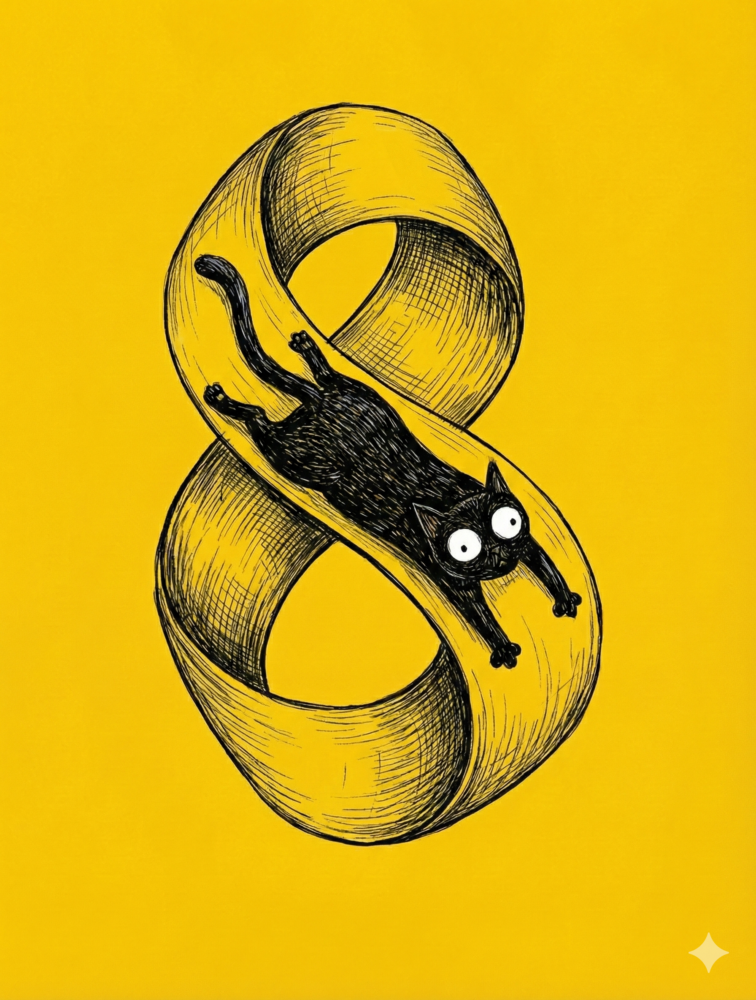

# 【随笔】恼人的克莱因瓶（续一）

第一次发现自己想错了的时候，阿宝和大鱼刚刚吵完架。他俩不仅都想睡在妈妈身边，并且还不允许对方睡妈妈身边，这就无解了。一顿大哭大闹之后，妈妈宣布大家必须闭嘴，一次只能一个人说话。轮到我时，我说：

> 你们要不要听一下，那个困扰了爸爸好几天的那个物理问题？

我听见他们嘟囔了一下，先说不要，然后又改了口，于是就继续起来：

> 把一个纸条，两头粘起来，它就成了一个纸圈，对不对？

他们嗯了一声。

> 如果一只小蚂蚁在上面爬，它怎么也爬不到里面去，只能在外面绕圈子对吗？

> 现在再拿一张这样的纸条，在粘起来之前把它拧一下，让它正面对着反面粘在一起。
>
> 然后，有一只小蚂蚁在上面爬，爬一圈之后会出现什么情况？

他们想了一会儿，阿宝抢着说：

> 小蚂蚁会爬到它的反面。

我说：

> 对，然后再爬一圈它又会回到正面。它不需要从纸条的侧边翻过去，就能爬到另外一面。
>
> 这个纸圈，叫做莫比乌斯圈。

我继续说：

> 我们做两个这样的纸圈，把它们的侧边粘起来，这就叫做克莱因瓶。
>
> 在我们生活的这个世界里，克莱因瓶是不存在的。

阿宝说：

> 为什么呢？

我说：

> 在三维世界里，你没办法把它们完全粘起来。

大鱼哈哈大笑：

> 爸爸，你真搞笑！直接粘起来不就行了吗？怎么可能粘不上呢！

大宝打断了我们：

> 行了，就到这里。可以做实验解决就明天做实验，今天先睡觉。

然而，说到这里，我却发现了自己其实想岔了——我想象中的那只蚂蚁，依然是三维空间空间的实体——所以，当它爬到纸条背面相同区域时，它会认为自己身处完全不同的地方。

如果它是真正的二维生物呢？这只蚂蚁将不是趴在纸面，而是被压缩在纸内无限薄的二维切片上。 

大鱼和阿宝又吵了起来。阿宝说：

> 我不想要弟弟出生！

我听到了这句话，有些不开心，顺嘴批评了她一句。大宝也同样地，告诉她说：

> 你这样说不对，你这么说，妈妈不开心。

忽然被爸爸、妈妈同时严肃批评，阿宝大哭起来。

我用被子捂住耳朵，继续想那只被压扁在纸条上的蚂蚁——不，如果我就在那二维空间里，我会看到什么？

因为没有厚度，纸的两边，就像两条铁丝一样，没有厚度的平行轨道。我可以在轨道上滑行，同时左手拿着红笔，右手拿着蓝笔，给这两条铁丝涂色。只用一圈，我就会回到起点，右手的蓝笔会触碰到已经被涂成红色的那部分轨道，左手的红笔会触碰到已经被涂成蓝色的那部分轨道。

我不会认为自己的前后左右有任何变化，但原来在我左右两边的铁丝轨道，在没有交叉过的情况下，左右互换了。

这就是我之前想错了的地方！

我以为蚂蚁会爬到反面，这是因为我没有放弃自己天生的第三个维度，真正用二维的方式思考莫比乌斯圈上蚂蚁的处境。

阿宝和大鱼的哭声，忽然又清晰起来，我忍不住笑出声来。大宝很生气：

> 你笑什么？

> 是这样……

我刚开口，却发现自己没法解释。此刻躺在妈妈两边，正在互相讨厌对方的阿宝和大鱼，在黑暗中变成了我脑子里左手边和右手边平行的那两条铁轨，但实际上他们根本就是一条线，根本就分不开的一条线。我想告诉大宝，我看到他们自己在和自己吵架，但这话实在太疯狂了。

我只好闭嘴，干笑了一声。

<待续>