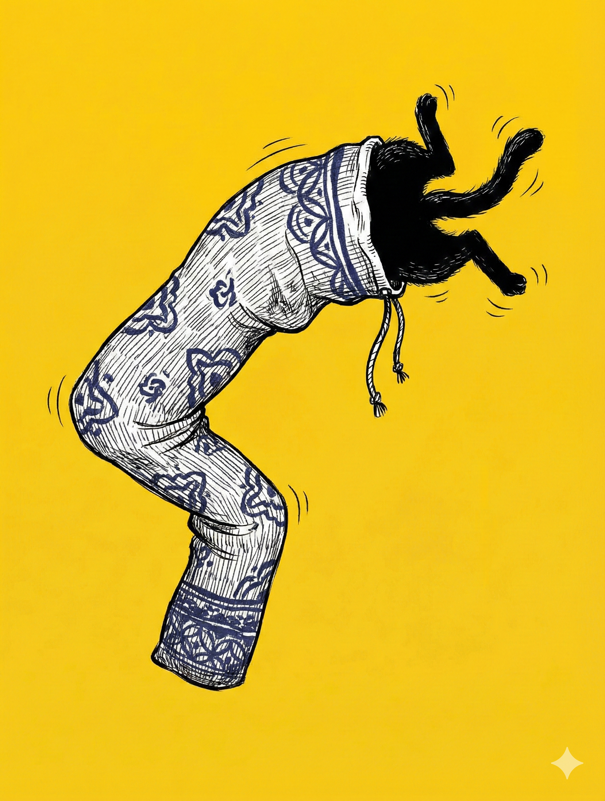

# 【随笔】恼人的克莱因瓶（续二）

就这样，终于弄明白了自己第一个困惑的根源——我想不通玻璃克莱因瓶模型和真正的克莱因瓶有什么不一样，是因为自己：

1. 没搞明白什么是真正的克莱因瓶。
2. 在尝试理解克莱因瓶时弄错了类比的对象。

克莱因瓶是两个莫比乌斯带拼起来这句话，让我终于理解了什么是真正的克莱因瓶。也同时弄明白了这里面被我混淆的几个画面：

1. 在扁平二维平面上的莫比乌斯圈投影和爬在上面的二维生物
2. 莫比乌斯带二维平面上的二维生物
3. 爬在莫比乌斯纸圈表面的三维蚂蚁
4. 爬在玻璃克莱因瓶模型上的三维蚂蚁（或者我这个三维生物）
5. 爬在真正的克莱因瓶里的三维生物
6. 把玩真正克莱因瓶的四维生物

因为我是三维空间生物，我真正能懂的，其实只有 3 和 4 。

理解画面 1 和 2 需要降维的想象力；而理解 5 和 6 需要升维的想象力。

之前失败的想象，让我把 2 和 3 混为一谈，4 和 5 混为一谈。当我想尝试着通过类比的方式，用二维的莫比乌斯圈帮助我理解四维的克莱因瓶时，被 3 和 4 这两个明明可以出现在三维空间的情景带进了坑里。

……

终于想明白自己错在哪里了，但真正的克莱因瓶又是什么样的呢？

我忽然发现，刚刚还在吵架的孩子们已经睡着了。大宝凑过来轻声问我：

> 你睡着了吗？

我说：

> 没有，快了。刚刚还在想那个物理问题，但现在想明白了，打算像你说的那样，明天做个实验看看。

又聊了一会儿天，也不知啥时候，我们俩也先后睡着了。

……

第二天一早，阿宝先起床，我给他剪了好几个纸条，做成普通的纸圈，莫比乌斯圈。在上面画蚂蚁，用颜色笔试着把两边涂成不同颜色，等等。

最后，我给他表演魔术。我说：

> 你想一下，如果我顺着中间，把这个莫比乌斯圈剪开，会发生什么？

她想了想说：

> 会变成两个纸圈？

我得意地把纸圈剪开，然后递给她——纸圈还是一个，只不过更大，扭得更厉害。阿宝惊讶地拿起来，仔细看了看，眼睛瞪得溜圆。

大鱼也起床了，他让我在莫比乌斯圈上画小汽车。我便给他画了一个，然后交给阿宝和大鱼各两个莫比乌斯纸圈，说：

> 你们现在试试，把它们的边粘起来。

他们俩拿起来研究了一下，发现确实无法做到，便把纸圈抢过去，站在沙发上把它扔到空中。小玉不知从哪个角落冲了过来，想要抓住那两个纸圈，孩子们便和猫咪玩了起来……

我拿起装尺八袋的布袋子，开始琢磨前一天在床上凭空想象的问题——爬在真正的克莱因瓶里，到底会不会像爬一个管子呢？

我把尺八袋口翻过来，然后又把底部弯过来，拿在手里仔细打量。果然，如果要对接成功，只有两种方法：

1. 把底部也翻过来，那这就是一个普通的甜甜圈造型。
2. 让底部穿过袋子自己，和翻过来的袋口对接——外面接上里面，里面接上外面——那些玻璃克莱因瓶模型就是这么做的。

而真正的克莱因瓶，我闭上眼睛想象了一下——如果是和这个翻过来的尺八袋表面类似——我在爬完那个翻转的曲面之后，想要不重新从表面穿过尺八袋，它的底部必须——凭空消失！

我想起 DeepSeek 和 Gemini 其实一直在说，但我却一直没收到的那句批评：

> 你想要视觉化一个根本无法视觉化的概念，这是不可能做到的。

我长长吁了一口气，把尺八袋抖了抖，正准备把尺八重新装进去。

小玉却以为我也在逗它，在空中一个翻身就立刻冲了过来。孩子们跟在后面，哈哈大笑起来！

