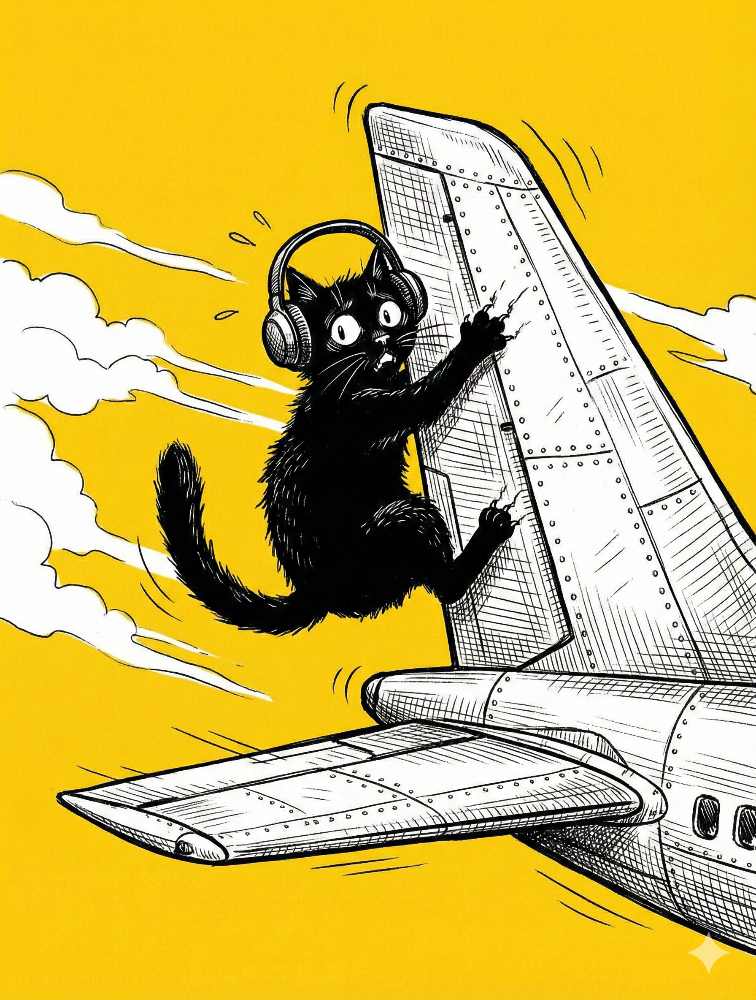

# 【生命⋅修行】只不过是湍流

> 糟了，我搞错登机口了。

我一面在视频里和大宝这么说，一面慌忙起身，开始寻找 46 号登机口在哪里。我能感受到自己的语速和呼吸越来越急促，但我不想挂掉视频——因为那意味着：

1. 我开始控制不住自己的情绪。
2. 我解决不了大宝需要我帮助的问题。

然而，更糟糕的事情发生了。我发现，搞砸这一切的竟然是我自己：

一周多之前，我在大宝电脑上把她正在编辑的旅行计划用 iCloud 共享了一下。但她每次使用的时候直接忽视了 iCloud 无法同步的提示。今天早上，这个文件忽然把她最近新增的各种清单、计划全都丢了，怎么也恢复不了。

我一边小跑，一边脱口而出：

> 你不要怪我好不好，这样会让我心情不好！

大宝等我慌慌张张登上了摆渡车，确认我不会赶漏航班后，再次又悠悠地说到：

> 可是，明明是你的错。
>
> 竟然还不让我怪你，明明是你的问题嘛！
>
> 不然我用得好好的！

我还想狡辩，就让她打开另一个从来没有共享过，最近一直在使用和修改的投资计划表。让她看看是不是也同样没有可恢复的历史版本。

见鬼，这个文件有着满屏幕数不清的历史版本可以回退！

> 你凑近一点，不要晃！

虽然摆渡车走走停停，我还是终于在抖动着的手机屏幕上，看明白了那是无数代表着历史版本的窗口在屏幕上丝滑地滚动着。

大宝是对的，果然就是我的问题！

真热啊，我感觉毛衣的高领里已经渗出了汗珠。

我抬起头，望向窗外，看见一架全身通红的大客机——也是海航的。

> 怎么涂得这么奇怪？我要坐这架飞机吗？

我暗自嘀咕着，感觉到那股烦躁和愤怒在身体里转了一大圈，然后转回来把自己紧紧地裹住。整个上半身和后脖子都僵硬起来。我半天没有和大宝说话，一手拿着手机，一手拎着两个大包下了摆渡车，又机械地跟着人群，爬上了另一架涂成白色，看起来脏兮兮的大飞机。

> 你赶上飞机没？

> 哦，我已经上飞机了！

我转动着手机，让她看机舱里的情景。

> 那你在干什么？

> 我什么都没干，等着呢。

我再次转动手机，让她看挡住我去路的乘客背影。说话间，前面的人侧身给我让出一条路来。把手机放到座位前，我才看见屏幕里自己那幅愁眉苦脸的样子。还好要起飞了，不然再聊下去，这一身怨气，怕是隔着屏幕都要把她给熏坏了。

……

关上手机屏幕，我感觉自己瘫坐在位置上还是一动都不想动，连表情都不想换一下。

于是，我又重新拿起手机。找到已经陪伴自己到第三天的汽水音乐，开始放歌。

一段莫名其妙的口水歌旋律飘入耳中，屏幕上灰色大字显示的，是某位网友的感慨。大约意思是，爱到最后就是互相伤害，过去的了解都成了攻击的武器之类。

我的目光被这句话吸引，忍不住跟着回复了一句：

> 这阶段，也就刚进第二关，离「最后」还远着呢……

打完这些字，又瞬间觉得自己太多事了。于是赶紧划过了这首歌，打开了手机的飞行模式。

……

我把手机扔进包里，掏出笔记本来。

笔跟着飞机抖动着，字迹歪歪扭扭。我看到昨天夜里写下的文字，和现在的状态也没多大区别。明明是在安静的书桌边写下的，却也同样歪歪扭扭，哆哆嗦嗦。

飞机忽然猛地加速，向后倾斜。座椅剧烈地抖动着，眼前的屏幕「叮」的一声亮了起来。

内脏翻腾、紧缩的感受，并没能在刚刚的书写中完全好转，我索性收起笔记本。

> 过几天就会好起来的。

我安慰自己道。

耳机里正在播放着陈奕迅的《十年》。

这首十多年前，曾在办公室里听得我泪流满面的歌，此时此刻却显得平平无奇。

我又想起大宝那个搞丢内容的文件，还有那疯狂涨价的内存、闪存，四处刷屏的ClawBot，席卷世界的 AI……不仅仅是 iCloud，最近似乎什么都搞不定，抓不住，理不顺。我期待着自己可以逍逍遥遥，游刃有余；结果却慌慌张张，连滚带爬。

这是湍流。

飞机狠命地用安全带和座椅把我牢牢抓住，玩儿命地摇晃着。我呆坐在那里，不知道该干些什么才好……

「叮」——屏幕熄灭了。

