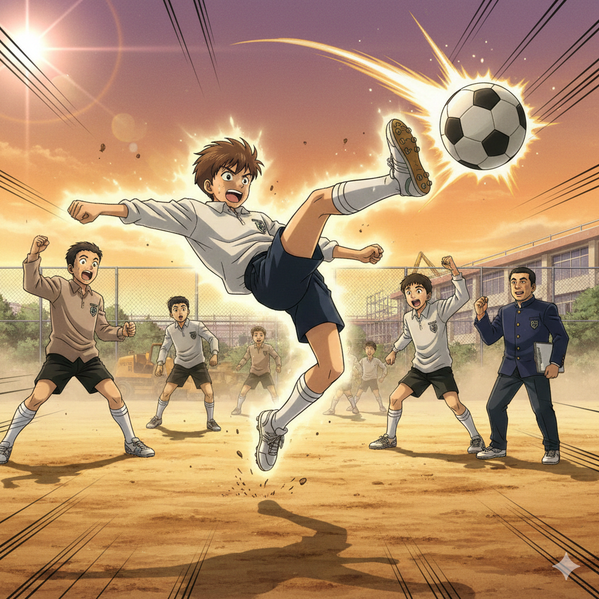

# 【生命•故事】（150）足球少年和一些记忆碎片

我不太会踢足球，不过我总是喜欢提起，自己初中好友 B 是学校球队教练口中最有灵气的前锋。

不过，初中之后，他既没有考进任何一所以足球为传统运动的高中，也没有走上职业道路，最终成为了一家超市的理货员。

那时候，还有一本热血动漫《足球小将》在我们中流行，这是我的高中好友 P 介绍给我的。他带着一副厚厚的深度眼镜，似乎是若林的粉丝，特别喜欢做守门员。每次戴上手套，站在球门前，他总是认真地弓下腰，透过闪光的眼镜片死死地盯着球场，紧张地、快速地左右移动着。

.png)

他从不在意扑救射门时跌倒在地，总是毫不犹豫地先让自己失去重心，然后砰地一声砸到地上。浑身上下，甚至眼镜上都沾满了球门前的黄土。

结果，我们班的首发守门员通常是一脸满不在乎的欧阳，那个下各种棋都全班无敌的家伙。但他并不太爱守门。P 作为替补门神，也从不怠慢。

.png)

不是和其他班比赛的时候，我也会常常上场和大家玩，由于技术有限，我通常只是打后卫。我最喜欢面对的，是班上的一个小个子。他比我还矮，还瘦，穿着几乎磨出破洞的双星足球鞋。球一旦落到他脚下，就再也不肯离开。他总是模仿着那些跳桑巴舞的巴西球星，在我面前带着球，兀自转着圈。通常把我晃得团团转，然后得意地带球从我身边切过。

但是，他不爱出球。所以我总是可以转身再扑上去，一次、两次、三次，大部份时候，最终总会把球抢断下来。

即便如此，他也只是嘿嘿一笑，下次依旧如故。

让我害怕的，是班上一个大胖子。他是前锋，也是学校的铅球冠军和纪录保持者，体重至少是我的两倍以上。他每次带着球冲过来时，总是咋咋唬唬，带着风，像轰隆隆开过来的坦克。想要站在他面前拦住他，自己总是下意识地缩成一团，怕被这巨物撞骨折，然后一紧张，他就把我晃过去了。只在空气中，给我留下一鼻子的汗臭味。

好朋友 H 是踢中场的，他毫不介意自己技术不够精细，他总是说：

> 我反正就是跑不死，可以一直追着球跑。

他也同样带着一副塑料眼镜，瘦瘦的，总是穿着一件深色的羊毛衫，每次踢球都是汗涔涔的。

他教我，作为后卫，大部分时候，看准落点，冲上去一个大脚就完事儿了。或者，跟着需要紧盯的对方前锋，苍蝇一样地跟着，让人家不能舒服地拿球就可以了。这两招，基本够我混过所有和大家踢球的时光。

……

学校的入口在操场一侧，而教师宿舍在另一侧。放学后我们在操场上疯玩，不时有老师横穿操场，结果有一次，有位年纪大的老师，被足球砸中脑袋，直接送医院去了。

当时踢球的同学被批评了，但好像也没被处分。他们嘟囔着：

> 他为啥就不肯从跑道绕一下呢？

到了后来，学校的装修继续进行，校后的操场也变成了工地，被围栏封了起来。推土机整天在里面轰隆隆，我们就再也没有机会回到那没有多少草坪，满是黄土的足球场踢球了。

甚至，我们有时会想，如果当时没有把老师踢进医院，这一切会不会不一样呢？