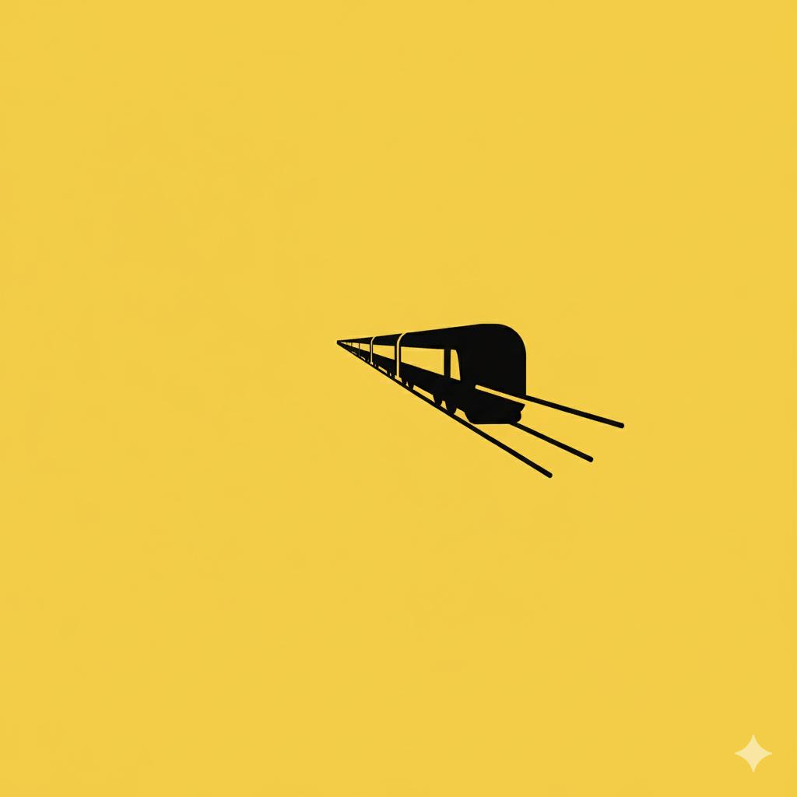

# 【随笔】开往大海的列车

记得爸爸妈妈说过，他们想要去海南玩。这次正好有假期，大宝便买了火车票，全家人一起带着爸妈出发了。

临出发，爸爸却说他以前去过海南。说他以前去的时候，那里还没开发呢，都是森林。妈妈说：

> 你没去过，自己糊涂了吧。

我也不知道，他记忆中那个部分出现了偏差。或许是他年轻时曾经去过的九宫山？那时他还给我带回来好多漂亮的水晶石呢。看爸爸坚持说自己去过，快要和妈妈吵起来。我打趣说：

> 爸爸，是不是你年轻时和谁偷偷出去玩的，所以妈妈不知道？

爸爸想起年轻时的事情来，说：

> 年轻时，倒是有个副司令员的女儿看上我……

我笑着跑去厨房找妈妈：

> 完了！妈妈要生气了，爸爸还要说那个副司令员的女儿。

妈妈说：

> 哼，我才不生气呢。人家根本看不上他！

大宝也笑起来：

> 因为那时以前的事儿，所以妈妈不生气。
>
> 现在的事情，爸爸就会生气，所以爸爸不让妈妈去和老头儿跳舞。

说起跳舞，妈妈倒来劲儿了，她说：

> 现在我连广场舞都不跳了，都是陪你爸爸走路。他呀，是不让我跳交际舞。
>
> 那时我们厂男的少，我男女舞步都学。你大姨就是我的舞伴。

我也想起来，妈妈曾经教过我来着，便告诉大宝：

> 妈妈还教会我跳舞来着，原来是让我当他的舞伴呀。

大宝有些惊讶，问：

> 你也会？

我说：

> 是啊，最简单的三步、四步，现在忘记了。

大宝转向妈妈：

> 算了，虽然爸爸不记得自己想去海南了，至少妈妈还记得。

收拾完东西，我们就出门了。

……

我们早早地准备好出门了，爸爸还关心家里的猫：

> 那些猫怎么办？

我让他放心：

> 两只猫互相作伴，我们留下的猫粮和清水足够了，饿不着他们。

……

从二号线出来，爸爸低头张望着自己空空的双手，一脸困惑和茫然。妈妈对我解释说：

> 他总是在找是不是少拿了什么东西，刚刚大鱼的羽绒服我让他拿了一会儿。

说着，妈妈朝爸爸挥了挥手里的羽绒服：

> 在我这里，你没有其他东西要拿了。

爸爸哦了一声，赶紧跟上了妈妈的脚步。

我留意到，每走一段，他依然会不时地四下张望，看到每一个人都在，才再次放心地跟上妈妈。虽然他现在已经有了好几次被警察送回家的经历。但每逢一家人出门，他却还是不由自主地，要确认每一个人都没有走丢。火车站人多，我们分开坐在两排，冲了泡面吃晚餐。过不多久我就见他伸着头到处查。妈妈远远地告诉我，他在找阿宝。我赶紧指了指，阿宝就猫在我前面一张椅子里，专心吃着小零食。他伸着头，弓着背，认真朝那个方向确认了半天，然后又扫视了一圈大鱼、大宝坐着的位置，才再次放心地坐下继续吃面。

……

因为春运，我们六个人的票竟然是在四节不同的车厢。上车后发现，不止是我们如此，其它人也一样。妈妈先送爸爸到了他的车厢，然后遇到一位好心的年轻人交换了位置，好歹他们两人待在一块儿。

阿宝和我在同一节车厢，大宝则和我们隔了三节车厢。

于是，车开之后，我便开始来回穿梭。先把阿宝送到爷爷奶奶那里玩，又给大鱼和大宝把水和吃得分一些过去，接着又带着大鱼去看爷爷奶奶的位置，还有我和姐姐的位置。然后，再把大鱼送回去，再送回来。

大鱼在我前面摇摇晃晃地飞跑，我在后面慌张地跟着，不时向磕碰到到乘客道歉，慌得乘务员在一边直喊：

> 小心！
>
> 小朋友不要摔倒了！！！

……

大鱼要和我玩游戏，说完石头剪刀布。可是他又怕输，让我先出，他后出。

我伸出拳头，他想了想。伸出手掌来，正想得意地把我的石头包住，却发现我悄悄把石头变成了剪刀。这下他可不乐意了：

> 爸爸，你不可以变！！！

我说：

> 是吗？你确定吗？这样可不好玩哦。其实，两个人一起出才好玩。

他说：

> 就是不许变，你先出，然后不许变。

我决定让他体会一下，就老老实实地不再耍花样。他开心地赢了两局，忽然发现这样也没什么意思。于是，看清楚我出的是剪刀，他专门出了一次布。然后把手靠过来，说：

> 咔嚓咔嚓，我输了。
>
> 我专门让你赢的哦！

然后，他觉得还是没意思。便向妈妈抱怨：

> 妈妈，和爸爸做游戏不好玩。我要和你玩游戏。

大宝说：

> 我不和你玩游戏，找你爸爸玩。

他便说：

> 那我们一起看风景吧？

可是妈妈依然不同意。他便叫我：

> 爸爸，快坐过来！

我忍不住逗他：

> 你不是说，不想和爸爸玩了吗？

他一本正经地说：

> 对啊，我想和妈妈一起看风景，可是她不和我看。
>
> 所以，你就得过来陪我看呀！

于是，我们又一起玩起来看风景的游戏。我们一人一句，说自己看到了什么，但是不许重复对方已经说过的东西。正玩得高兴呢，妈妈走了过来，对我说：

> 阿宝让你去陪她睡觉。

我赶紧告别了大鱼和大宝，回到我和阿宝的车厢，阿宝已经躺在被子里了。我叫她：

> 阿宝！你睡了吗？

她开心地从被子里钻了出来，看见我，咯咯直笑。我又问她：

> 那爸爸去旁边自己的床铺睡觉咯？

她一脸犹豫，想说不，又吞了回去。我看出来，她想要我离她近一点，正巧乘务员从身边走过。我赶紧拦住他问到：

> 这个上铺的乘客哪里上车啊？

乘务员说：

> 马上就上了，广州白云上来。你想换的话，一会儿和人家商量呗。

我索性先爬到了阿宝上铺躺下，想着等别人来了，再央求人家换位置好了。

……

没躺几分钟，阿宝又跑去大宝那里吃东西了。一直到快熄灯了，才重新回来。

她说：

> 爸爸，我在妈妈那里看了一段视频，明天早上 5 点钟，火车就要坐轮船了。

我说：

> 哦？那么早，我们可能看不到了呀。

过了一会儿，她又对我说：

> 爸爸，我想要起来看火车坐轮船。

我说：

> 那你赶紧睡吧？不然早上可能起不来呢。

阿宝说：

> 你能叫我吗？

我说：

> 如果爸爸醒了，就叫你好吗？

没多久，阿宝再次问我：

> 爸爸，到时候，你会被吵醒吗？

我说：

> 应该会吧。

阿宝说：

> 那，你被吵醒了就叫我啊！

我说：

> 好的。

她终于安静下来，没多久，就进入了梦乡。

……

火车轰隆隆、轰隆隆的摇晃着，不时发出吱嘎吱嘎的响声。

几位还没睡觉的乘客不时走来走去，空气中远远飘来一点快餐面的香气，旁边铺位的一位小哥躺下没多久，就传来了一阵又一阵的呼噜声，声音忽大忽小。不像我爸爸打鼾，经常是从很小声开始，然后一声更比一声高，直到最后猛地堵住，挣扎一番后才安静下来，慢慢开始下一次循环。

我噼里啪啦地在黑暗中敲打着键盘，屏幕的光线很有些刺眼，但我的眼睛却越来越模糊……

