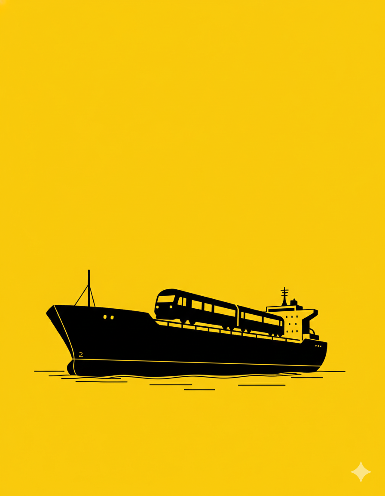

# 【随笔】火车坐轮船（续）

我和阿宝回到了自己的座位边，坐下来喝了口水。一扭头，发现窗外一截绿色的火车箱缓缓地从那空着的轨道上滑了过来。我赶紧又拿起手机打给大宝：

> 你们上船了吗？

她说：

> 车动了，但旁边也是火车。看不见大海。

我说：

> 那就是上船了，估计你在船中间的轨道。

正说着话，我看见窗外滑过的车厢上写着一个「4」字，然后，它停下来不动了。既然 8 号车厢紧挨着 4 号车厢，那么旁边的 9 号软卧车厢挨着的就是 5 号车厢。我眼睛一亮，对阿宝说：

> 妈妈就在我们旁边的车厢，在刚刚到软卧车厢应该就能看到他们。

我拉着阿宝，起身就跑，然后在软卧车厢一个窗口一个窗口的找起来。但是，旁边那节车厢大部份窗户都拉着窗帘，不知道他们在哪里。乘务员看我牵着小朋友在这里咋咋唬唬的，赶紧走了过来。我还以为他要赶我们走，结果他只是说：

> 嘘，小声一点，别人睡觉呢……

我看了阿宝一眼，不好意思地闭上嘴巴。然后又拿起手机打给大宝，小声地说：

> 现在我们就在你们旁边，你从窗户就能看到我和阿宝。

一边说着，一边又和阿宝一起，从头开始一个窗口一个窗口地找过去。阿宝眼睛尖：

> 快看，妈妈的包！

果然，那边的一扇窗户边，放着的正是大宝的那个亮紫色编织袋，「显眼包」果然显眼。窗帘被掀开一角，隔着两层灰扑扑的玻璃，我依稀看到那边有人对着我们挥手。我们也兴奋地对着窗户那边一直挥手。但是那边车厢并没有开灯，黑咕隆咚难以确认是不是大宝。我便对着手机说道：

> 给我们拍个照呗！

不一会儿，我看见对面有手机的闪光灯忽闪了一下。看到了妈妈，阿宝颠颠地跑回我们的座位，一屁股坐下，抬头对我说：

> 爸爸，我饿了！

我找出两小杯快餐面泡上，在窗边静静地坐了下来。窗外的光线开始明亮起来，透过火车窗玻璃和轮船的舷窗，越来越辽阔的大海出现在眼前。

旁边的几个小孩也起床了，趴到窗边看着外面：

> 哇，我们在海上了！

我跟着说道：

> 我们坐火车，火车坐轮船，轮船在大海上……

孩子们听我这么说，哈哈大笑起来。

