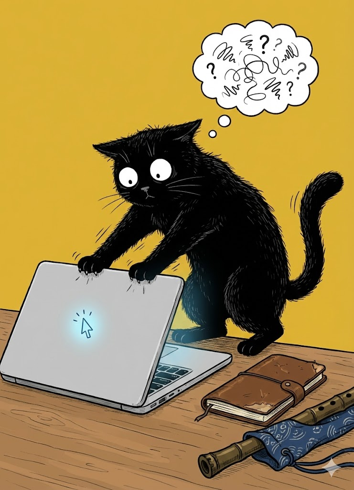

# 【随笔】在AI时代的写作

在去海南的火车上，我佝偻着爬进上铺，半躺在那个坐都坐不直的狭小空间里，敲下了那篇《火车坐轮船》随笔的前半部分。当时没想到的是，完成这篇小文的收尾，居然已经是 8、9天从海南回来之后的事情了。

是的，在冬天清晨的被窝里，再睡一小会儿的念头实在是太抓人了，哪怕是海南的冬天，尤其是假期的冬天。

于是，这一中断就是许多天。

而这一停下来，我就开始怀疑写作的意义。

我依然会不时地用笔在自己那个仿 TN 的皮质笔记本内芯纸张上胡乱写一段又一段日记，这个算是倾泻一些情绪上的垃圾吧。但是，继续练习写作并发表到公众号这样的公开平台，又有什么意义呢？

在 AI 开始批量接管人类程序员的工作之前，它的写作能力就已经超过我了。一开始只是英文，然后是中国的古文，然后，现在它变成了我的私人写作教练。

我依然记得，DeepSeek 第一次帮我写出《江城子 · 震雷焕新》那首诗和小序后，我发完朋友圈就一次又一次刷新数着点赞的情景。看到有人留言夸我文采好，我还要红着脸犹豫一会儿，再回复说，哪里哪里，全靠 DeepSeek。

每次进出家门，我也会时不时地停下来，看着 ChatGPT 帮忙想出的那副对联会心地微笑一番。

就在不久前，大宝夸我最近几篇文章写得好了一点时，我还得意洋洋地告诉她：

> 我最近让 Gemini 给我量身定做了一个写作训练系统，每次写完就让它给出修改建议。
>
> 真的好用！

 可是，既然这件事情 AI 明明干得比我好，我又为什么要让 AI 当我的教练，来练习做这件事情呢？

大宝总是鼓励我：

> 加油，我觉得将来你能出书，能写好看的小说给我看。

我通常只是笑笑，有时候，我会咧着嘴说：

> 好的。

然后与此同时，在内心里又一遍地告诉自己：

>  这是不可能的。

当然，同时又有一个小小的声音对自己说：

> 万一呢？

可是，在我正继续拙笨地练习的同时，我看见 AI 正在飞快地开始替代着一类又一类原本是只有人类擅长的工作。我甚至觉得自己开始理解那个常常发搞笑短视频，不停开自己玩笑，但时不时对着棋盘长叹一声的「棋士柯洁」。他缓缓摇着头叹出的那一口气，会让我跟着心口一闷，然后忍不住深深吸一口气，听见自己胸骨被撑得发出一声咔啪的轻响。

前几天晚饭和朋友聊天时，我也问出过这个问题：

> 不光是写程序，做视频这些领域。
>
> 说到 AI 最擅长的文字吧，当然，它的文字能力早就远远超过我了。我一直在看的一些公众号作者，在开始调教 AI 写作，现在那 AI 写的文章，已经和他们原来自己写的一样好了。
>
> 你们怎么看？

我想起，当时我就觉察到自己话说出口后，声音都略略带着些颤抖，身体是一种不由自主的紧绷状态，然后特意放松下来，往椅子背后靠了那么一下。

……

大约去年的这个时候，我就思考过所谓[古法纯手工写作](20250211【随笔】论古法纯手工写作.md)的问题。

时隔一年，我居然又想起它来。我拿出笔记本内胆包，准备把电脑收起。在它的旁边，是那把大宝送给我的，装在蓝色印花布袋子里的尺八•悠。

手停在笔记本屏幕的边缘，我犹豫着，真的就这样合上吗？

