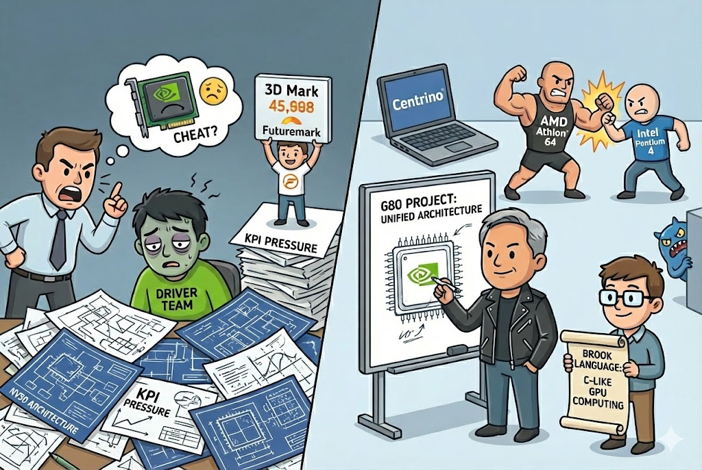

# 【AI】小白话系列——人工智能简史（四十四）

HardOCP 的 Kyle Bennett 在丑闻爆发的当口，曾经在文章里多次暗示：

> 他和 NVIDIA 内部不开心的工程师有过私下交流。

后来，他也进一步透露：

> NVIDIA 内部的驱动团队（Driver Team）因为要给硬件架构（NV30）擦屁股，写代码帮硬件干活，沮丧、疲惫到了极点。

正是 NV30 的奇葩架构，让背负着 KPI 的压力的一线工程师们在无法搞定老板目标的压力之下，不得不作弊了事。

这场危机，直接打醒了一度洋洋自得的英伟达。黄仁勋意识到两件重要的事情：

1. 不能再让工程师陷入这样的两难泥沼了。GPU 需要有像 CPU 一样的标准、通用架构。
2. 他恨透了自己的命运居然被 Futuremark 这样的小公司捏在手里。如果全世界的游戏都用我的 Logo，都用我的代码，3DMark 的测试就不重要了。

G80 在这一年被秘密立项。

同年，Intel 发布了划时代的 **Centrino (迅驰)** 笔记本平台。在这个平台上，笔记本集成了自家的显示芯片，不再需要 英伟达 或 ATI 的外置显卡了。

与此同时， AMD 的 Athlon 64 吊打 Intel Pentium 4 ，他们开始酝酿一个改写计算架构的计划，觉得可以借此机会，一举掀翻 Intel。

2003年，曾经在英伟达做过实习生的 Ian Buck 此时正在斯坦福读博士，他开发出了 Brook  语言。这可是世界上第一款真正意义上的「通用 GPU 模型」，程序员可以用类似 C 语言的方式，指挥显卡进行数学计算。这可比用 CPU 做数学题，快出了许多。

2004年，Intel 内部酝酿的怪兽项目 Larrabee 传出了风声，他们想要用 x86 架构做显卡。

Ian Buck 刚刚博士毕业，黄仁勋就找到了他，让它负责和 G80 配合的通用软件平台。

<待续>

