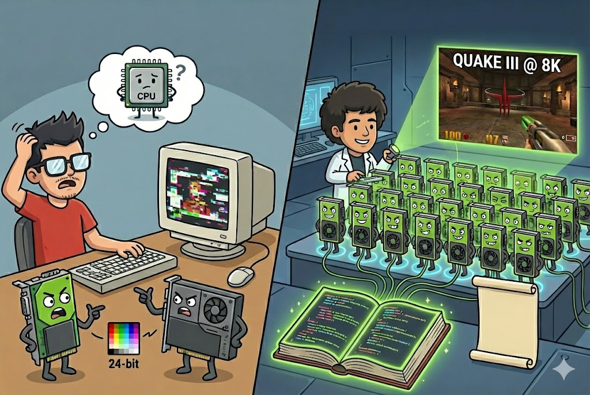

# 【AI】小白话系列——人工智能简史（四十五）

Ian Buck 是我的同龄人，甚至很可能跟与我同一个星座。得知这点，我忍不住咽了咽口水，有点自豪，又有点羞愧。和我发现人工智能界的几位大神——吴恩达，李飞飞出生年份时那种感觉一模一样。

也就是说，在我蹲在宿舍同学的电脑前，调试着自己新写的程序，挠着头想搞定 Trident 和 S3 两张显卡处理 24 位真彩图片， 那莫名其妙差异的同时=时。Ian Buck 可能正在大洋的另一边，普林斯顿大学的机房里，尝试着在 SGI 02 的图形工作站上模拟热对流和流体。虽然面对的难题不同，但他和当年的我一样，也是满头包。

[在 2009 年，Ian Buck 接受 Alan Dang 的访谈](https://tomshardware.com/reviews/ian-buck-nvidia,2393.html)，谈到这段最早尝试使用图形硬件的个人经历时说：

> Though things were so very constrained, it was hard to make a case for it.
>
> 限制太多了，根本做不出什么东西来。

然而，等到了 2000 年前后，他在斯坦福读博士生时，更强大的 GeForce 已经诞生了。他留下了一个著名的玩票记录：把32块 GeForce 显卡并联起来，驱动了 8 台投影仪，在 8K 分辨率下玩了一把《雷神之锤 III》。

我记得当年 1280 x 1024 才是主流，而且是顶配的主流。我们那时候玩，为了游戏的流畅，更多选择 800 x 600 的分辨率。Ian Buck 却在那个时间点，黑出了 20 年后才可能体验到的配置。 

也不知是不是因为这个，Ian Buck 得以在英伟达工作了一段时间（从2000年11月到2001年9月）。

反正，他和其他科学家开始琢磨，显卡这么强的计算能力，除了玩游戏，应该还能干点啥。

他最早的一篇论文，是用 Direct X9 级别的消费显卡进行光线追踪——《[Ray Tracing on Programmable Graphics Hardware 在可编程图形卡的光线追踪](https://graphics.stanford.edu/papers/rtongfx/rtongfx.pdf)》。目的只有一个，就是向世界证明，显卡迟早会变成一种通用处理器。

我们之前聊过，GPU 和 CPU 最大的不同就是一群小学生和一个老教授的区别。

一群小学生的成长速度是两个维度的：

1. 小学生很容易成长，变得更聪明。
2. 小学生的集群可以变得更大。

而且事实上，在当时 GPU 的性能增长速度的确是摩尔定律的三次方，远远高于 CPU。比如：

> *2004 年的 Pentium 4 (3.8GHz) 峰值性能约 **15 GFLOPS**，而同年的 GeForce 6800 Ultra 已经达到 **53 GFLOPS**。到了 2009 年，高端 CPU 还在 **100 GFLOPS** 徘徊，而 AMD/NVIDIA 的旗舰显卡已经突破了 **2000 GFLOPS (2 TFLOPS)**。*

少数明眼人意识到，这是一个彻底改变计算机科学游戏规则的机会。

尽管 GPU 卡性能增长是 CPU 的好几倍，但对于大多数科学家和程序员来说，这些算力几乎只是堆在机箱里的垃圾。几乎只有像 Ian 这样的计算机图形博士研究生级别的顶级黑客才能把 GPU 勉强用起来，这个门槛太高了。

怎么办呢？

顺着这个方向，Ian Buck 整出了他博士期间最重量级的研究成果——《[Brook for GPUs: Stream Computing on Graphics Hardware 在图形硬件上的流式计算](https://graphics.stanford.edu/papers/brookgpu/brookgpu.pdf)》

<待续>