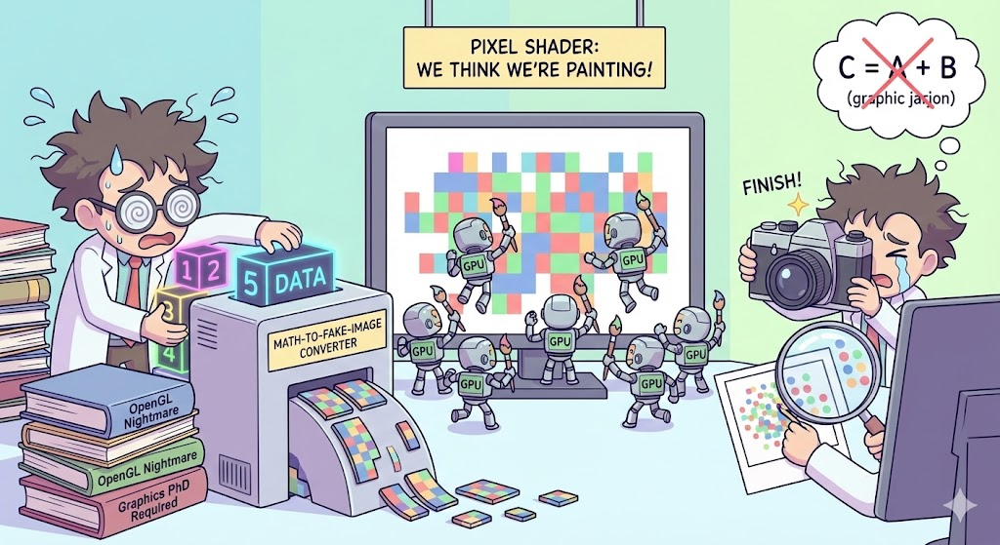

# 【AI】小白话系列——人工智能简史（四十六）

让我们回忆一下，以前曾聊过，到了 GeForce 256这一代，GPU 能干的事情包括：

1. 纹理映射 (Texture Mapping)，也就是贴图（把图片贴在三角形上）。
2. 深度测试 (Z-Buffering)，也就是遮挡（算出谁在前谁在后）。
3. 纹理过滤 (Filtering)，包括像素混合（制作半透明效果）。
4. Vertex Shader（顶点着色器）
   1. 骨骼蒙皮（Skinning），让弯曲的关节能有逼真的肉感。
   2. 布料与流体模拟（简单的物理），展现逼真的头发，衣服和水面质感。

5. Pixel Shader（像素着色器），计算每一个点的最后颜色与光照

这些功能，本来只是拿来往屏幕上画图的。但是，在科学家眼中，这一套画笔、颜料、刷子，也可以拿来做算术——那些复杂的科学计算。

* 纹理映射实际上可以当作二维数组，或者数据内存用；
* 像素着色器简直就是一个巨大的并行计算单元；
* 像素混合可以拿来做最后的求和、累加；
* 深度测试则可以凑合着拿来当 if else 的条件判断用；
* 定点着色器可以当作一个循环控制用；
* 但是纹理过滤这种为了图像好看，但实际上破坏精度的能力必须想办法关掉；
* 骨骼蒙皮和布料模拟科学家们也用不上，他们有自己的公式和算法。

在 Ian Buck 发明 Brooks 之前，科学家们想要利用 GPU 的算力来进行科学计算，大约是这样的流程：

假设是一个特别简单、且常见的需求——把两组特别巨大的数组相加。

$$C_i = A_i + B_i$$

学过编程的大约都能想到，这就是下面这段简单的 For 循环代码：

```c
for (int i = 0; i < 10000; i++) {
    C[i] = A[i] + B[i];
}
```

这种运算，CPU 这个老教授，只能一个一个数过去， GPU 这群小学生，则可以分成16 个小组，16 条管线一起上阵，最后汇总就好——理论上效率直接 x 16 。实际上，计算越复杂，越适合并行操作，GPU 越厉害。

假设你这位科学家也是这么想的，而且碰巧你懂点计算机图形学的黑魔法，你会这么干：

**第一步：伪装**

这 10000 个数据不能直接扔给 GPU，必须「画出」来：

1. 创造两张 100 x 100 的两个正方形
2. 把数据转换成 R（红）、G（绿）、B（蓝） 三种颜色
3. 因为当时的颜色数值只支持 0-255，如果你的数字是其他范围的整数或者浮点数——这显然是非常常见的——你还得把你的数字进行复杂的转化、映射成三组 0-255 之间的数字。是不是有种削足适履的憋屈？
4. 最终，你得到了两张抽象的正方形马赛克图片

**第二步：搭建舞台**

你得假装要画画，你用绘图命令告诉显卡：

> 给我在屏幕正中间画两个三角形，要刚好拼成一个完美的二维正方形，严丝合缝地覆盖屏幕上 100 x 100 的正方形空间。

这个正方形其实没有任何意义，完全是为了接下来计算用的「舞台」。

**第三步：偷梁换柱**

你得写一段  **Pixel Shader（像素着色器）** 代码，让显卡开始干活。

对于显卡来说，它是这么理解的：

> 对于屏幕上正方形的每一个像素，读取「图片A」对应位置的像素值，再读取「图片B」对应位置的像素值。然后把它们混合，涂在屏幕上。

实际上，显卡做的工作就是：

> 所有管线并行开动，瞬间完成了这 10000 个像素点所代表的
>
> $$C_i = A_i + B_i$$


**第四步：截屏取证**

事情还没完。计算结果在哪里呢？不是在内存里，而是在显示缓存里。如果你开着显示器，你会看见屏幕正中间有一个奇怪颜色的正方形马赛克图案。

你得调用显卡的 API，运行一个类似于下面的函数

`glReadPixels()`

做一个全屏幕的截屏操作，把屏幕上（显示缓存）刚刚显卡画好的内容，搬回到内存里。

接着，再做一个复杂的逆运算，把颜色数值还原成你原本的数字。

这就像，你请了一群画画的小天才，他们一秒就在墙上完成了一副巨作。然后你只能拿起相机咔嚓拍一张，回家后洗出照片来，再数数上面究竟有多少不同颜色的点点



……

这就是当年的潜规则，正如 Ian Buck 所说，你得先读个计算机图形学博士，才能搞明白这一套魔法。然后，还要忍耐精度不够，无法调试，带宽瓶颈等等麻烦，才能用上 GPU 这个大杀器。

这也正是 Ian Buck 发明 Brooks 的原动力。

<待续>
